# Networking Concepts
## Types of Networks

- Switch: Connects multiple devices to the network.
- Router: Forwards traffic between networks.
- Wireless Router: Connects multiple wireless devices to the network and may include a switch to connect wired hosts.
- Access Point (AP): Connects ti a wireless router and is used to extend the reach of a wireless network.
- Modem: Connects a home or small office to the internet.

## Network Topologies and Description
- PAN: Personal area network, often bluetooth devices.
- LAN: Local area network, cables small area,
- VLAN: Virtual LANs allow an administrator to segment the ports on a single switch as if it were multiple switches
- WLAN: Wireless LAN, no cable version.
- WMN: Wireless mesh network, uses multiple access points to extend the WLAN.
- MAN: Metropolitan area network, large campus or a city.
- WAN: Wide area network, connects multiple networks that are in geographically separated locations.
- VPN
  
## Connection Technologies
- Analog Telephone
- Integrated Services Digital Network: ISDN, considered broadband because uses multiple channels to carry different types of services. Over telephone wires.
- Broadband: uses different frequencies to send multiple signals over the same medium.
  - Satellite
  - DSL Modem
  - Cable Modem
- DSL: Voice and data signals are carried on different frequencies on the copper telephone wires. A filter prevents DSL signals from interfering with phone signals. 26 Mbps both or 52 download 6 upload asymmetric.
  - VDSL: Very High Speed DSL, can give 100 download and upload.
- Cable: Uses coaxial cable lines for cable TV. 
- Fiber: Fiber optic cables and glass. High bandwidth. 
- Also there is something called line of sight wireless. Uses radio signals for transmitting internet access, a clear path required.
- Satellite
- Cellular: Cell phone technology relies on cell towers distributed throughout the user’s coverage area to provide seamless access to cell phone services and the internet.
- Mobile hotspot and tethering
  
## Networking Protocols Standards and Services
- TCP: Data transfer protocol, most of the internet uses, is a fundamental network protocol that provides reliable, ordered, and error-checked delivery of data between applications. 
- UDP: is a network protocol that allows devices to send messages to each other over the internet. It's often used for applications that require speed and efficiency, such as gaming, video streaming, and DNS lookups. Some Data lost.
- TCP/IP Model: TCP/IP specifies how data is broken into packets, addressed, transmitted, routed, and received at its destination
  - t establishes a connection (three-way handshake), manages data flow, and retransmits lost packets

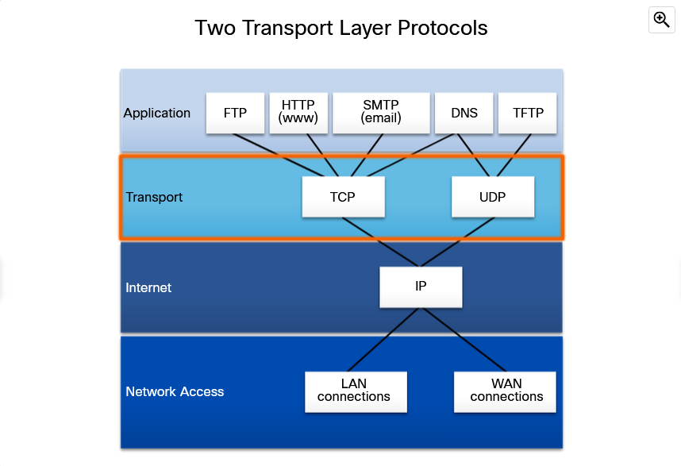

## Application Port Numbers
- Source Port/Destination Port
- TCP source port is greater than 1023, dynamically generated by the sending device.
- HTTP port 80
- HTTPS port 443
- DNS 53
- FTP 20,21
- TFTP 69 Trivial file transfer protocol.
- SSH 22
- DHCP 67,68

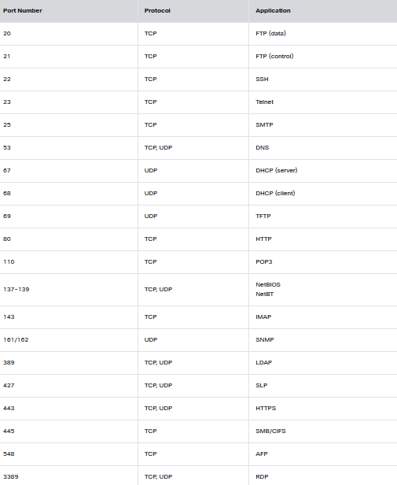

## Wireless Protocols
- WLAN Protocol:
  - IEEE 802.11 family of standards

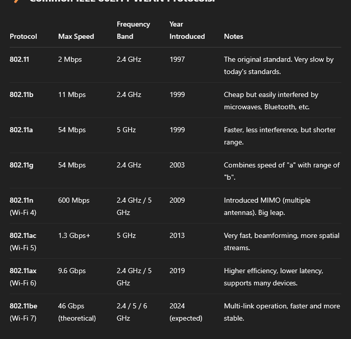

- Bluetooth, Described in the IEEE standard 802.15.1, Bluetooth devices operate in the 2.4 to 2.485 GHz radio frequency range and is typically used for PANs
  - AFH, adaptive frequency hopping, prevents bluetooth interference.
- RFID: RFID uses the frequencies within the 125 MHz to 960 MHz range to uniquely identify items, such as in a shipping department 
- NFC uses frequency 13.56 MHz and is a subset of the RFID standards. NFC is designed to be a secure method to complete transactions.
- Zigbee and Z-Wave are two smart home standards that allow users to connect multiple devices in a wireless mesh network.
- Cellular:
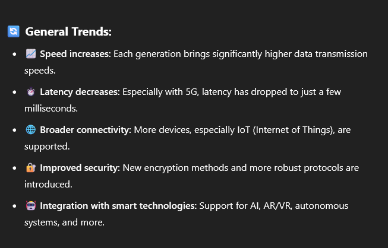

## Network Services
### Client-Server Roles
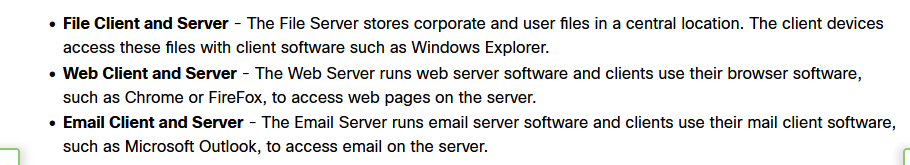

- DHCP server: Dynamic host configuration protocol, DHCP is the service used by ISPs, network administrators, and wireless routers to automatically assign IP addressing information to hosts.    
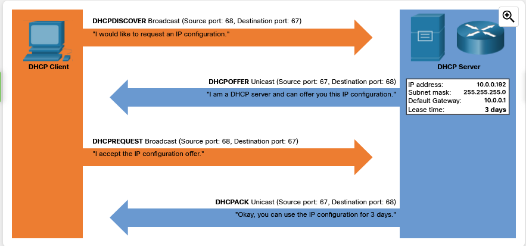
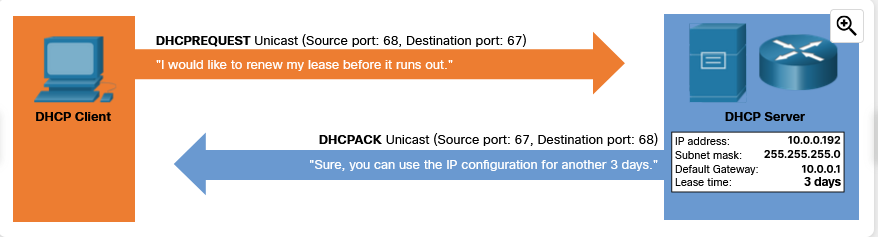

- DNS Server: DNS is the method computers use to translate domain names into IP addresses.  

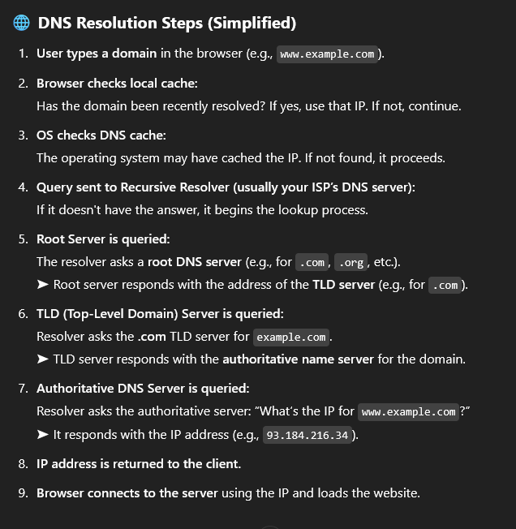
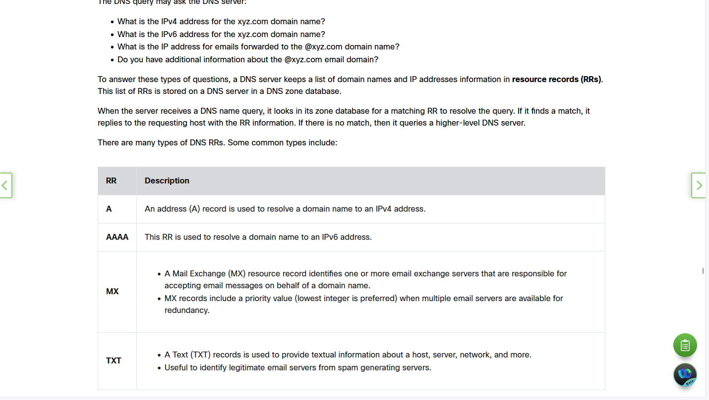
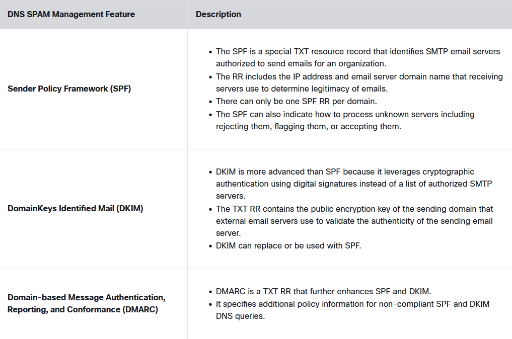

- Print Server: enable multiple computer users to access a single printer.
  - Provide access
  - Administer print jobs, store them que them etc.
  - Provide feedback
  
- File Server: The File Transfer Protocol (FTP) provides the ability to transfer files between a client and a server. An FTP client is an application that runs on a computer that is used to push and pull files from a server running FTP as a service.

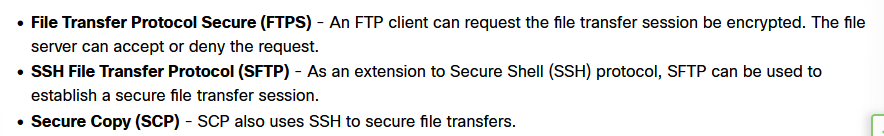
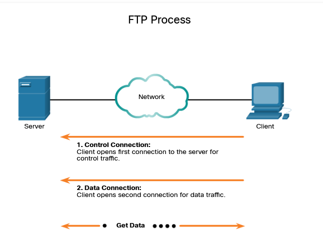

- Web Server: Web resources are provided. HTTP and HTTPS used.

- Mail Server: Email requires several applications and services, as shown in the figure. Email is a store-and-forward method of sending, storing, and retrieving electronic messages across a network. Email messages are stored in databases on mail servers.
- Proxy Server: Acts as another computer. 
- Authentication Server: 
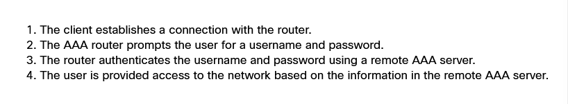

- Syslog Server: Logs
- Load Balancer
- SCADA Supervisory Control and Data Acquisition system is used in an industrial control system (ICS). 

## Basic Network Devices
- Network interface card NIC
- Repeater: regenerates weak signals.
- Hub: receive data on one port and then send it out to all other ports. Can connect to a network but its legacy now.
- Bridge: Divides LANs into segments. Legacy.
- Switch: This made bridge and hubs legacy.
  - Microsegments LANs.
  - Higher bandwidth.
  - Uses MAC addresses.

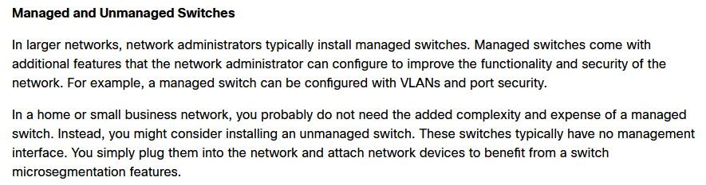

- Wireless Access Points: APs provide network access to wireless devices, such as laptops and tablets. The wireless AP uses radio waves to communicate with the wireless NIC in the devices and other wireless access points. An access point has a limited range of coverage. Large networks require several access points to provide adequate wireless coverage. A wireless access point provides connectivity only to the network, while a wireless router provides additional features.
- Routers: Routers can have all the functionality of a switch or a wireless AP. However, routers connect networks.
  - Uses IP addresses to forward traffic.

## Security Devices

- Firewalls: Firewalls protect data and equipment on a network from unauthorized access. A firewall resides between two or more networks. It does not use the resources of the computers it is protecting, so there is no impact on processing performance
  - Access Control List ACL
- IDS: Intrusion Detection Systems, passively monitors the network.
  - Stand-alone IDS mostly dissapeared.
- IPS: An IPS builds upon IDS technology. 
  - The biggest difference between IDS and IPS is that an IPS responds immediately and does not allow any malicious traffic to pass, whereas an IDS allows malicious traffic to pass before it is addressed. However, a poorly configured IPS can negatively affect the flow of traffic in the network.
- UTM: is a security solution that combines multiple network protection features into one single device or platform.
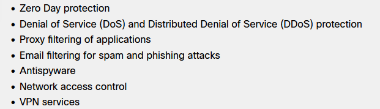

## Network Cables
- Coaxial: copper or aluminum, carries data in the form of electrical signals.
- Twisted Pair Cables: copper cabling used for telephone communications and most Ethernet networks.
  - Use twisted pairs to prevent interference.
  - Shielded twisted pair, each pair coated with anoither foil.
- RJ-45 PLugs, plugs that we used home for modem.
- Cat 5 cat 6, cable types, cat6 better.
- Fiber Optic: uses light, fastest.
  - Single mode Fiber: uses laser, longer range, higher bandwidth, yellow ones. Long distance and backbone use
  - Multi mode fiber: uses led, shorter distance lower bandwidth.
### Twisted Pair Wire Schemes
- T568A and T568B
- A starts with green
- B starts with orange

# Apllied Networking
## MAC Addressing
- MAC determined by manufacturer
- Cannot be changed
- On the NIC, used to communicate with and identify other devices in network.
- Sometimes routers have other NICs to communicate with outer devices.
- 6 pairs of hexadecimal digits (48 bits total)

## IPv4 Addressing
- It is used to identify and locate devices on a network through IP addresses.
- 32 bits, 4 bytes
- 4 decimal numbers
- 32 bit subnet mask 255.255.255.0
- Network portion, first 3 decimal
    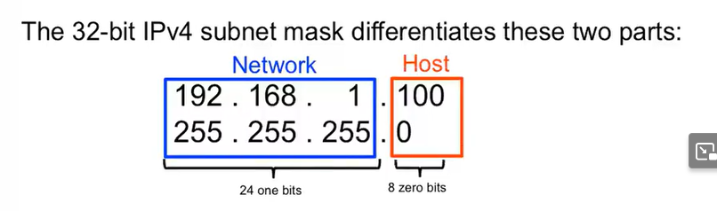

## IPv6 Addressing
- Eight 16 bits segments separated by ":"
- Leading zeros can be omitted:
    
- Full zero strings:
    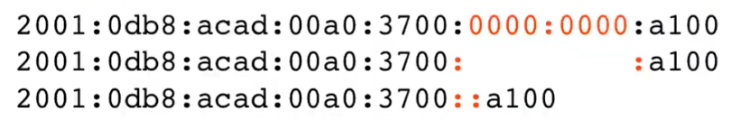
    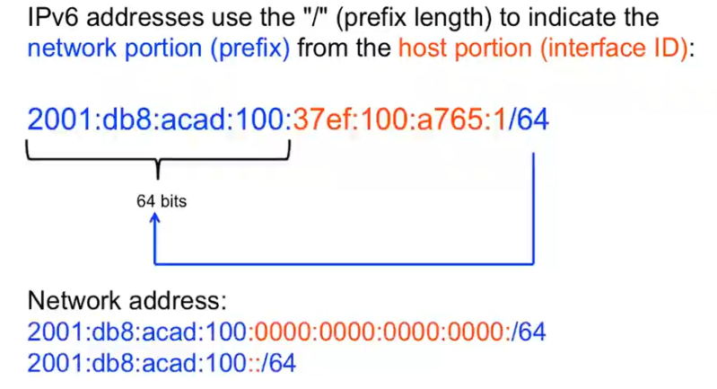

## Static Addressing
- In a small network, you can manually configure each device with proper IP addressing. You would assign a unique IP address to each host within the same network. This is known as static IP addressing.

## Dynamic Addressing
-Rather than manually configure every device, you can take advantage of implementing a Dynamic Host Configuration Protocol (DHCP) server. A DHCP server automatically assigns IP addresses, which simplifies the addressing process. Automatically configuring some of the IP addressing parameters also reduces the possibility of assigning duplicate or invalid IP addresses.

## Link Local
- If your Windows computer cannot communicate with a DHCP server to obtain an IPv4 address, then Windows automatically assigns an Automatic Private IP Addressing (APIPA) address. This link-local address is in the range of 169.254.0.0 to 169.254.255.255.

## IPv4 Classes

## Firewall
- UPnP: Universal plug and play
- DMZ: A demilitarized zone (DMZ) is a network that provides services to an untrusted network. An email, web, or FTP server is often placed into the DMZ so that the traffic using the server does not come inside the local network.
- Port forwading: Hardware firewalls can be used to block TCP and UDP ports to prevent unauthorized access in and out of a LAN. However, there are situations when specific ports must be opened so that certain programs and applications can communicate with devices on different networks. Port forwarding is a rule-based method of directing traffic between devices on separate networks.
- MAC address filtering
- Whitelist and Blacklist

    