# COMP1234 MIDTERM

## 7 JANUARY

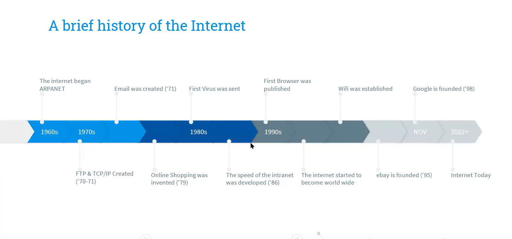

### Archticetcture of the Internet

- LAN-WAN-IXP
  - LAN: Local Area Network
  - WAN: Wide Area Network (Internet Service Provider)
  - IXP: Internet Exchange Points

### Static Web Pages

- HTML document that storeed on o web server and does not change.
- .html extensions.

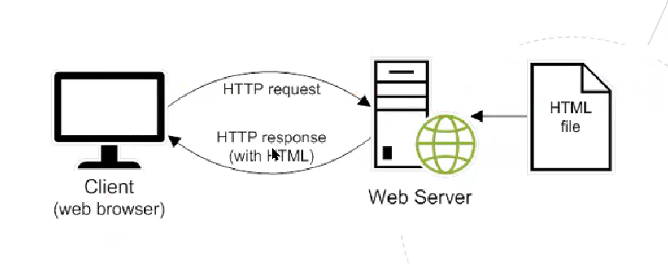

### Dynamic Web Pages

- Web page created by a script, info is not a file in server.
- Amazon sends a script that basically creates a html for the results of the search.

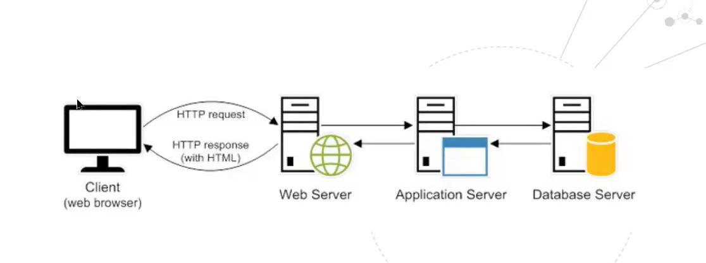

---

**The HyperText Markup Language or HTML**
is the standard markup language for
documents designed to be displayed in a
web browser. It can be assisted by
technologies such as Cascading Style
Sheets and scripting languages such as
JavaScripthelp an application run more
efficiently.

**Cascading Style Sheets (CSS),** is a style sheet
language used for describing the
presentation of a document written in a
markup language such as HTML or XML.
CSS is a cornerstone technology of the
World Wide Web, alongside HTML and
JavaScript

**Javascript,** JavaScript is client-side scripting language
that is run by the JavaScript engine of a
web browser.

- When a browser requests an HTML page
that contains JavaScript or a link to a
JavaScript file, both the HTML and the
JavaScript are loaded into the browser
- Because JavaScript runs on the client, not
the server, it provides functions that don’t
require a trip back to the server. This can
help an application run more efficiently.

## 14 JANUARY

### Client/Server Communication

- Usually more than one client is in communucation with server.
- Clients send requests and server responds.
- Server can be client and client can be server, but usually a different powerful machine designed for this purpose is teh server.

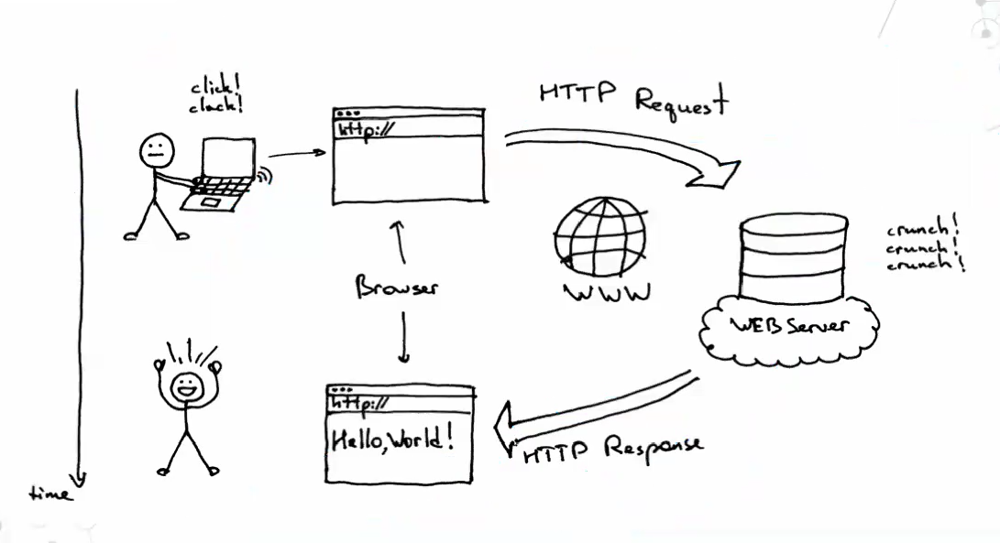

>HTTP: Hyper Text Transfer Protocol <br>
HTTPS: Hyper Text Transfer Protocol Secure <br>
HTML: Hyper Text Markup Language<br>
FTP: File Transfer Protocol


### The Web Protocol and File Transfers

- **Internet Protocols**
  - Basically a set of rules. (For example mors code is a protocol too)
  - TCP/IP (Transmission Control Protocol/Internet Protocol)
  - The foundation of the internet, defining how data is sent, transmitted, and received between devices. It ensures reliable communication between computers over networks.

### Uniform Resource Locators (URL)

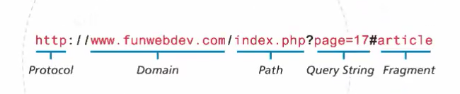

- **Protocol**
- **Domain** 
- **Path,** identifies a file or directory to access on that server.
- **Query String,** parameter=value, It typically starts with a ? and includes multiple parameters separated by &.
- **Fragment,** A fragment (or anchor) is the part of a URL that comes after the # symbol. It is used to navigate to a specific section of a webpage without reloading the page.
- **Port** A port is a logical endpoint used in networking to identify specific processes or services running on a device. It allows multiple services to communicate over the same IP address.
  - Basically it clarifies which service is going to enter from which door.

    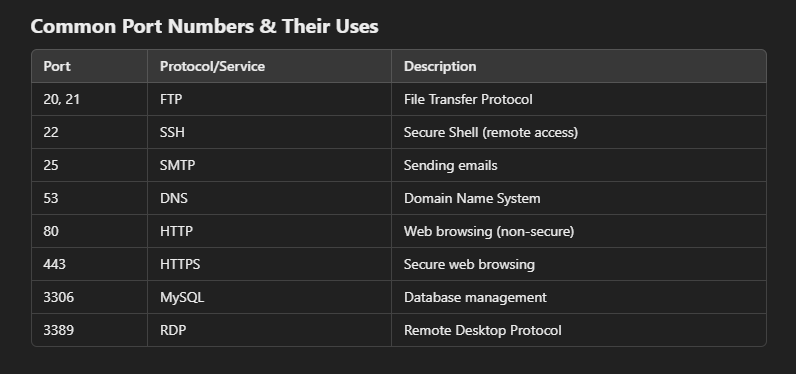

### HTTP Request Methods

- **GET,** used to request data from server, read-only.
  - Whenever you click on a link or something you send a GET request.
  - Can be cached, bookmarked. (When you left the page information will be stored)
  - Limited data lenght, depends on browser.
  - Not secure, data is visible in the URL.
- **POST,** used to send data to server (create or update data).
  - Like login or signup pages.
  - Cannto cached, when you refresh the page you need to enter data again.
  - Secure
  - No size limit.
  - Data is hidden not in the URL.

### Application Stack on a Server

- An operating system
- A web server software
- Database
- A scripting language to process dynamic requests.

>LAMPP Stack <br>
Linux-Apache-Maria-PHP or Pearl<br>
Operating system-Software-Database-Scripting Language
---

### Fetching a Web Page

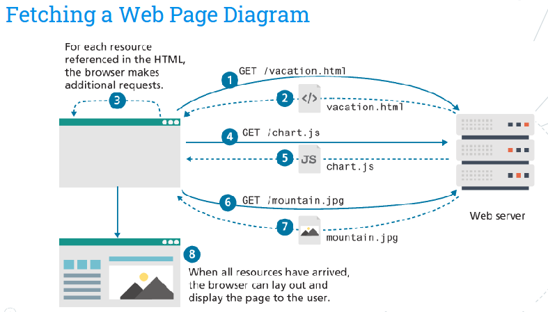

## 21 JANUARY

### Directories and File Structures

### Absolute Path and Relative URLs

- When referencing a page or resource on an external site, a full absolute URL reference is required.
  - `https://github.com//berhanerdogan/notes`
  - or C:\documents\mydocument.doc 
- When referencing a resource that is on the same server, relative reference can be used.
  - Url does not include **https**
    - **Same Directory,** `<a href="example.html">`
    - **Child Director,** `<a href="example/example.html">`
    - **Grandchild/Descendant Directory,** `<a href="/example1/example2/example.html">`
    - **Parent/Ancestor Directory,** `<a href="../..example.html">`
    - **Sibling Directory,** `<a href="../example.html">`>
    - **Root Reference,** `<a href="/public_html/comp1234/example.html">`

      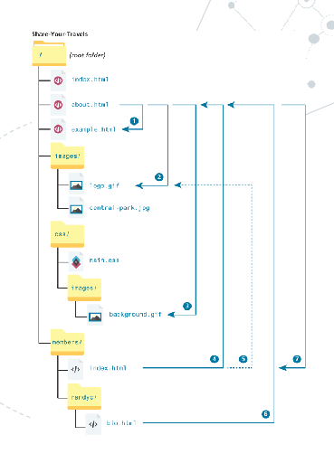

### HTML Basics

- **Tags:** `<a></a>`
- **Empty Tags:** `<br>,<hr>,`
- **Correct Nesting:** `<p>Order your copy <i>today</i><p>`
- **Tag Attributes:** `<a href="example.html">`, `<a href="example.html" title="Click to Contact us" class="nav_link">`
- **Boolean Attribute:** `<input type="checkbox name="mailList" checked>`
- **Attributes for Identifying:** `<div id="page">, <a href="example.html" title="Click to contact us" class="nav_link">`
- **Comment:** `<!--Comment-->`

### CSS Basics

- **CSS Rule:**

   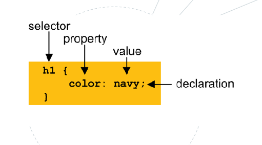

- **Comments:** `/*This is a comment*/`
- **External CSS link (head section):** `<link rel="stylesheet" href="example.css">`

## 28 JANUARY

### HTML Syntax

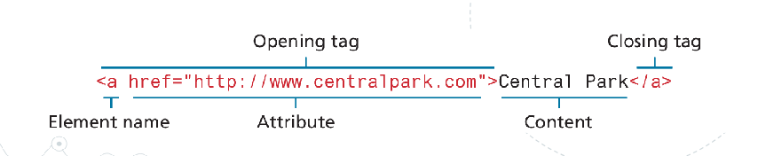
**Anchor tag with href attribute**

### Structure

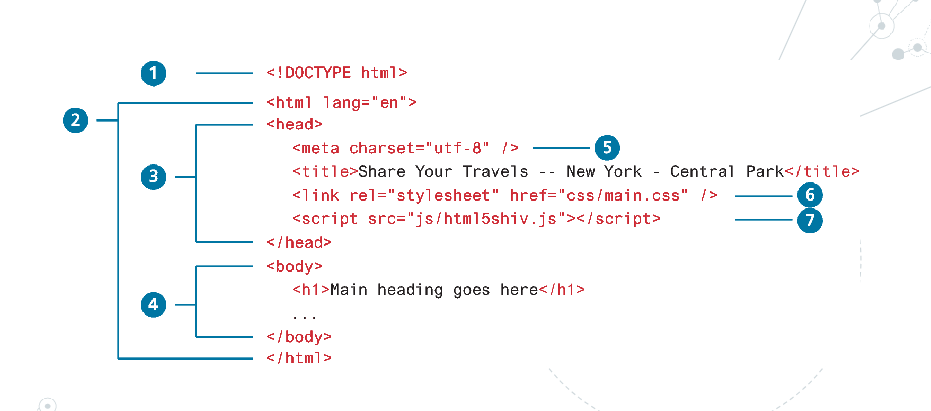

1. `<!DOCTYPE html>` Tells the browser what type of document it is about to process.
2. `<html>`, `<html lang="en">` The `<html>` element is sometimes called the root element as it contains all the other HTML
elements in the document. The optional lang attribute tells the browser the language that is
being used.
3. `<head>` Descriptive elements about the document. such as title, encoding. css etc.
4. `<body>`Contains all the content of the web page-
5. `<meta>` Provide metadata (information about the webpage) to browsers, search engines, and other services.
6. `<link rel="stylesheet" href="css/main.css" />` Css link
7. `<script src="js/htmls5shiv.js></script>` Script

---

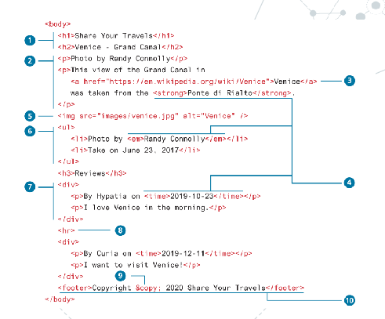

1. `<h1>` Headings, there are six levels of headings.
2. `<p>` Paragraphs, block-level. Container.
3. `<a href="https://github.com">` Anchor or links.
4. `<p> This is a <strong>bold<strong> word</p>` Inline text element.
5. ``Image
6. `<ul>`unordered list
7. `<div>`division, Container.
8. `<br> <hr>`line break and horizontal line
9. `&copy` character entitiy, &copy; this
10. `<footer>`  Semantic Block Element. Special containers
in HTML5 for describing structural elements in
a document, footer

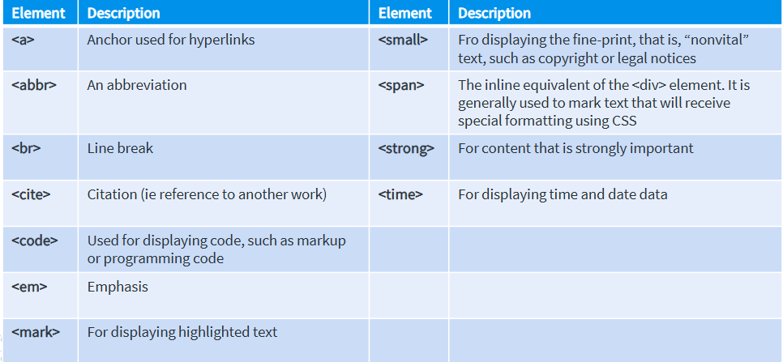

### HTML Semantic Structure

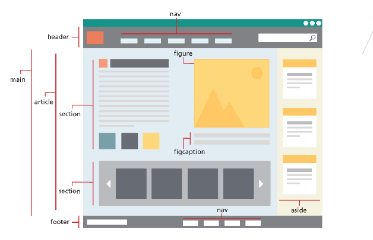

## 4 FEBRUARY

### Introduction to CSS

- **What is CSS:** CSS is a W3C standard for describing the appearance of HTML elements.
  - CSS can be added directly to any HTML element (via the style attribute), within the `<head>`
element, or, most commonly, in a separate text file that contains only CSS.
  - Can be link to html in 3 ways, external stylesheet, embed styles in the head section, use of style attributes.
    - First inline styles, then embedded styles, and lastly styles from an external style sheet.

### CSS Syntax

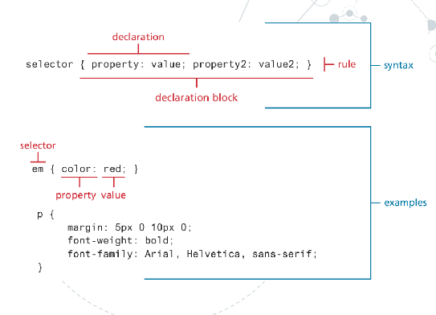

### Selectors

- Element Selectors, any element by their name, or group of elements with comma, or using (*) to select all elements.
- (.) class selector
- (#) id selector
- You need to use **[]** for attribute selectors.
  - Example: `[title]`

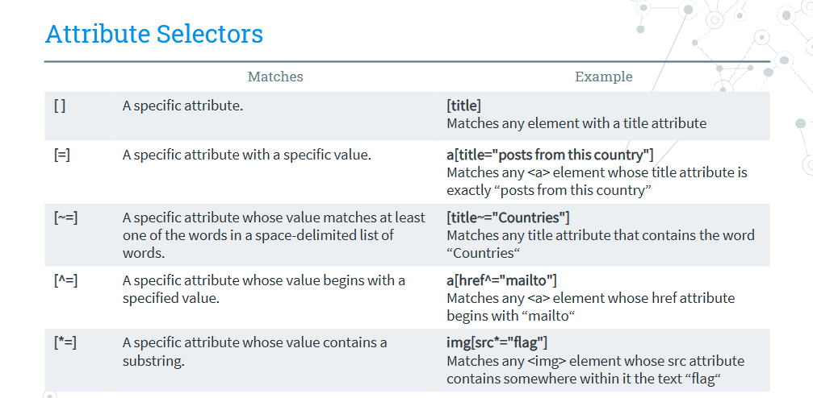

### Pseudo-Elements and Selectors

- A pseudo-element selector is a way to select something that does not exist explicitly as an element in the HTML document tree.

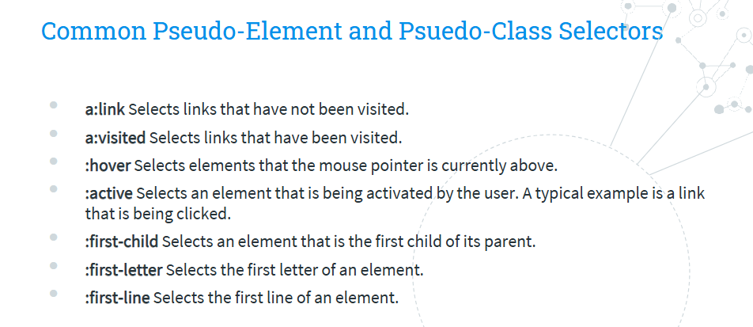

### Contextual Selectors

- Allows you to select elements based on their ancestors, descendants, or siblings.
- **Descendant Selector:**
  - Just need space
  - `div p a{}`
- **Child Selector:**
  - Matches a specified element that is a direct child.
  - The character is `>`
  - `p>a{}` This will select the anchor tag which is a dricet child of paragrapgh tag but will not select deeper nested elements.
- **Adjacent Selector:**
  - Character is `+`
  - Adjacent sibling selector,  selects an element that immediately follows another element, sharing the same parent.
  - `hr+p{}`
- **General Selector:**
  - A General selector matches All following elements that shares the same parent as the
specified element.
  - Character is `~`
  - All siblings of a specified element that come after it, regardless of whether they are adjacent or not.
  - `h3~p{}`

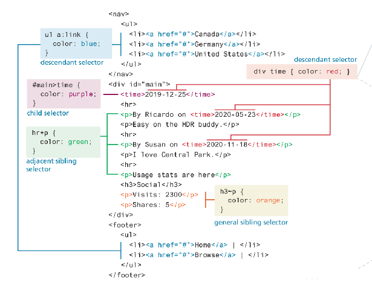

### Cascade

- “Cascade” in CSS refers to how conflicting rules are handled.
- **Inheritance:** Font, color, list and, text properities are inheritable **while** layout, sizing, border, background, and spacing are not inheritable.
  - For example:

```CSS

body{
  font-family: Arial;
  color: red;
  border: 8px solid red;
  margin: 60px;
}

```

- **Specificity:** how the browser determines which style rule takes precedence when more than one style rule could be applied. The more spesific takes precedence.
  - Element<Class<ID

- **Spesificity Algorithm:** 

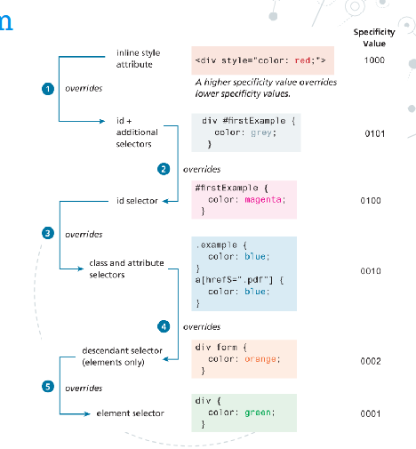

- **Location:** Finally, when inheritance and specificity cannot determine style precedence, the principle of location will be used.
  - For instance, an inline style will override one defined in an external author style sheet or an embedded style sheet.

## 11 FEBRUARY

### CSS Box Model

- Central concept is all HTML elements can be considered a box and each of those boxes has 5 modifiable dimensions.
  - Height, width, padding, border, margin.

    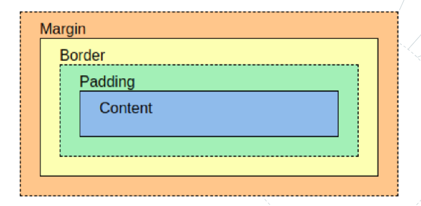 

    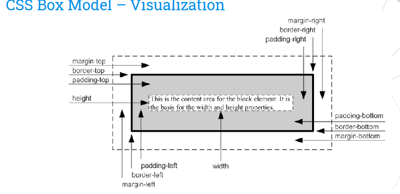

- **Height of Box** = ( top margin + top border + top padding) + height + ( bottom padding + bottom border + bottom margin
- **Width of Box** = ( left margin + left border + left padding) + width + ( right padding + right border + right margin )

### Properties for Positioning Elements

- **z-index** Elements with a higher z-index value appear on top of elements with a lower z-index.
- **Static** Element follows the default flow.

```CSS
.box {
    position: static;
}
```

- **Relative** element moves relative to its original position. Uses top left corner.

```CSS
.box {
    position: relative;
    top: 20px;
    left: 30px;
}
```

- **Absolute,** no space in flow. This element is removed from normal flow.
  - It positions relative to the nearest positioned ancestor (relative, absolute, or fixed).
  - If no ancestor exists, it positions relative to the `<body>`.

```CSS
.parent {
    position: relative;
}

.child {
    position: absolute;

    top: 50px;
    right: 20px;
}
```

- **Fixed**

```CSS
.fixed-box {
    position: fixed;
    top: 0;
    left: 0;
    width: 100%;
    background: black;
    color: white;
}
```

- **Sticky** The element acts like relative but sticks to the viewport when scrolling.
  - Requires top, left, right, or bottom to work.

```CSS
.sticky-box {
    position: sticky;
    top: 10px;
    background: yellow;
}
```