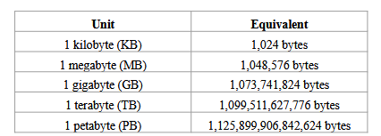
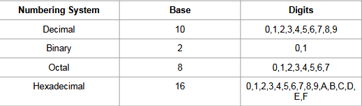
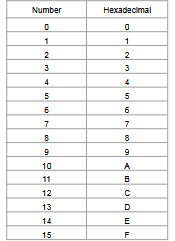
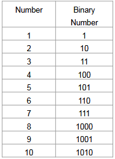
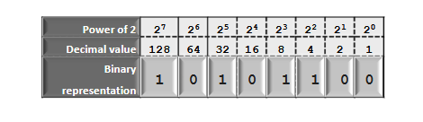
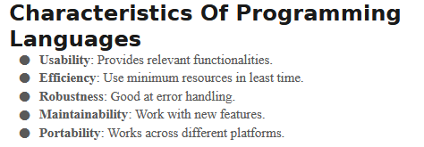
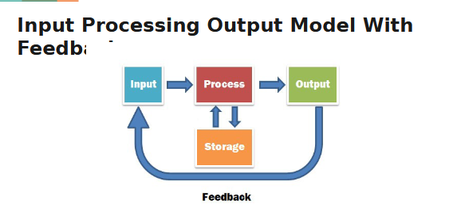
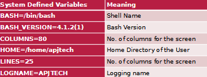
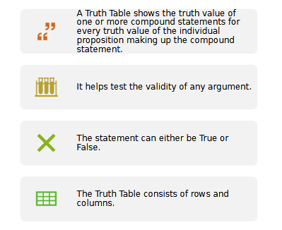
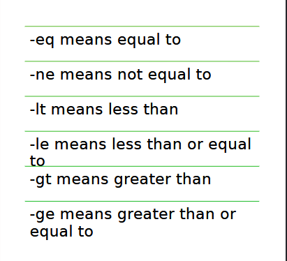

# COMP1236 FINAL

## The Number System - Binary, Hex Numbers, ASCII Code, and Conversions

- Binary, octal, hexadecimal, decimal.
- Bits, the smallest unit, 0 and 1.
- Byte = 8 bits
  
 

 

  
 
 

 - ASCII, American Standart Code for Information Interchange
 - This table will help.

## Intro to Programming

- Ada Lovelace, first program.
- FORTRAN first high level language.
- First programs were in machine language.

### Characteristics of Programming Languages

- Usability
- Efficency
- Robustnesss, being good at error handling
- Maintainability, works with new features
- Portability, work across platforms

### Tools

- Interpreter, step by step translation of source code to machine, executes directly, stops at error, slower.
- Compiler, complete translation of source code, no direct execution, faster.
- Assemblers, convert assembly language to binary.

 
 

## Basics of Shell Programming

- Kernel, The computer program that forms the core of your OS.
  - File management
  - Process management
  - I/O management
  - Memory management
- Shell, It plays the role of converting the human-readable commands from the
user to kernel language
  - Command-Line Shell, access through CLI.
  - Graphical shell, uses GUI
- STDIN, standard input
- STDOUT, standard output
- STDERR, standard error

### System Defined Variables

- $set is used to display.

### User Defined Variables

- Users can define a variable using the ‘=’ operator, followed by assigning a value to a variable name.
- Always treated as strings unless specified.
- "" helps you put space or put -_
> myvar=1  
> echo $myvar

## Opeators in Shell Script

- Types:
  - Arithmetic
  - Relational
  - Boolean
  - Bitwise
  - File Test

### Arithmetic:
  - \+ addition, \- subtraction
  - \* multiplication, \/ division
  - \% modulus
  - \++, \-- increment and decrement.

> read -p "Please enter 2 numbers: " x y
> let a = $((x + y))
> let b = $((x * y))
> let x = $((x % y))
> echo $a $b $c

### Relational

- \== equal, \!= not equal
- <> greater and less
- <= => greater or less and equal
- \=== equal and checks type too (strings and integers etc)

### Boolean

- && and, both true
- || or, one condition is true
- != not equal

### File-test
- -b checks a file is a special block or not. Eg. an array of bytes, and the value last
written there is the value read at a given location
- -c, checks a file is a special character file or not.
- -d, directory
- -e, exist
- -r, check if the given file has read access or not
- -w, write access
- -x, execute access.
- -s, check size, it will turn true when file size is bigger than 0.

## Decision Control

- Boolean Values, True or False thats it.
- 5 > 3 or 3 == 3 or anything like this is a boolean expression.
- Checks true false basically

## Conditional Statements

- If, If-Else, nested If-Else
  - [] square brackets
  > if [[ $x > $y ]]; or if $((x > y));
  
- Switch and nested switch
 

## Flags

## Function

> function myFunction{ 
 > commands
>}  
>myFunction

- Bash also allows you to create function files that will store all your functions. These are called function libraries.
- The syntax to load all functions is as follows:
. /path/to/your/functions.sh
- Sure!

> **A parameter** in Bash is a variable that holds a value, while **an attribute** defines special properties or behavior of that parameter (like making it read-only or an integer). ✅

- There are global and local variables. Scope is limited for local variables.
- Globals are accesible.