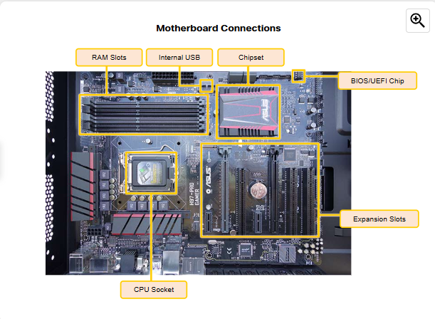
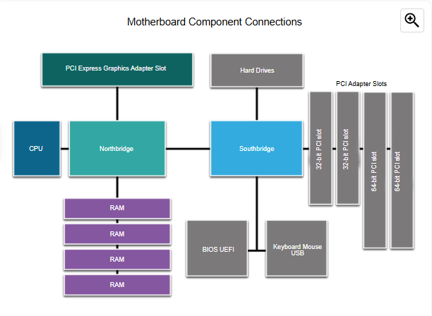
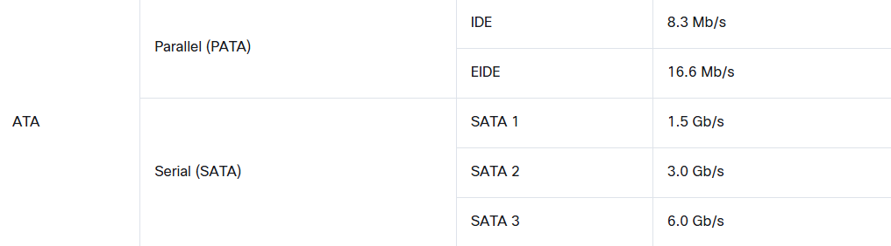
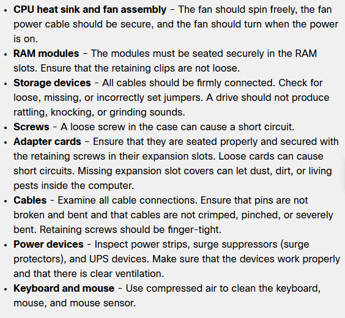
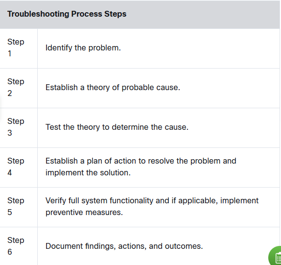
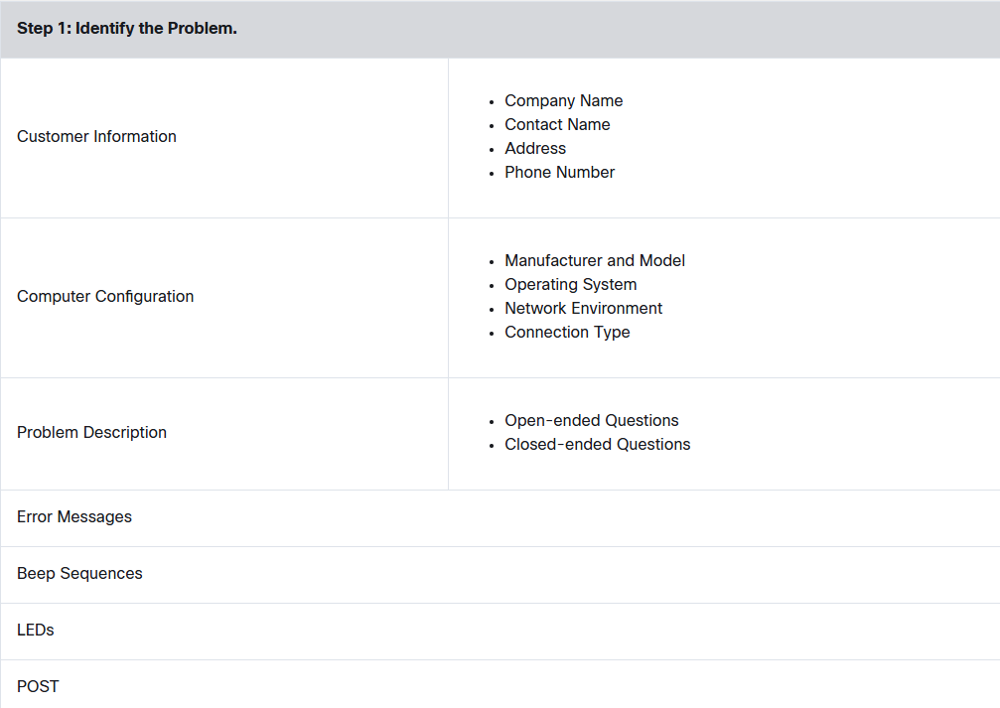

# COMP1151 MIDTERM

## Personal Computer Hardware

### Electrical and ESD Safety

- Electrostatic discharge (ESD), occurs when two surfaces, both hold a buildup of static electricity, contact.
  - 3000 Volts is the lowest limit that humans can feel electricity. But 30 Volts can damage a computer part.
- ESD can cause permanent damage to electrical components. Follow these recommendations to help prevent ESD damage:
  - Keep all components in antistatic bags until you are ready to install them.
  - Use grounded mats on workbenches.
  - Use grounded floor mats in work areas.
  - Use antistatic wrist straps when working inside computers.

## Case and Power Supplies

### Cases

- Horizontal, Full-Size, Compact, All-in-one

### Power Supplies

- Converts **AC** power to ***DC** power.
- **AT** Advanced Technology, this is the original supply for legacy systems.
- **ATX** AT Extended, updated version of AT but still obsolete.
- **ATX12V,** most common, includes a second motherboard connector to provide dedicated power to the CPU.
- **EPS12V,** designed for servers now commonly used in high-end desktops.

### Connectors

- **200 or 24-pin** connects to motherboard.
- **SATA** connects to disk drives.
- **MOLEX** connects to hard drives and optical drives.
- **BERG** connects to legacy floppy.
- **4 or 8-pin** supplies power to different areas of motherboard.
- **6-8-pin PCIe** supplies power to internal components.

**The different connectors also provide different voltages. The most common voltages supplied are 3.3 volts, 5 volts, and 12 volts. The 3.3 volt and 5 volt supplies are typically used by digital circuits, while the 12 volt supply is used to run motors in disk drives and fans.**

## Motherboards

- A motherboard is a printed circuit board (PCB) that contains buses, or electrical pathways, that interconnect electronic components.

  

- **CPU**  (Central Processing Unit) considered brain of the computer.
- **RAM** (Random Access Memory) temporary data storage location.
- **Expansion Slots**these provide locations to connect additional components.
- **BIOS or UEFI Chip,** firmwares for boot and runtime servuces.

---

- **SATA** or **ATA** optical drives, hard drives, and solid-state drives to the motherboard. SATA has hot swapping.
- **IDE** Integrated Drive Electronics, standart interface for connecting disk drives, 40-pin connector.
- **Internal USB,** 19-pin, connects to USB 3 ports.

### Motherboard Chipset

- **Northbridge** controls high-speed functions.
- **Southbridge** low-speed
  
    

### Motherboard Form

- **ATX** Advanced Technology eXtended, most common, 20-pin, integrated I/O ports.
- **Micro-ATX** Smaller, bridges are same, fewer expansion slots.
- **ITX** smallest, there is even **Mini-TX** used by offices because low power.

## CPU

- The central processing unit (CPU) is responsible for interpreting and executing commands.
- **PGA,** Pin Grid Array, he pins are on the underside of the processor package and is inserted into the motherboard CPU socket using zero insertion force (ZIF). ZIF refers to the amount of force needed to install a CPU into the motherboard socket or slot.
- **LGA,** Land Grid Array, pins are located in the socket instead of processor.
- Speed, Ghz.
- Transmission delay and heat generation.
- 32-64 bit, the amount of data the processor can handle at once and the maximum memory it can access.

## Cooling Systems

- Passive cooling, heat sinks, silent, low power, natural convection.
- Active cooling, fans or liquid cooling, actively remove heat, better performance, noise.

## Memory

### Read-Only Memory

- ROM
- Directly accessed by CPU
- The instructions stored in ROM include basic operation instructions such as booting the computer and loading the operating system.

### Random Access Memory

- RAM
- Temporary working storage for data and programs are being accessed by CPU.
- Volatile, no storage, if powers gone data is gone.
- Adding ram may increase the speed.
- Speed must match the chipset.
  - **Unbuffered,** regular for computers, computer reads data directly, faster, but amoun is limited.
  - **Buffered,** this is specialized memory for servers and high-end workstations that use a large amount of RAM. Memory chips have control chips built into module.

### Types of RAM

- Dynmaic RAM
  - Older
  - Used for main memory.
  - Constantly in need of refreshment via electric pulses because gradually discharges energy.
- Static RAM
  - Requires constant power.
  - Used for cahce memory
  - Low power, and faster, more expensive than DRAM.
- SDRAM
  - Higher transfer rates.
  - Able to process overlapping instructions in parallel.
- DDR, 184-pin, 2.5V, twice as fast as SDRAM.
- DDR2, 240-pin, 1.8V, Improves performance by decreasing noise and crosstalk between signal wires
  - 533MHz
- DDR3,800MHz, 1.5V, 240-pin
- DDR4, 1600MHz, 1.2V, 288-pin.
  - Available with advanced error correction features such as error-correcting code memory (ECC memory) to detect multiple bit errors.
- GDDR, Graphic, Used in conjunction with a dedicated GPU, GDDR-GDDR2-GDDR3-GDDR-4-GDDR5.
- DDR5, DDR5 quadruples DDR4 maximum storage capacity, 288-pins but different pattern.

### Memory Modules

- DIP, individual memory chips, dual rows of memory.
- SIMM, Single Inline Memory, small circuit board holds several memory chips.
- DIMM, circuit board that holds dynamic RAMs.
- SODIMM, support of 64-bit transfers. This smaller, more condensed version of DIMM provides random access data storage that is ideal for use in laptops, printers, and other devices where conserving space is desirable.

### Cache

- **L1 Cache,** internal, integrated into CPU.
- **L2 Cache,** external, originally was on motherboard now on CPU.
- **L3 Cache,** used on some high-end workstations and server CPUs.

### Memory Errors

- **Nonparity,** If your computer uses nonparity memory, it lacks built-in error detection, so any memory errors go unnoticed, possibly causing software crashes or unexpected behavior.
- **ECC,** Error Correction Code, can detect multiple bit errors in memory and correct single bit errors in memory, finance etc.
- **Parity**, Parity memory contains eight bits for data and one bit for error checking. The error-checking bit is called a parity bit.

## Adapter Cards and Expansion Slots

### Adapter Cards

- Adapter cards increase the functionality of a computer by adding controllers for specific devices or by replacing malfunctioning ports.
- Sound, video, eSATA, NIC (network).
  - Wireless NIC, Capture Card (to record and broadcast screen), TV Tuner, USB controller card.
  - **Storage Controller,** can be integrated or added as an exapansion.
    - Storage controller is a hardware or software component that manages the connection between a computer's processor and storage devices

### Expansion Slots

- **PCI,** old.
- **Mini-PCI,** This is smaller version of PCI found in some laptops.
- **PCI-X,** PCI eXtended, four times faster. Still become mostly obsolete.
- **PCIe,** common one has four sizes.

## Hard Disks and SSDs

### Types of Storage

- **HDD,** magnetic, works with a spindle turns the platters that hold the data, RPM is the speed.
- **Tape Drive,** magnetic, old.
- **SSD,** solid state, faster, more fragile, store data as electrical charges.
  - Disc drive form factor, just like HDDs.
  - Expansion cards, plugs directly into motherboard.
  - **mSata or M.2,** special socket, best.
- **Optical,** CD-DVD-Blu-Ray, reading writing abilities change.  

### Storage Device Interfaces

  

## Ports, Cables, and Adaptors

- **DVI,** Digital Visual Interface, 24-pins.
- **DisplayPort,** high-end graphics.
- **HDMI,** was developed specifically for high-definition televisions. However, its digital features also make it a good candidate for computers.
- **Thunderbolt** allows for high-speed connection of peripherals such as hard drives, RAID arrays, network interfaces, and it can transmit high-definition video using the DisplayPort protocol.
  - **Thunderbolt 3** ses the same connector as USB-C, can provide 4K.
- **VGA** analog video, locks.
- **RCA,** Radio Corporation America, 3 cables, left-right sound and graphics.
- Other I/Os (Input/Output)
  - **PS/2**, keyboard-mouse, colored circle.
  - **Audio and Game Port**
  - **Network**
  - **SATA**
  - **IDE**
  - **USB**

## Boot The Computer

### BIOS

- All motherboards need BIOS to operate. BIOS is a ROM chip on the motherboard that contains a small program. This program controls the communication between the operating system and the hardware.
- BIOS settings are stored in CMOS memory chip by the manufacturer.

### UEFI

- Most computers todey run with UEFI.
- Provides additional features and addresses security issues with legacy BIOS.
  - For example mouse-enabled software interface.
  - Larger boot drives.

### UEFI and BIOS Security

- **Passwords**
- **Drive Encryption**
- **LoJack,** This is a security feature that consists of two programs; the Persistence Module and the Application Agent. The Persistence Module is embedded in the BIOS while the Application Agent is installed by the user. When installed, the Persistence Module in the BIOS is activated and cannot be turned off. The Application Agent routinely contacts a monitoring center over the internet to report device information and location.
- **Trusted PLatform Module (TPM),** storing encryption keys, digital certificates, passwords, and data. TPM is used by Windows to support BitLocker full-disk encryption.
- **Secure Boot,**  Secure Boot is a UEFI security standard that ensures that a computer only boots an OS that is trusted by the motherboard manufacturer.

## Electrical Power

### Wattage and Voltage

- **Ohm's Law,** voltage is equal to the current multiplied by the resistance:
  - **V = IR**
- **Voltage (V),** measured in **Volts (V)**
  - The force that pushes electric charges through a circuit.
  - Determines how much energy each charge carries.
- **Resistance (R),** measured in **Ohms (Ω)**
  - opposition to the flow of current in a circuit.
- **Current (I),** measured in **Amps (A)**
  - The flow of electric charge (electrons) through a conductor, like a wire. It is measured in amperes (A) and represents how many electrons pass through a point in the circuit per second.
- **Power (p),** measured in **Watts (W)**
  - Electric power (P) is the rate at which electrical energy is consumed or produced in a circuit. It is measured in watts (W) and determines how much work electricity can do (like lighting a bulb or running a computer).

### Power Fluctuation Types

- **Blackout,** complete loss of AC power.
- **Brownout,** Reduced voltage level of AC power that lasts for a period of time. It occurs when the power line voltage drops below 80 percent of the normal and when electrical circuits are overloaded.
- **Noise,** poor quality power,
 Interference from generators and lightning.
- **Spike,** sudden increase in voltage but very short period like lightning.
- **Power surge,** dramatic increase in voltage above the normal flow.

### Power Protection

- **Surge Protector,** shields voltage spikes, diverting to ground.
- **UPS,** provides temporary battery backup power during power outages.
- **SPS,** switches to battery only when a power failure occurs. It has a slight delay in switching, unlike a true UPS, which provides instant power.

## RAID

- Redundant array of independent disks
- A data storage technology that combines multiple hard drives or SSDs to improve performance, redundancy, or both.
- **Striping,** RAID type that enables data to be distributed across multuple drives, provides a significant performance increase but failure in single drive results in losing of all the data.
- **Mirroring,** RAID type that stores duplicated data on one or more other drives.
  - This provides redundancy so that the failure of a drive does not cause the loss of data.
- **Parity,** RAID type that provides basic error checking and fault tolerance by storing checksums seperately from data.
  - This enables the reconstruction of lost data without sacrificing speed and capacity, like mirroring.
- **Double Parity,** This RAID type provides fault tolerance up to two failed drives.

## Monitor

### Monitor Terms

- **Pixel,** tiny dot capable of displaying the shades red, green, and blue (RGB).
- **Dot Pitch,** distance between pixels.
- **Brightness**
- **Contrast Raito,** measurement of how white and black a monitor can get.
  - A contrast ratio of 1,000:1 displays dimmer whites and more pale blacks than 4,500:1.
- **Aspect Ratio,** horizontal and vertical measurement of viewing area of a monitor.
- **Refresh Rate,** Hertz (Hz), how often per second your monitor can redraw the screen.
- **Repsonse Time**
- **Frames per Second (FPS),** FPS is is how many times the computer is creating each frame. The higher the FPS, the better, but the monitor must be able to display the frames at the high rate.  
- **Interlaced/Non-Interlaced**
  - Interlaced monitors create the image by scanning the screen two times. The first scan covers the odd lines, top to bottom, and the second scan covers the even lines. Non-interlaced monitors create the image by scanning the screen, one line at a time from top to bottom.

## Preventive Maintenance and Troubleshooting

### Preventuve Maintenance

- Dust
- Remove dust from the inside of a computer using a combination of compressed air, a low-air-flow ESD vacuum cleaner, and a small lint-free cloth.

  

### Troubleshooting

