# COMP1234 FINAL
## HTML Tables
- \<table>
- \<tr>  table row
- \<td> \<th> table data and table header
- colspan and rowspan attributes
  - Eg. \<th colspan="2">\</th>
  - Cell number have to be less if you'll use colspan or rowspan.

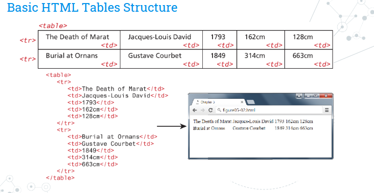

### Additional Table Elements
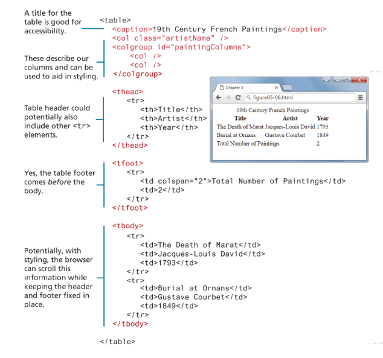

- \<tfoot> (table footer) comes before \<tbody> (table body)

- Using tables for layout is legacy now.

### Styling Tables
- borders cannot be assigned to the \<tr>, \<thead>, \<tfoot>, and \<tbody> elements.
- Use border collapse
- See examples below

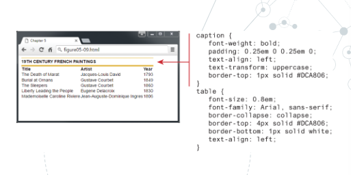
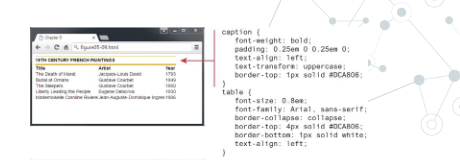
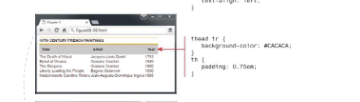
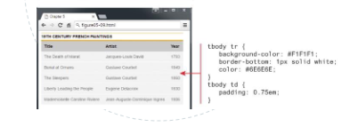
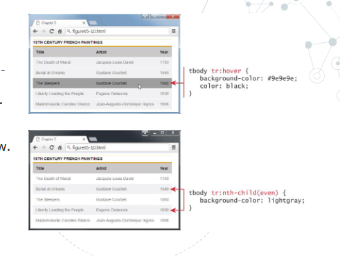


## HTML Forms
- Forms provide the user with an alternative way to interact with a web server.
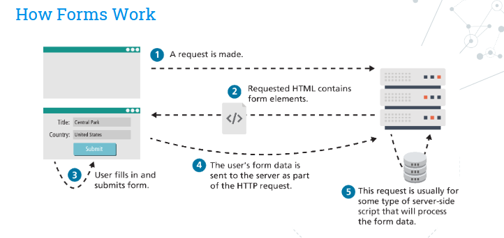

```
//Start of the form, data fil be sent to 'process.php' file with POST method.
<form method="post" action="process.php"> 
  // Groups the form area
  <fieldset> 
    // Some kind of a title (for whole area)
    <legend>Details</legend>
    
    <p>
      // TLabel for this section
      <label>Title: </label>
      // Text-box, The text entered as input by user sent with 'title' name.
      <input type="text" name="title" />
    </p>

    <p>
      // Label of this section
      <label>Country: </label>
      // Drop down menu which will be sent with the name 'where'.
      <select name="where">
        // first option is default.
        <option>Choose a country</option>
        <option>Canada</option>
        <option>Finland</option>
        <option>United States</option>
      </select>
    </p>
    // button to send the form
    <input type="submit" />
  </fieldset>
</form> 
```

### Query Strings
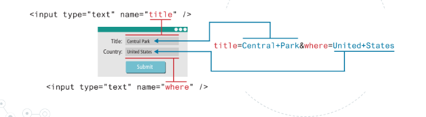

## Form Methods
The method attribute specifies how the query string data will be transmitted from the
browser to the server. There are two possibilities
### GET:
- Data can be seen in the address bar
- Data remains in cache and browser history.
- Data can be bookmarked.
- There is a limit on the number of chars un the returned form of data.
- All of these can be advantage and disadvantage at the same time.
### POST:
- Can contain binary data.
- Data his hidden from the user.
- No cache, no browser history, no bookmark.
- Not a security miracle stand-alone.
<br>
<hr>
<br>

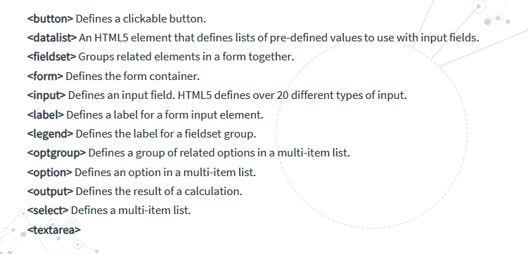

### **See slides for detailed input methods

## JavaScript
- JavaScript is a scripting or programming language that allows you to implement complex features on web pages.
- CLIENTS SIDE
  - reduces the load on server.
  - browser can answer faster so better for UX.
- Naturally there are disadvantages.
  - Complicated debug and maintain.
  - JavaScript is not fault tolerant, will simply stop execution at the invalid line.

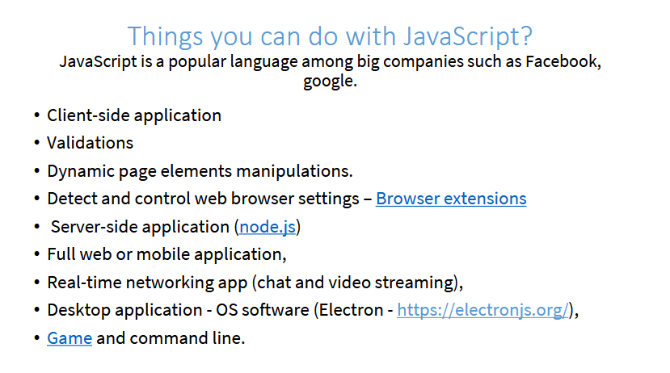

- Static content / Dynamic Content


- Smth called noscript tag, Use noscript to present content when a browser either JS is disabled or not supported.

- 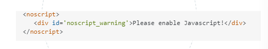

### Basic JS Rules
- Case sensitive
- Semicolon use at the end is optional.
- Whitespace is ignored
- To declare a variable: var, const or let.
  - Cannot start with digit, start with letter, underscore or dollar sign.
  - case sensitive
- // is single line comment
  - /* ..... */ multiple line comment
- alert(): pop-up output
- prompt(): Displays a message and input
- confirm(): Displays a question in modal window with ok and cancel buttons.
- document.write(): Outputs directly into HTML document.
- console.log(): Displays content un the JS console.

### Primitive vs Reference Types

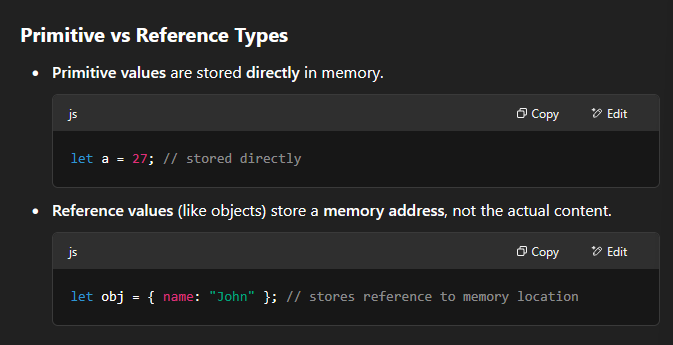

### Var vs Let vs Const

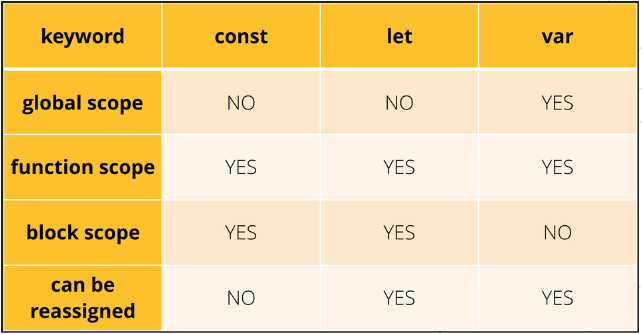

### Rational Operators

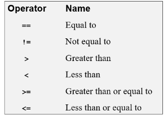

### Equality vs Identity Operators
- For example "===" Checks the type to, both side have to be string or number.

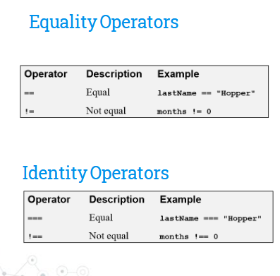

### Parse
- parseInt(string)
- parseFloat(string)
- If the first character cannot be converted to a number, NaN (not-a-number) is returned.

### isNaN()
- Tests whether a string can be converted to a number.
- Returns boolean.

### Logical Operators
- And, or, not
- &&, ||, !

### If Syntax
```
if (condition){
    ----code goes here-----;
} else if (condition){
    ------code------;
}else{
    ----code------;
}
```

### While
```
while (i <= 5>){
    sum += i;
    i++
}
alert(sum);
```
### For
```
// C type
for (let i = 0; i < 5; i++) {
  console.log("i is", i);
}

// For...in
const numbers = {
    a: 10,
    b: 20,
    c: 30
};

for (let key in numbers){
    console.log(numbers[key]);
}

// For...of
let numbers = [10, 20, 30];

for (let num of numbers) {
  console.log(num);
}

```
### do While
- This one works at least once even if the condition is false. Because it checks after execution.
```
let i = 0;

do {
  console.log("i =", i);
  i++;
} while (i < 3);
```

### Switch
- Matches the value
```
switch (height) {
    case "200":
        message = "Above average";
        break;
    case "170":
        message = "Average";
        break;
    case "110":
        message = "JUMP";
        break;
    default:
        message = "Invalid input"
        break;
}
```
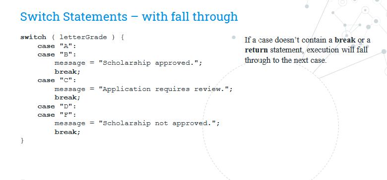


<br>

## JS Arrays

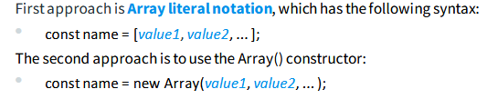

- Index starts from 0.
- Can contain different data types such as strings, numbers or booleans.

```
// Create an empty array.
const myArr=[];
// add values
myArr[0]=1
myArr[1]=2
myArr[2]=3
// or in a single line
const myArr[1, 2, 3]
// with length
myArr[myArr.length] = "4";
// with push (best practice)
myArr.push("4");
```
## DOM

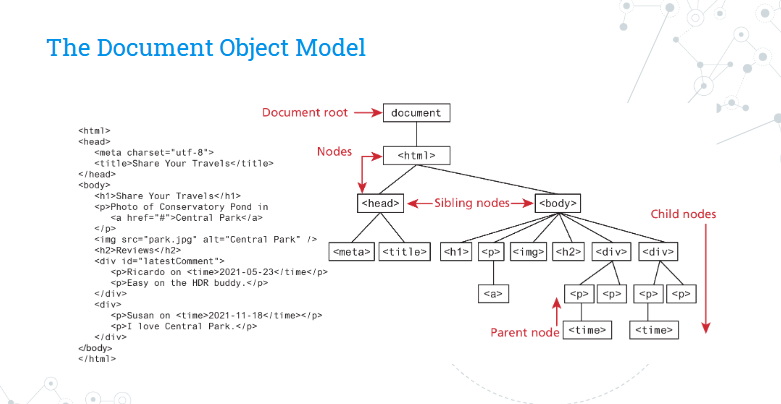

- In the DOM, each element within the HTML document is called a node.
- NodeList, special object that represents collection of nodes.
- The DOM document object is the root JavaScript object representing the entire
HTML document. It is globally accessible via the document object reference.
- getElementById("id")
- getElementsByClassName("name")
- getElementsByTagName("name")
- querySelector()
- querySelectorAll()

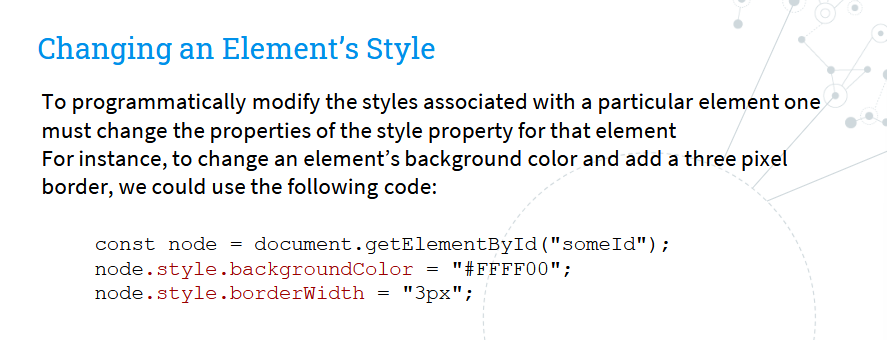

