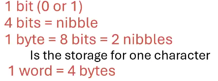
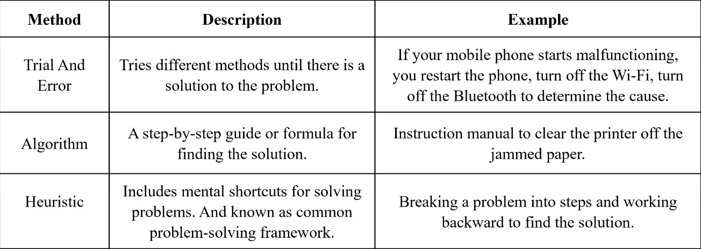
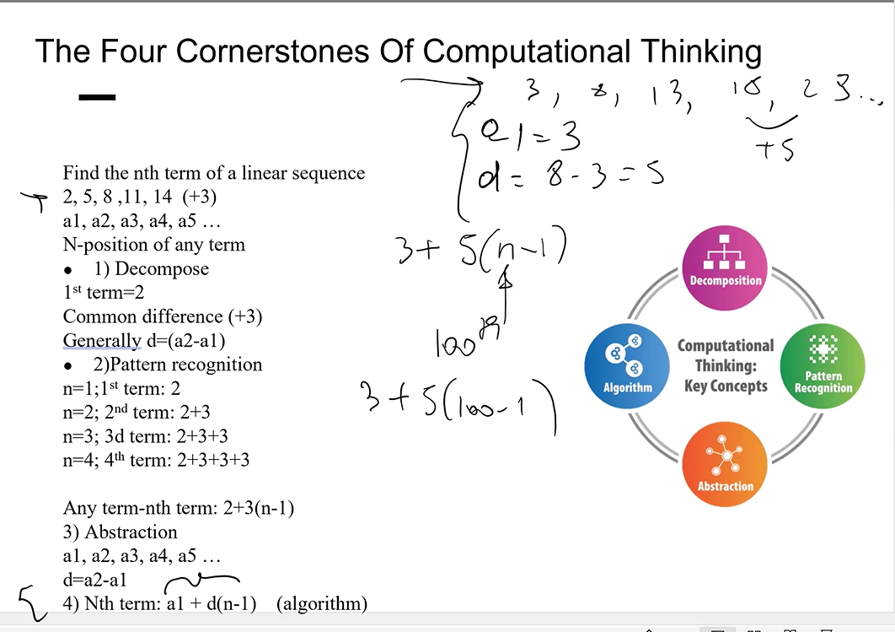
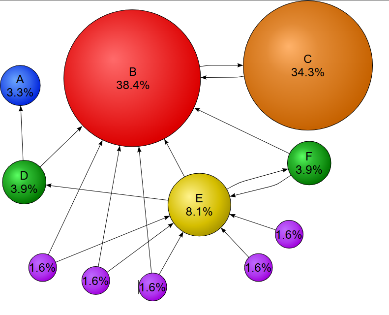
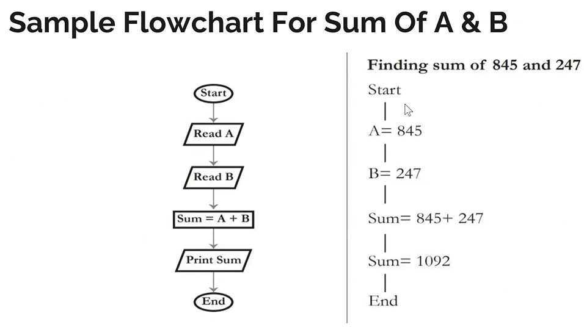
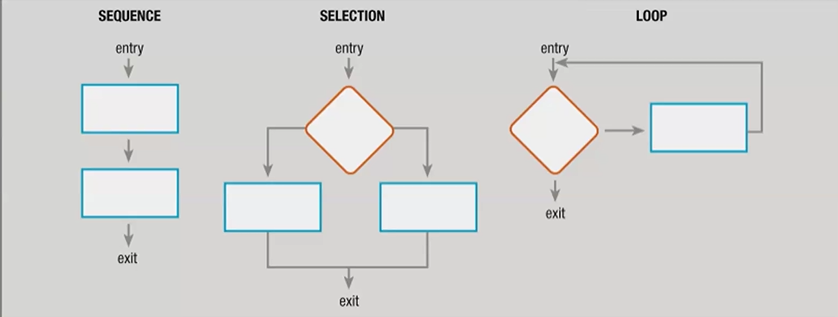
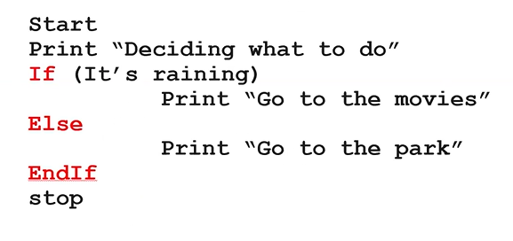
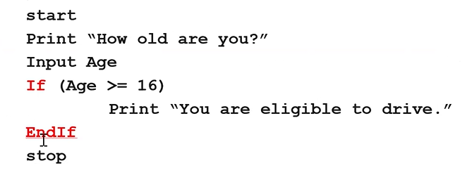
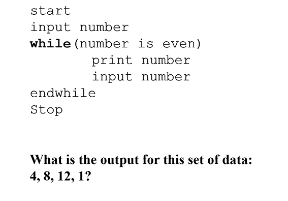
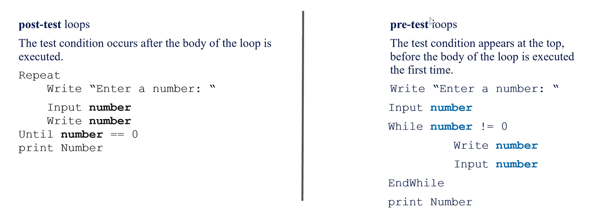

# COMP1236 MIDTERM

## 13 JANUARY

## History of Computers

- She says computers are actually too old and perfect.
- Abacus is considered as first computing machine.
  - Computer is a computing machine but not vice versa.
- John Napier invented **logarithms**
- Blaise Pascal invented **calculator** To help him with collect taxes. This calculator can only **add and subtract**
- Leibnitz invented a calculator that can do **multiplication and division.**
- Jacquard, he was a waiver. Used **punch cards** for weaving.
  - That means there is input and output data, which provided a model for various industries.
- Charles Babbage designed the **Difference Engine and Analytical Engine.**
  - Father of computers.
  - Difference Engine was never built.
  - Neither of them completed.
  - Difference Engine was only desgined for spesific calculations other one was for general purpose.
-Lady Agusta Ada, **first ever programmer**, worked with Charles Babbage, Lord Byron's daughter. She worte programs to be run on his machines. (Mostly punchcard-styleworking machines.)
- Herman Holerith, **Census Machine**
  - Census means data about whole population.
  - Still uses punchcards.
- Bletchley Park, during WW2 Alan Turing and his collegues broke the enigma code here. **Collosus**
- Alan Turing considered the father of computing science.
- Also worked on AI to, father of AI too.
- Turing Test, If a human evaluator cannot reliably distinguish between a machine and a human in conversation, the machine is considered to have passed the test.
- **ENIAC,** first general purpose computer.
  - Other ones built just for calculating one thing or breaking one code etc.
- Dr. Grace Murray Hopper, invented **COBOL**, and did balistic calculations.
  - COBOL is still used but its a high-level programming language.
  - She also invented the terms **Bug, and Debugging.**
- Old computers were working with vacumm tubes. Then transitors were invented, and then miniaturization of computers started.
- Microelectronics revelation.
- Jack Kilby invented first **Integrated Circuit**, fit computing into smaller platforms.
- **1971 first microprocessor (Intel 4004)**
- *1974/75 first personal computers**
  
### First Generation Computers

- 1937-1946
- Calculating Machine/Mark 1/ENIAC
- Mostly for military

### Second Generation computers

- 1947-1962
- First commercial computer
- IBM/CDC/UNIVAC
- COBOL/IC/FORTRAN, programming languages.

### Third Generation

- 1963-1980
- First operating system, 1969, UNIX. (Bell Labs)
- First DRAM (Intel)
- Golden Period
- Individual PC connect to mainframe for networking.
- Mainframe computers acts as servers.

### Present Generation

- 1981 onwards.
- Acorn by IBM, world's first personal computer.
- First PC with graphical user interface (GUI) called Lisa built by Apple, later become Macintosh.
- Portable computers than laptops.
- HTML is developped.
- Pentium proccessors and gaming machines.
- Google
- WIFI
- XP and MacOS

## 20 JANUARY

## Components and Operations

- Hardware: equipment or devices.
- Software: programs that contains instructions for computers.
- Input Devices: Allow data to enter to computer.
- Processing: Working on data.
- Central Processing Unit (CPU): Hardware that performs the tasks.

---

### Components of a Computer

- Central Processing Unit (CPU)
- Internal Memory
  - RAM (Random Access Memory)
  - ROM (Read Only Memory)
- Mass Storage Devices
  - Magnetic, optical, and solid-state
- Input Devices
- output Devices
  
>INPUT-PROCESS-OUTPUT

---

### Software and Programming Languages

- System Software: operating systems.
- Application software: Word Processors, web browsers...

### Programming Languages

- Machine: Only binary
- Assembly: Symbolic representation (eg: ADD A,B)
- High-level: Contains English words phrases and algebraic expressions. (eg: C++, Java, COBOL)
- Scripting: Interpreted, Client-side (JavaScrpit), Server-side (PHP or ASP)

| Compilers| Interpreters |
| ----------- | ----------- |
| Translates high level to machine | Both translates and executes instructions |
| Faster | Slower |
| Detects errors | Stops at first error |

### Writing programs

- **Text editor**
- **Debugger**
- **Complier or Interpreters**
  
---

## 27 JANUARY

## Computational Thinking

### Key Concepts

- Decomposition, divide the problem into managable patterns
- Pattern Recognition, look for patterns
- Abstraction, remove any unnecesssary info about the question.
- Algorithm, follow a steb by step method to solve

---

### Algorithms

- An algorithm is a set of instructions that enable you step by step to achieve a particular
- Search Algorithm
  - Binary, Linear Search
- Sort Algorithm
  - Bubble Sort
  - Selection Sort
- **IF** you need to use binary search, you need to use one of the sorting methods because it needs data that sorted already.

## 3 FEBRUARY

### Run Time Analysis

- Its a method to analyze an algorithm and its efficency.
- Omega (Ω) expresses lower bound execution time, **Best Case**
- Theta (θ) expresses average execution time. **Asymptomatic Behavior**
- Big-o (O) represent higher bound execution time. **Worst Case**

### PageRank

- PageRank works by counting the number and quality of links to a page to determine a rough estimate of how important the website is.
  - Google uses it.
  
---

  

### Types of Algorithms

- Divide and Conquer
  - Problem divided into sub-problems
  - Binary search for example
- Brute Force
  - Most straightforward
  - Finds more than one solution.
  - Does not have pre-proccessing phrases
  - Not optimal, higher time and space complexity.
  - Linear sorting or password cracking
- Recursive
  - Takes smaller inputs
  - Repeats untill solution have been found.
  - Represents a natural way of thinking,
  - Need more memory.
- Dynamic Programming
  - Uses partial past data.
  - Higher efficency
  - Concept of memorization.
  - Avoid repetition.
- **If you calculate 6! one by one its recursive but if you have the data of how factorials calculated, you will go by "6!=6x5x4x3x2x1" and "5!=5x4x3x2x1" so you can use "6!=6x5!", so that is dynamic programming.**
  
### Flow Charts

---

- Start/End: Circle
- Input/Output: Parallelogram
- Rectangle: Action or Process
- Diamond: Decision

---
 Three Basic Stuctures:

   

## 10 FEBRUARY

### Pseudocode

- Informal way to create a rough draft or program outline
- No defined syntax, helps users to pen down ideas without worry about it.
- Good for team communication within different programming languages.
- Basic constructs using pseudocode:
  - **Squence**
  - **If-Then-Else**
    - If might be **single alternative**, no *else"
       
  - **For**
  - While, Pre-conditioned, if statement is not true skips the steps goes directly to endwhile
    
  - **Repeat-until**, Post-conditioned, executes the condition at least once, does not check wheter its true, Untill the condition is true, repeats.
    
  - **Case**
