# Sorting and Searching Algorithms

## Insertion Sort

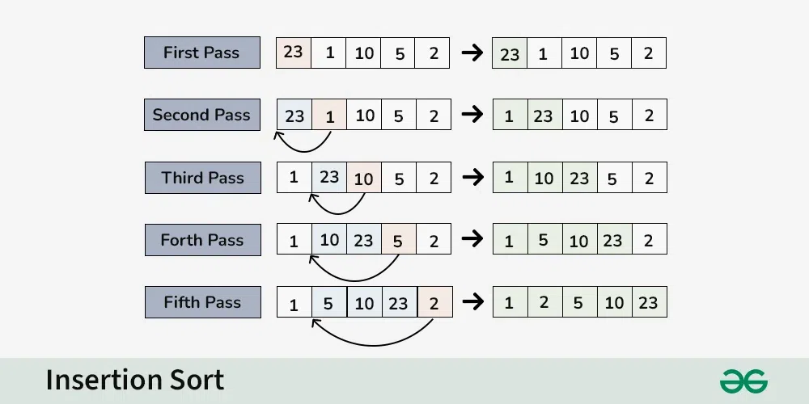

- Time complexity:
  - Best - O(n)
  - Average - O(n^2)
  - Worst - O(n^2)

## Selection Sort

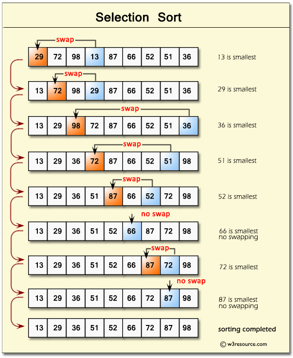

- Time complexity:
  - Best - O(n^2)
  - Average - O(n^2)
  - Worst - O(n^2)

## Bubble Sort

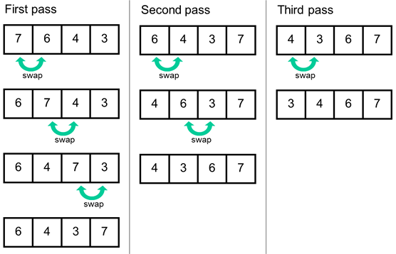

- Time complexity:
  - Best - O(n)
  - Average - O(n^2)
  - Worst - O(n^2)

## Quick Sort

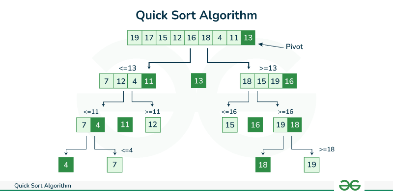

- Time complexity:
  - Best - O(log n)
  - Average - O(n log n)
  - Worst - O(n^2)

## Merge Sort

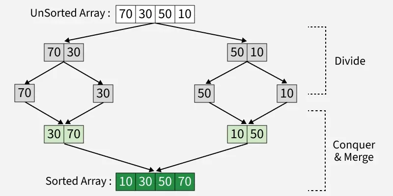

## Linear Search

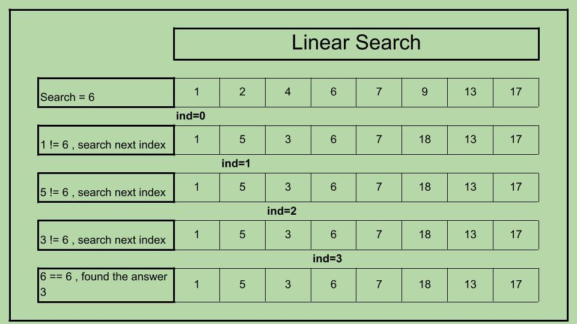

- Time complexity:
  - Best - O(1)
  - Average - O(n)
  - Worst - O(n)

## Binary Search

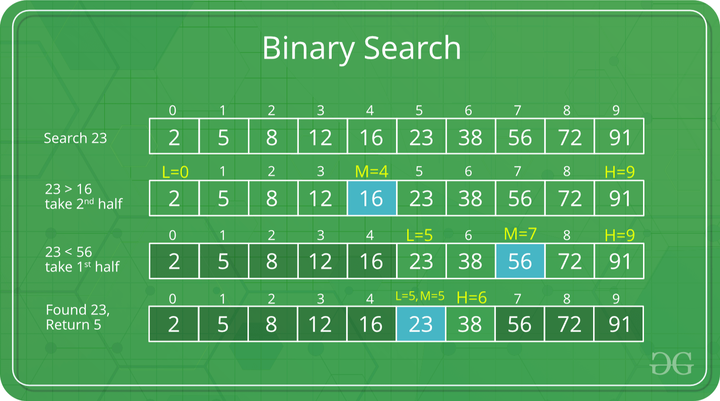

- Time complexity:
  - Best - O(1)
  - Average - O(log n)
  - Worst - O(log n)

## BigO

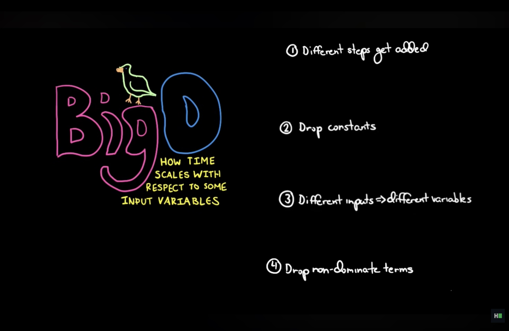

### Common complexities (fastest to slowest):

- O(1) - Constant: same time regardless of input (array index lookup)
- O(log n) - Logarithmic: halving data each step (binary search)
- O(n) - Linear: processing each item once (simple loop)
- O(n log n) - Linearithmic: efficient sorting (merge sort)
- O(n²) - Quadratic: nested loops (bubble sort)
- O(2ⁿ) - Exponential: doubling for each input (recursive Fibonacci)
- O(n!) - Factorial: permutations (traveling salesman brute force)

# Linked Lists

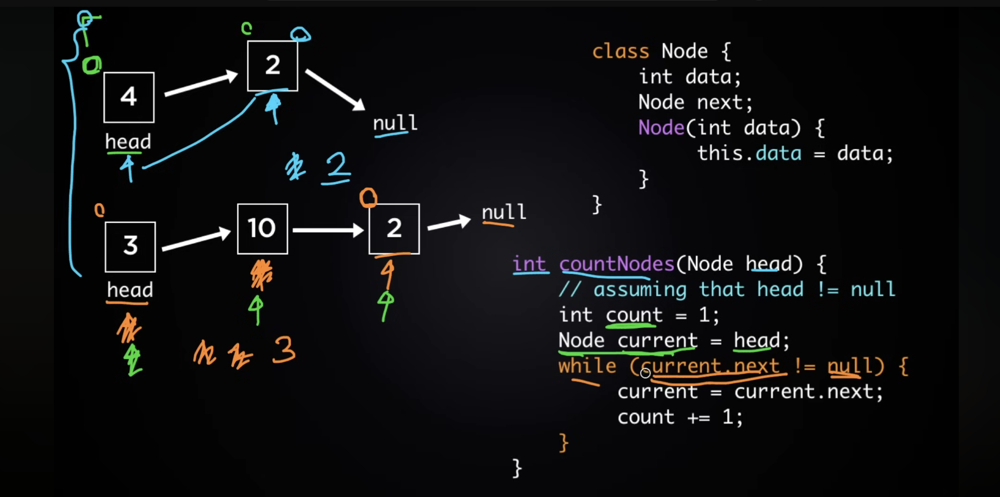
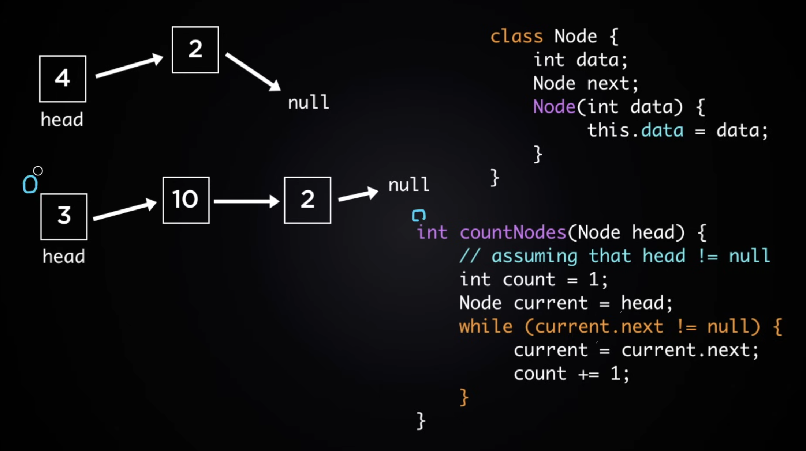

# Stacks and Queues

## Stacks

- A structure in which elements are added and removed from only one end; a “last in, first out” (LIFO) structure 
- Push, pop --> add remove from top
- Top --> returns the top element
- Array based, linked list based

## Queues

- First in first out
- Array or linked list based
- Enqueue --> add element end of the que
- Dequeue --> remove element from the front of the queue.

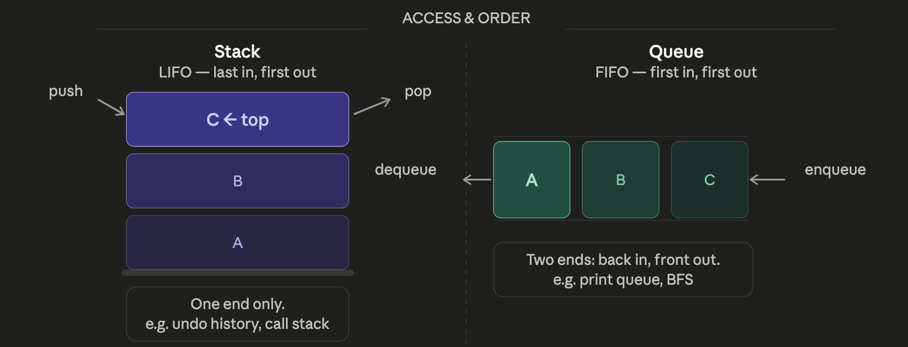

## Hash Tables

- All types of data
- Hash function --> converts any key into an integer index.
- Load Factor --> once the table gets too full (typically > 0.7), it doubles its bucket count and rehashes everything. This keeps the average case at O(1), at the cost of occasional O(n) resize spikes.
- Collision:
- Seperate Chaning
  - Every bucket is a linked list
- Linear Probing
  - Go to next empty index
- Quadratic Probing
  - +1, +4, +9
  - Causes secondary clustering
- Double Hashing
  - Second hash function

## Binary Trees

- Level Order
- Pre-order - root, left, right
- In-order - lef, root, right
- Post-order - left, right, root
- Left child of index -- i = 2i
- Right child of index -- i = 2i + 1
- Parent of index -- i / 2

## Heaps

- Complete binary tree
- Max Heap --> Every parent is bigger than its child
- Min Heap --> Every parent is smaller than its child
- Organize data top down
  - Binary trees organize data left to right
- Sift-up operation
  - Add the node at the end
  - Compare with parent untill it is in place
- Delete (Extract the data at the roor)
  - Copy the last item to the root
  - Sift-down
- If the root is placed at index 1 in an array: The left child will be at 2 * index  The right child will be at 2 * index+1 Parent of any node will be at index/2 

## Graphs

- Directed and undirected
- Weighted and unweighted
- Depth First
  - Progress untill dead end
  - Needs a boolean visited array
  - Uses stack, if no unvisited neighbor left, remove node from stack

  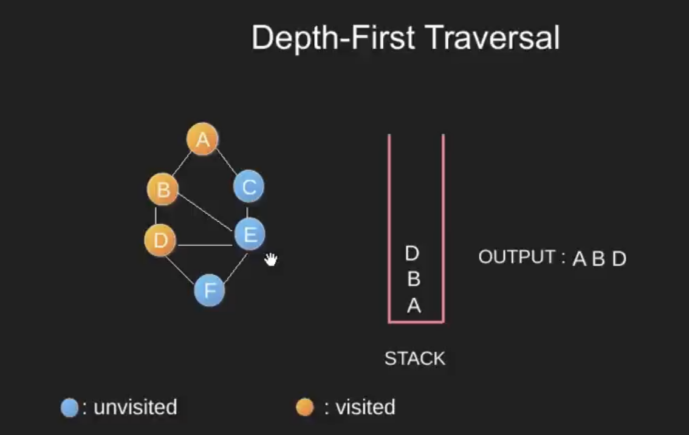

- Bredth First
  - Uses a queue and a visited array
  - Traverse nodes in layers
  - Like level-order

    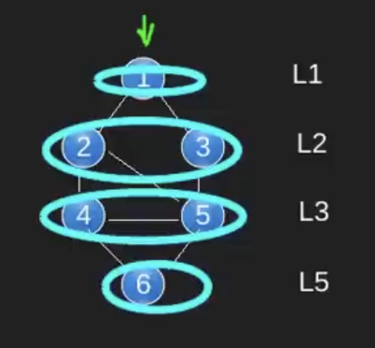

- Dijkstra, bellman-ford
- A* --> Dijkstra with heuristic approach