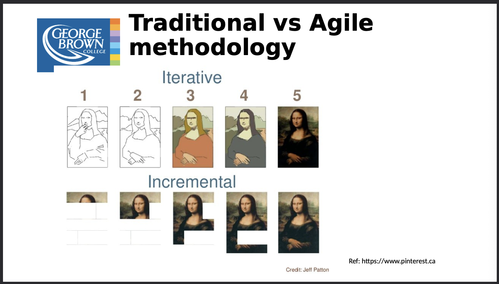
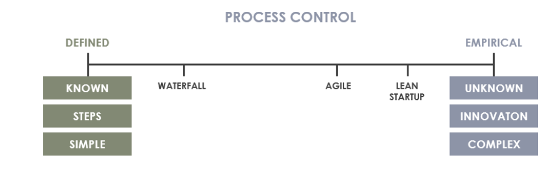
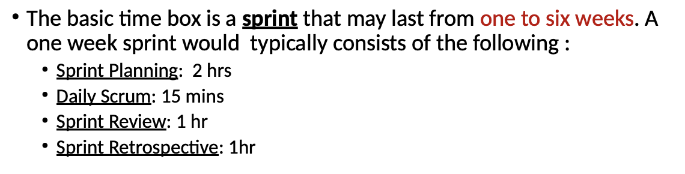
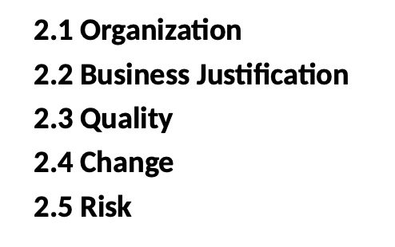
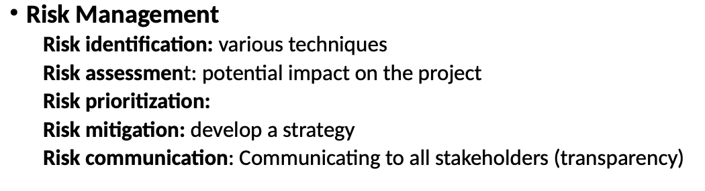
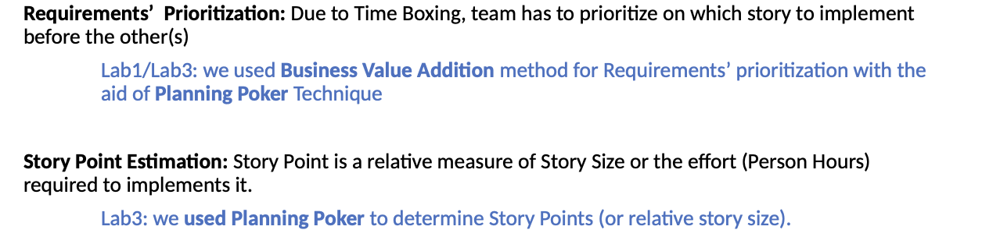
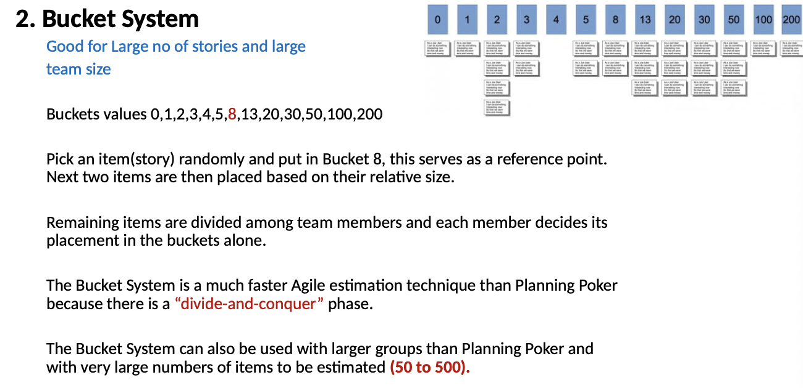
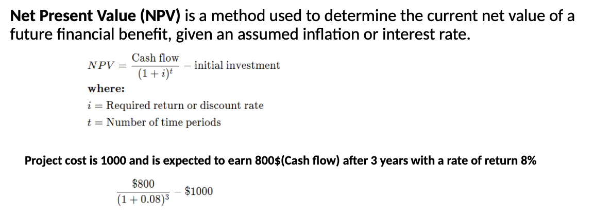
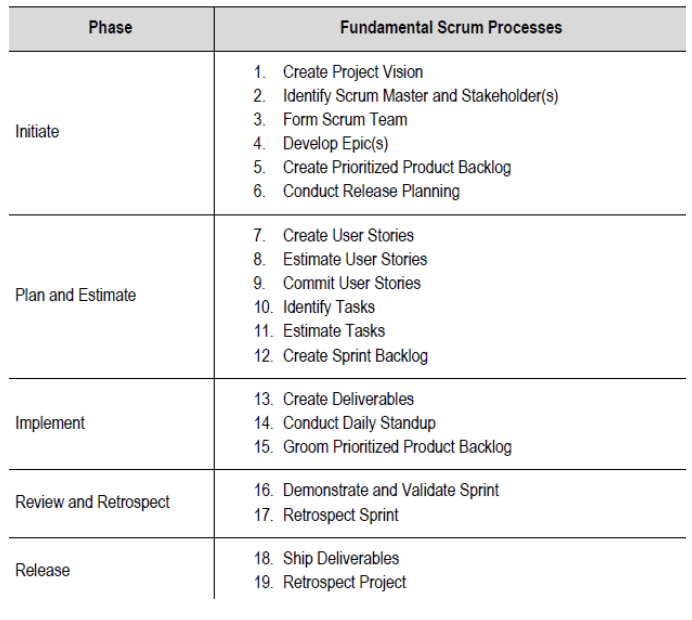

# Introduction to Agile Software Development

- Agile software development is an iterative and flexible approach to building software that emphasizes collaboration, customer feedback, and continuous improvement.
- It advocates adaptive planning, evolutionary development, early
delivery, and continual improvement, and it encourages rapid and
flexible response to change

## SCRUM

- Its a lightweight process framework for agile, most popular.
- "A process framefork" is a particluar set of practices that must be followed in order for process to be consistent with the framework
- “Lightweight” means that the overhead of the process is kept as small as
possible.

## SCRUM Principles

- Empirical Proces Control, making decisions through observation, experience, and experimentation rather than detailed upfront planning.
- Self-organization
- Collobration
- Value-based Prioritization
- Time-boxing
- Iterative Development

## SCRUM Team Roles

- PM - Product owner --> representative of customer.
- Development Team, 9 people
- Scrum Master --> is not a traditional team lead or project manager but
acts as a “servant-leader” and supports the development team while
ensuring that the scrum framework is being followed.

## Workflow

- Sprint
  -  time unit for scrum usually between one week and one month, usually 2 weeks.
- Sprint Planning Meeting 
  - held at the beginning of each sprint to discuss and
    agree on the scope of work that is intended to be done during that sprint.
- Daily Scrum, a daily meeting
- Sprint Review, end of the sprint meeting
- Sprint Retrospective
  - meeting held at the end of a sprint to reflects on the past
sprint

## SCRUM Artifacts

- Product Backlogs
  - a breakdown of work to be done and contains an ordered
    list of product requirements in the form of user stories other items are bug fixes,
non-functional requirements.
- Sprint Backlog
  -  is the list of work the development team must finish during the
n   ext sprint.
- Product Increment
  - Potential relasable output for each sprint. Also a implementation of sprint backlog items naturally.

# SCRUM Framework

## SCRUM Principles

- **Emprical Process Control** is based on observation and experimentation instead of detailed, upfront planning and defined process
- **Scrum teams** are **self-organizing** and the team chooses how best to
accomplish its work instead of being directed/controlled by any one not
even the Scrum Master
- The scrum team consisting of the scrum master, product owner, development team collaborate with each other and the client.
- **Product backlog** items or software features are prioritized based on theri business value addition.
  - The “business value” could be derived by getting customer input based on interviews, surveys and then analysed using financial analytical tools
  

- **User Stories** are impleneted as features gradually in multiple iterations.
  - Sprint team better understands the story after each iteration
  - Change requests from the client can be implemented in next iterations.

## SCRUM Aspects

- **Business Justification**, means that the development and implementation would add value to the organization wheter its tangible or intangible.
- Tangible value could be assessed using financial tools such as ROI
(Return on Investment), NPV (Net Present value) or IRR (Internal Rate
of Return)
- Intangible value is hard to quantify; customer satisfaction, public
service etc.
- **Quality** is determined by;
  - **Quality Management**
  - **Continuous Improvement** of product backlog items
  - **Acceptence Criteria**, each user story has one to ensure quality
  - **Done Criteria**, acceptence criteria for entire product.
- **Change** was traditionally bad, now its a window for improvement.
  - Changes in user stories will trigger change in the Prioritized Product Backlog and the process of updating both items is called “Grooming” the Product Backlog.
- **Risk**  is defined as “an uncertain event that can affect the objectives of a project and may contribute to its success or failure.”

## SCRUM Processes

## User Stories and Personas

### User Story (Scrum)

A **User Story** is a short, simple description of a feature written from the perspective of the end user.

### Purpose

* Capture requirements in a user-focused way
* Encourage conversation within the team
* Focus on delivering value

### Common Format

> *As a* [type of user],
> *I want* [goal/action],
> *So that* [benefit/value].

**Example:**

> As a student, I want to submit assignments online, so that I can meet deadlines easily.

### Key Characteristics (INVEST)

* **I**ndependent
* **N**egotiable
* **V**aluable
* **E**stimable
* **S**mall
* **T**estable

### Related Concept

User stories are stored and prioritized in the **Product Backlog** in Scrum.

### Persona (Scrum / Agile)

A **Persona** is a fictional representation of a typical user based on research and real data.

###  Purpose

* Help the team understand users better
* Improve empathy and user-centered design
* Guide decision-making

###  Persona Includes:

* Name and background
* Goals
* Frustrations / Pain points
* Behaviors
* Needs

**Example Persona:**
**Name:** Alex (22, College Student)
**Goal:** Quickly check grades on mobile
**Pain Point:** Complicated navigation

### Relationship Between User Stories and Personas

* **Personas** represent *who* the users are.
* **User Stories** describe *what* those users need.
* Personas make user stories more realistic and user-centered.

## Backlog

- The agile product backlog in Scrum is a prioritized features list, containing short descriptions of all functionality desired in the product
- **Backlog Items** contains;
  - Features
  - Bugs
  - Technical Work
  - Knowledge acquisition

    

## Prioritizaition

# Agile Project Management

### Traditional vs Agile Planning

## SCRUM Estimation Techniques

### Story Prioritization Estimation

- **Business Value-Addition**
  - each requirement carries a business value it could potentially generate to the company, decided by Product Owner.
- **MoSCoW**
  - M-Must have this
  - S-Should have this if at all possible
  - C-Could have this if it does not affect anything else.
  - W-Won't have this time bu would like in the future.
- **KANO**
  - ***Exciters/Delighters***, high value features.
  - ***Satisfiers***, features that offer value
  - ***Dissatisfiers***, features that, if not present, are likely to cause a customer to dislike the product but no effect if they are present.
  - ***Indifferent***, no effect, eliminated.
- **Technology Risk Based**
  - In this method, requirements are prioritized based on the risk associated in implementing it.

### Story Point Estimation Techniques

- **Planning Poker**              
  - Participants use specially-numbered playing cards to vote for an estimate of an item. 

### Task Mapping

## Agile Project Justification

- Scrum focuses value-driven delivery.
- The sponsoring organization should perform a proper business justification and create a viable Project Vision Statement prior to starting any project.

### ROI - Return on Investment

- Ratio between net profit and the cost of investment
- ROI = (Project Revenue - Project Cost) / Project Cost

### NPV - Net Present Value

- 

### Payback Period

- The amount of time it takes to recover the cost of an investment
- Payback period = Initial Investment / Net cash flow per period

## Quality Management

- The ability of the ompleted product or deliverables to meet the Acceptance criteria and achieve the business value expected by the customer
- Scrum adopts an approach of continuous improvement by keeping the Prioritized Product Backlog updated with any changes in requirements
- **Quality Assurance**
  - “Quality assurance refers to the evaluation of processes and standards that govern quality management in 

### Quality Planning

- Quality planning in Scrum ensures that essential features are prioritized, technical debt is managed within the Sprint, and acceptance criteria guide development toward a potentially shippable product.

### Quality Control

- Quality control in Scrum is the continuous execution of quality activities during the Sprint, supported by inspection, adaptation, and an evolving Definition of Done.

## SCRUM Phases

- Review lecture 4 for detail

