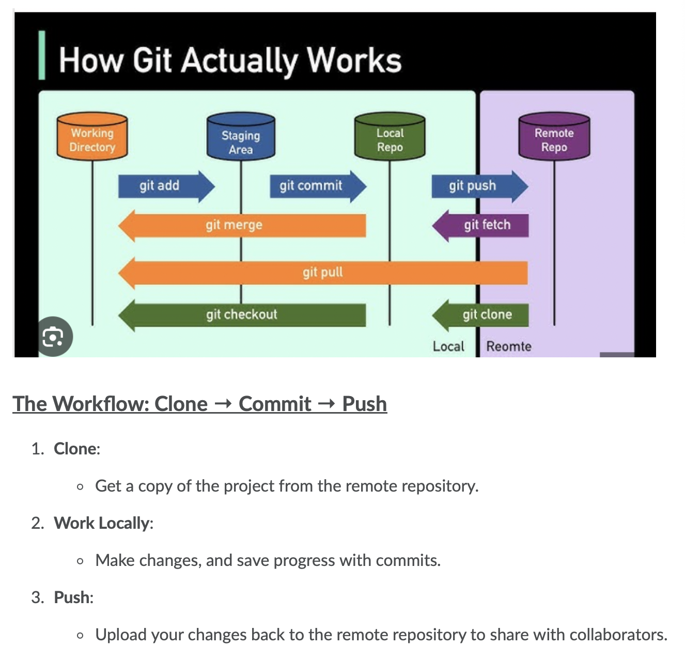
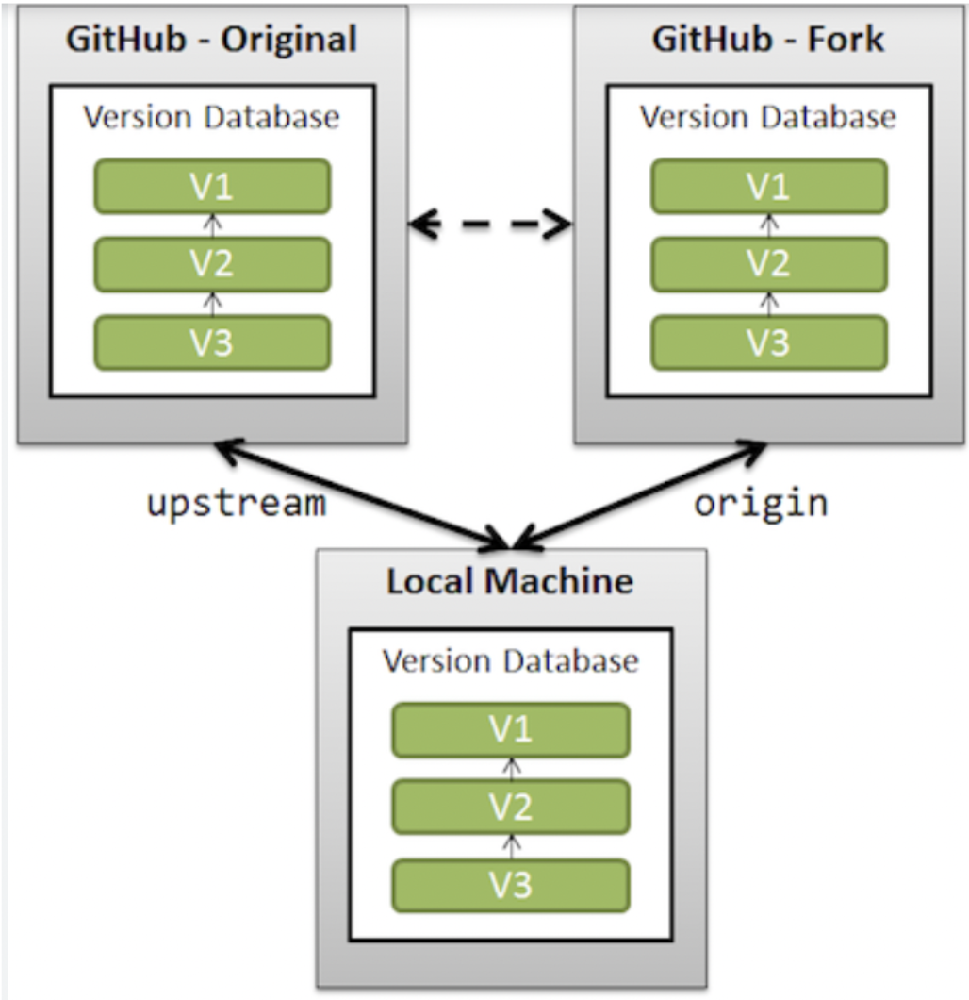
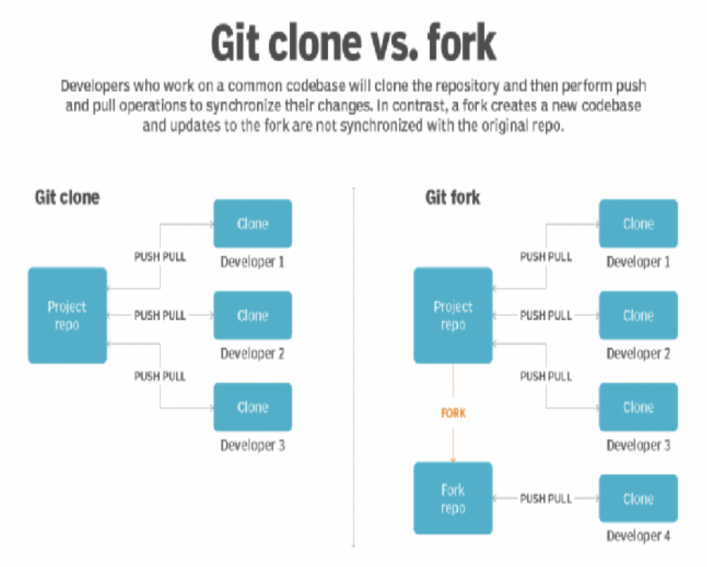
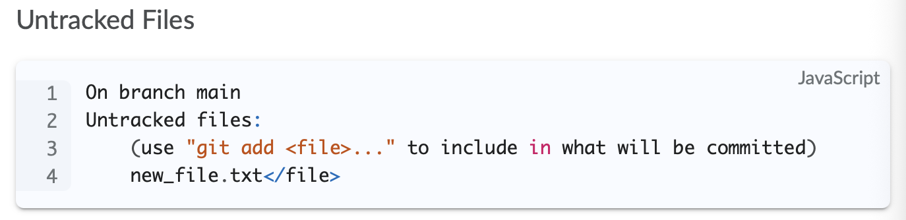
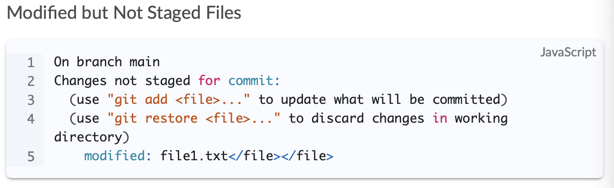
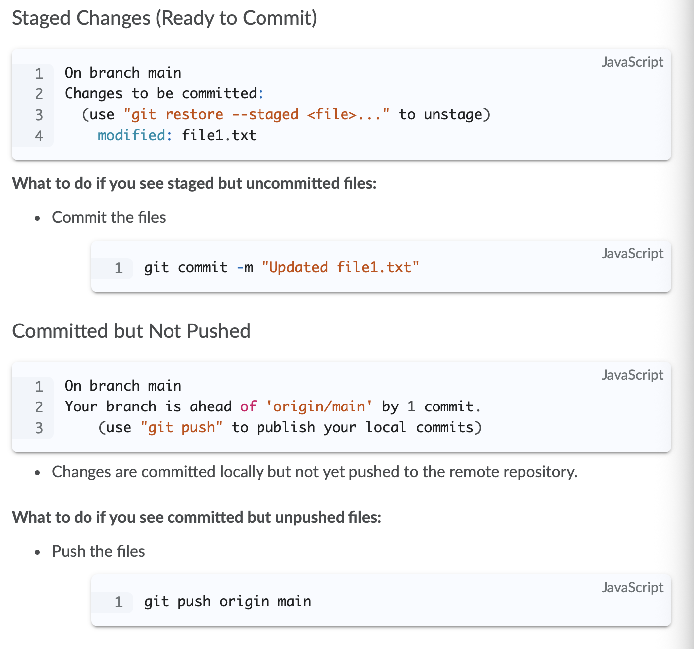
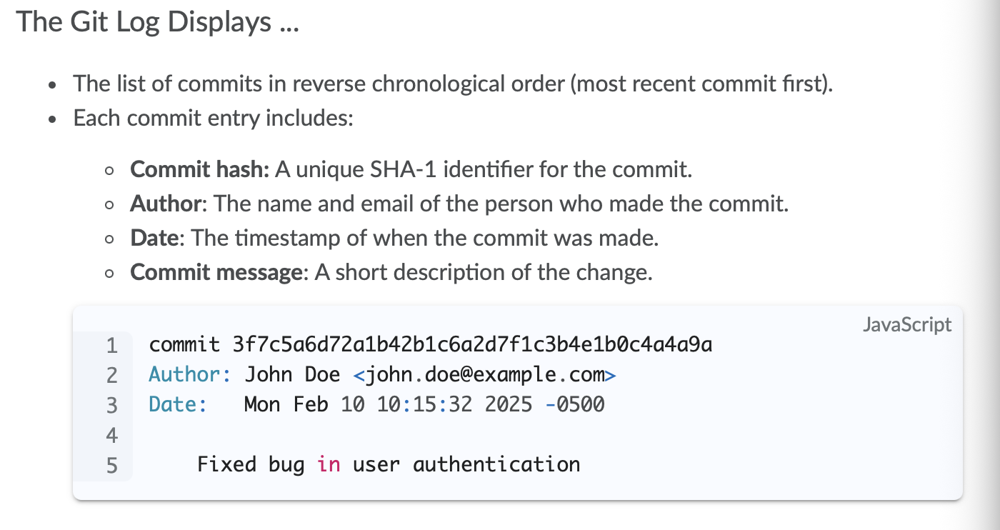

# Git

- Git is a distributed version control system that helps devs:
  - Track changes
  - Collaborate
  - Manage different versions

## Clone

- Clone creates a local copy of a repo from a remote source.
  - Github or GitLab, etc.
- Clone allows you to have entire project including version history, branches, files etc.
- Enables you to work on offline
- Serves as a local backup
- Ensures you have the full project history

## Commit

- Commit is a snapshot of changes made to the files in your repo. A checkpoint in the history. You record and save progress.
- Tracks changes over time, provides a rollback mechanism in case of errors.
- Facilitates collaboration by letting others understand what changes were made and why.

### Commit Steps

- **Staging Changes*:** You choose which changes you save and ad them to the "staging area"
- **Recording the Snapshot:** Git bundles staged changes into a commit with a message describing the update.
- **Unique Identifier:** Each commit is assigned a unique hash to track it.

## Push

- Pushing sends your committed changes from your local repository to the remote repository.
- Shares your progress with others
- Keeps remote repo updated 
- Syncs work across team

### Push Steps

- **Check Local Commits:** Only the commits that are not already on the remote are pushed.
- **Send Data to Remote:** Git transfers the changes to the specified branch in the remote repository.
- **Sync:** Remote repo updated.




## Git Branches

- Branches are pointers to a specific set of commits -- nothing more

### Branching Workflof Steps

- git branch
- git checkout
- git push

## Git Fork

- A personal copy of someone else’s Git repository that you make under your own account.
- Work without directly modifying the original repo.
- Especially useful when you want to add a new feature without introducing any bugs in the original repository



### Steps

- Go github, fork any repo
- Clone your fork with git clone
- Make changes, stage and commit
  - git add
  - git commit
  - git push (push to forked repo)



## Git Status

- The git status command is used to check the state of the working directory and the staging area in a Git repo.
- You can see;
  - changes
  - which files staged for commit
  - if there are any untracked files
  - wheter there are any changes that need to be pushed or pulled

## Possible git status Outputs




- Git detected there are new files that haven't been added to the staged area.
- These files are exists in your working dir but never been added to git.
- You can stage files or use statement below ignore it so it never staged.
```
echo "untracked_file" >> .gitignore
```




- You can stage them
- If you want to keep the changes but not commit yet, you can stash them:
```
git stash
```

- Or you can discard changes:
```
git restore existingfile.txt
```




## Git Log

- The git command displays the history of commits in a Git repository
  - What changes have been made, who made them, and when they were committed



```
// you can use:

git log --grep="authentication"
git log --author="John Doe"

git log -n 5 // show only last 5 commits
```

```
// Visual representation of branch history
git log --oneline --graph --all

// output
* 3f7c5a6 (HEAD -> main) Fix login issue
* b4e1b0c Update README
| * a2d7f1c (feature-branch) Add new feature
|/  
* e1b0c4a Initial commit
```
