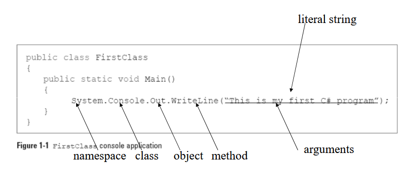
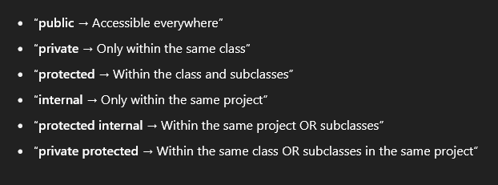
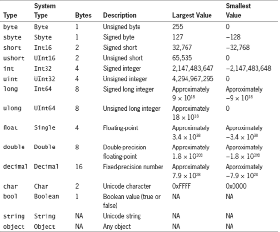
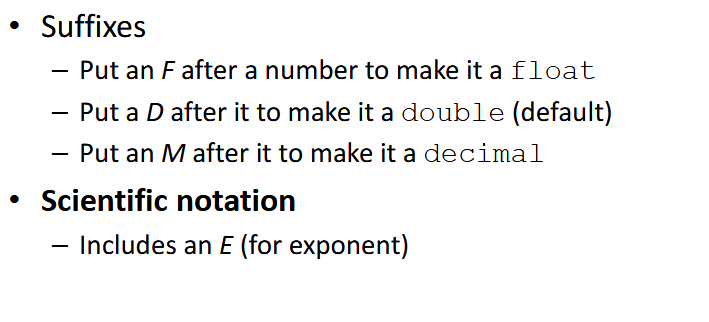
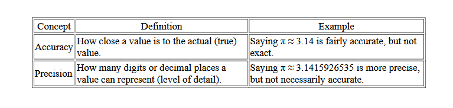
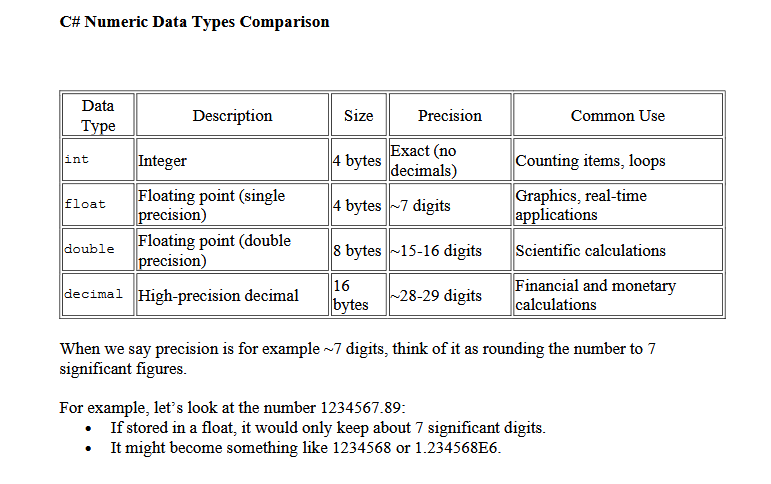
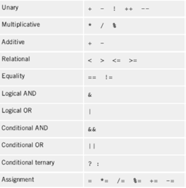

# C# Object Oriented Programming

## What is Object Oriented Programming
- Procedural Program
  - Create and name computer memory locations that can hold values (variables)
  - Write a series of steps or operations to manipulate those values.
- Identifier
  - Name of the variable
  - One word
- Procedures or Methods
  - Logical units that group individual operations used in a computer program.
  - Can be called or invoked by other methods or procedures.
- Objects
  - Contain their own variables and methods.
  - Attributes of an object represent its characteristics
  - State of an object is the collective value of all its
attributes at any point in time
- Class
  - A category of objects or a type of object/
- Encapsulation
  - Encapsulation is the process of hiding an object's internal data and only allowing access through public methods, to protect and control how that data is used.
  - Encapsulation means keeping data private inside a class and accessing it through public methods.
- Inheritance
  - Inheritance allows a class (child/subclass) to inherit attributes and methods from another class (parent/superclass).
- Polymorphism
  - Polymorphism means the ability of a single function, method, or object to behave differently based on the context or the object that is using it.
```
 class Animal
{
    public virtual void Speak() {
        Console.WriteLine("Animal makes a sound");
    }
}

class Dog : Animal
{
    public override void Speak() {
        Console.WriteLine("Dog barks");
    }
}
```
- Compile-time Polymorphism
  - Or Method Overloading
  - More than one method with same name, attributes or parameters or type can be different. Compiler knows which to use.
```
class Calculator
{
    public int Add(int a, int b)
    {
        return a + b;
    }

    public double Add(double a, double b)
    {
        return a + b;
    }

    public int Add(int a, int b, int c)
    {
        return a + b + c;
    }
}
```

- Run-time Polymorphism
  - The method in base class have to be virtual
  - A class overrides a method taken by parent or another class.
```
class Animal
{
    public virtual void MakeSound()
    {
        Console.WriteLine("Some animal sound");
    }
}

class Cat : Animal
{
    public override void MakeSound()
    {
        Console.WriteLine("Meow");
    }
}

class Dog : Animal
{
    public override void MakeSound()
    {
        Console.WriteLine("Bark");
    }
}

Animal myAnimal = new Dog();
myAnimal.MakeSound();  // Output: Bark

myAnimal = new Cat();
myAnimal.MakeSound();  // Output: Meow
```


- Abstraction
  - Abstraction means hiding complex implementation details and showing only the essential features of an object.


## C# Programming Language
- Object oriented
- Part of Microsoft Visual Studio
- Every piece of data treated as object
- Contains a GUI
- Modeled after C++



- Namespace: Used to group similar classes.
- Method header: includes the method name and information about what
will pass into and be returned from a method
- Method Body: Code goes here, inside the curly brackets.
- Keywords: Predefined and reserved identifiers that have special
meaning to the compiler.
-Access Modifiers: Access modifiers control the visibility of class members (fields, methods, etc.) from other parts of the code.


## Using Data

- Data Types




### Numeric Type Conversion
- Implicit Conversion: no data loss so automatic
```
int a = 100;
double b = a;  // int → double (auto)
```
- Explicit Conversion: Data loss, had to be manual.
```
double x = 9.78;
int y = (int)x;   // double → int (cut off, .78 is gone)
Console.WriteLine(y);  // 9
```

- System.Convert: Uses Convert.ToX

```
string numStr = "123";
int num = Convert.ToInt32(numStr);  // string → int
```
- Char Data Type:
  - Holds any single Unicode character
  - Place constant character values within single
quotation marks (e.g., 'A')

- String Data Type:
  - Values are expressed within double quotation marks


### Precision vs Accuracy




- Just take a look



- **State controlled loop ===> While/do-while
'''
while (i>10)
- **Count controlled ====> for
- **Sentinel-Controlled Loop: A loop that continues until a special "sentinel" value is entered, which signals the end of input or processing
'''
        input = Convert.ToInt32(Console.ReadLine());

        while (input != -1)
        {
            sum += input;
            input = Convert.ToInt32(Console.ReadLine());
        }

        Console.WriteLine("Toplam: " + sum);
  '''
