# Intro to RDBMS

##  What is a Database?
- Database: Data stored electronically in tables.
- Table: Table is a two dimensional data structure to store data.
  - Columns or Fields (vertical)
  - Rows or Records (horizontal) 
  - Cell, the intersection of a column and a row.
- Primary Key: Column or columns that uniquely represent a row.
- Foreign Key: is a constraint that makes a column in one table refer to the primary key in another table. It is used to create a relationship between tables.

## Relational Database (or paradigm)
- Multiple tables instead of one large table
- These tables related through the mechanism of Primary and Foreign keys.

## What is an ER (or EER) Diagram? 
- Enhanced Entity-Relationship Diagram (EER)
- Entity-Relationship Diagram (ER)
- A diagram that shows entities and how are these entities related
to each other.
- Entity: An abstraction for a table (where real life examples stored and named)
- Entities have attributes that are represented as columns in the tables

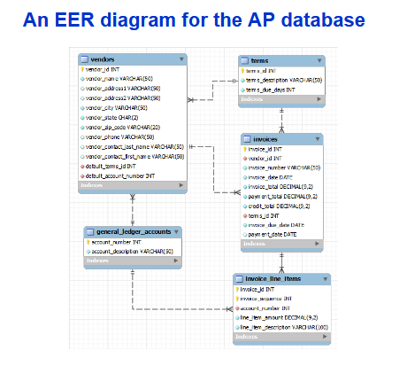

## Database Models

- Flat File: 
  - A simple data model that stores data in a single table or text file without relationships.
📝 Example: CSV files.
- Hierarchical Model: 
  - Organizes data in a tree-like structure with parent-child relationships.
📝 Each child has only one parent.
- Network Model:
  - Similar to hierarchical, but each child can have multiple parents.
📝 Represents complex many-to-many relationships.
- **Relational Model**:
  - Stores data in tables with rows and columns, using keys to define relationships.
📝 Used in RDBMS like MySQL, Oracle, SQL Server.
- Object-Oriented Model:
  - Stores data as objects, similar to object-oriented programming.
📝 Includes attributes and methods.
- Object-Relational Model:
  - Combines relational and object-oriented features.
📝 Adds object features to traditional tables.
- NoSQL:
  - Non-relational databases designed for large-scale and flexible data.
📝 Ideal for Big Data. Types: Document, Key-Value, Column, Graph.

## SQL: Structured Query Language
- Standardized language for working with any relational database.
- The SQL Interface:
    The application software (MySQL Workbench in our case) communicates
    with the RDBMS by sending SQL queries through the data access
    API

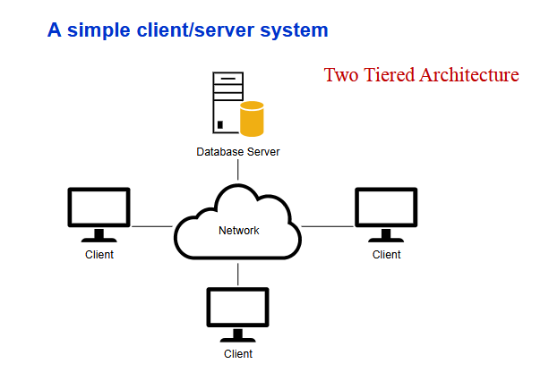
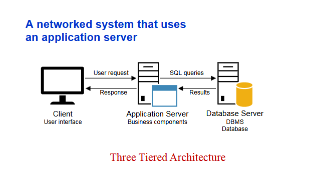
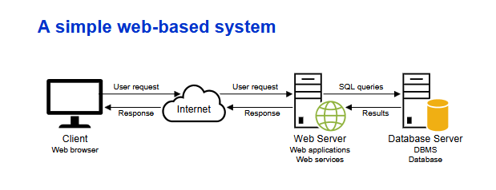

## MySQL Data Types
- CHAR, VARCHAR for character or textual data
- INT for integers  (Whole numbers)
- Decimal, float
- Date 

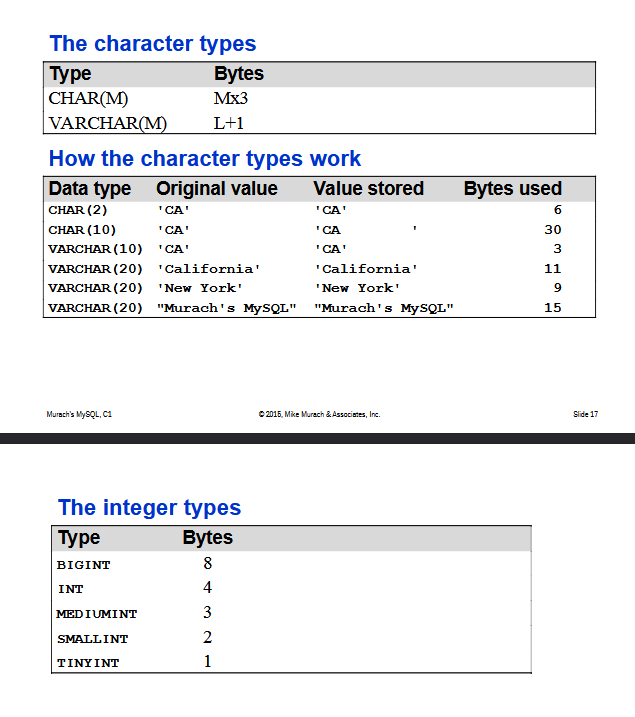
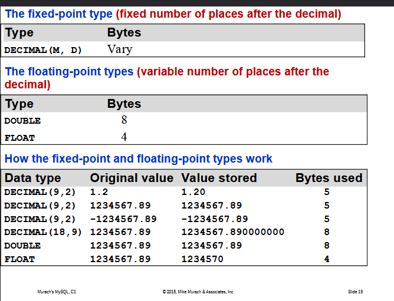
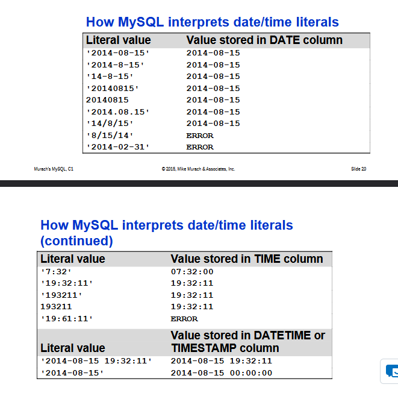

- Data migration issues, Most applications require modification when moved from one to another database.

## SQL Examples

- SELECT *
FROM ………….
WHERE ………. LIKE ‘%word%’
ORDER BY 1;
- SELECT (…………..) AS Balance
FROM……..
WHERE …. LIKE …..
- ROUND(number, decimal)
- CONCAT(str1, str2, ………………., strN)
- IS NULL
- SELECT ….
FROM ….
WHERE vendor_state IN (‘WI’, ‘DC’)
- SELECT DISTIINCT
LIMIT 5;
- LEFT(string, number_of_char)
RIGHT(string, number_of_char)
- CONCAT_WS(separator, str1, str2, ……………………., strN)
- ORDER BY DESC, ORDER BY ASC
- LENGTH(), CHARACTER_LENGHT()
- SUBSTRING_INDEX(string, delimiter, count)
- SUBSTRING_INDEX(john.example, ‘.’, 1) ====➔john
- SUBSTRING_INDEX(john.example, ‘.’, -1) ====➔example
- SUBSTRING_INDEX(john.example, ‘.’, 2) ====➔john.example
- REPLACE(org_string, search_string, replace_string)
- SELECT student_name,
CASE
WHEN grade >= 90 THEN ‘A’
ELSE ‘F’
END AS grade;
- SELECT invoice_number, invoice_date, invoice_total
FROM invoices
WHERE invoice_date BETWEEN '2014-06-01' AND '2014-06-30'
ORDER BY invoice_date;

- CREATE TABLE

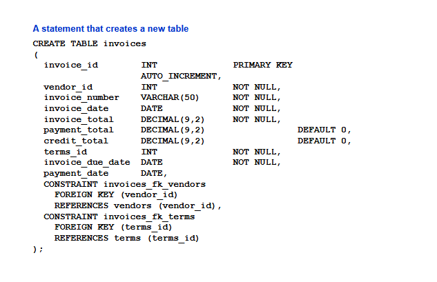

-   ALTER TABLE invoices
ADD balance_due DECIMAL(9,2)

    -**Adds new column**

-   ALTER TABLE invoices
    DROP COLUMN balance_due
    
    -**Delete column**

-   CREATE INDEX invoices_vendor_id_index
    ON invoices (vendor_id)
    
    -**Create index**

-   DROP INDEX invoices_vendor_id_index
    
    -**Delete index**

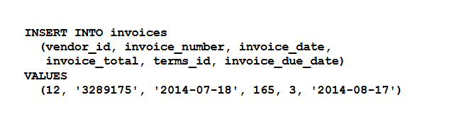
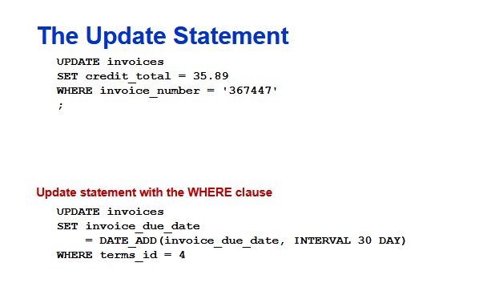
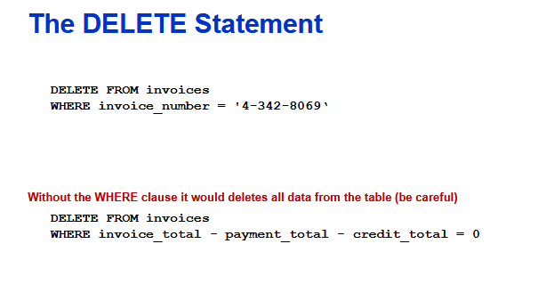

## Database Design
- Database modelling is the process of defining how data is stored, organized, and related within a database system. It often starts with an Entity Relationship Diagram (ERD).
- Types of relationships:
  - **One-to-One (1:1):**
    - One record in Table A relates to only one record in Table B.
    - Example: Person ↔ Passport. One person can only have one valid passport.
  - **One-to-Many (1:N)**
    - One record in Table A can relate to many records in Table B.
    - Example: Customer → Orders. One customer can give multiple orders.
  - **Many-to-Many (M:N)**
    - Multiple records in Table A relate to multiple records in Table B.
    - Example: Students ↔ Courses. Multiple students can attend multiple courses.
- Cardinality & Multiplicity
  - **Cardinality:** Cardinality defines how many instances of one entity can or must be associated with another entity.
  - Cardinality = How many?
  - Student and Course example:
    - How many courses can each students attend?
    - How many students can each course be open to?
    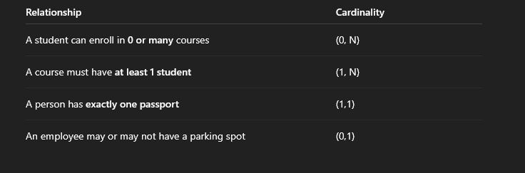
  -  **Multiplicity:** What range of instances is allowed? (visually in ERDs) 
  -  Multiplicity is basically the graphical or symbolic representation of cardinality.
    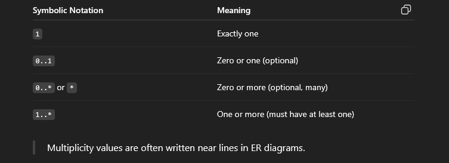S