# FULL STACK

## HTML CSS Review

### Flexbox
- The main idea behind the flex layout is to give the container the ability to alter its items’
width/height (and order) to best fill the available space
- Flexbox is considered a one dimensional layout, meaning that flexbox deals with layout in
one dimension at a time — either as a row or as a column

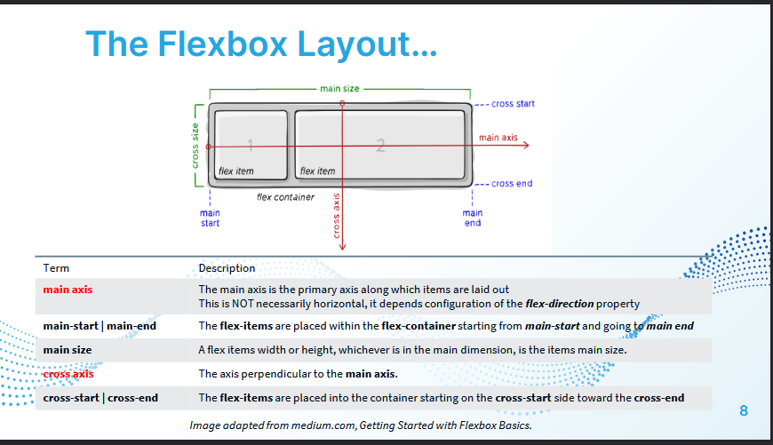

- **CSS Properties for the Flex-box container**

```
display: flex;
lex-flow: row wrap;
flex-direction: row ; //NOTE ROW IS  DEFAULT
flex-wrap: wrap;
justify-content //align the item on the main axis
justify-content: space-evenly; 
justify-content: flex-start  //if the direction is row
align-items: center: // align the item on the horizontal axis
    //the align-items property of        flex-box aligns the items inside a  flex container along the cross axis just like justify-content does along the main axis.
    //But align-content is for multi line flexible boxes. It has no effect when items are in a single line. It aligns the whole structure according to its value. 
align-items: stretch; //NOTE STRETCH IS DEFAULT
```

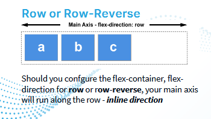
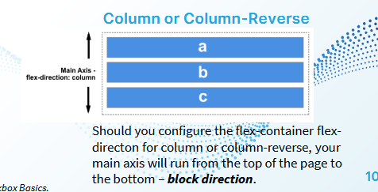
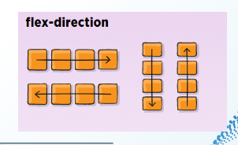

- **CSS Properties for the Flex-box items**
```
order: 0; NOTE 0 IS DEFAULT
flex-grow: 0;
flex-shrink: 1;
flex-basis: 100px;  this gonna check flex-grow/shrink first
align-self: auto | flex-start | flex-end | center
```  

### Grid Layout
- FJust like flexbox but two dimension.
- CSS Functions used with grid:
```
repeat(#times, size)
grid-template: repeat(3, 180px) / repeat(2, 100px);
minmax(minsize, maxsize)
grid-template-columns: minmax(min-content, 350px) minmax(150px, 1fr) 120px;
```
- The minmax() function is typically used within the track list of the repeat() function to
    specify the minimum and maxium sizes of one or more tracks
- When you use the auto-fit keyword on the repeat(), as many grid items as will fit in the
available space will be placed in the container and they will be expanded when necessary
to fit the available space.

- Css properties for grid containers
```
display: grid;//similar to display: flex;
grid-template: rows / columns //combo property
grid-template: row;
grid-template: column;
grid-gap: gapSizeForRow, gapSizeForRow
justify_content
justify-items //horizontally centers the items 
align-items  //vertically centers the items 
align-content
```

- **fr Unit:** Represents a fraction of the available space in a grid container.
- Can be used with mixed units.

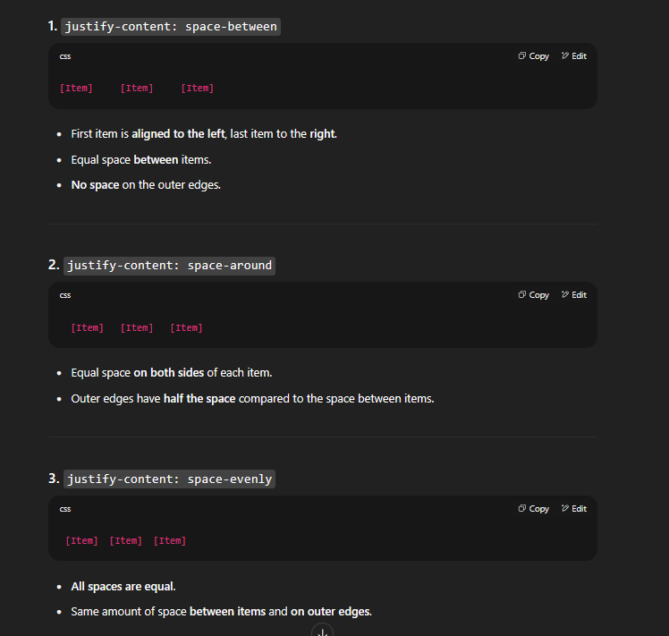

- **Grid template examples:**

```
grid-template-areas:
    "section-1 section-2"
    "section-3 section-4"
    "empty empty"
    ;

#section1 {
    background-color: purple;
    grid-row: 1 / 2 ;
    grid-column: 1 / 3;
}

#last-section {
    background-color: brown;
    grid-row: 5 / 6;
    grid-column: 1 / 3;
}
```

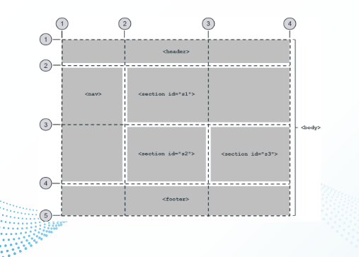

- Named lines example

    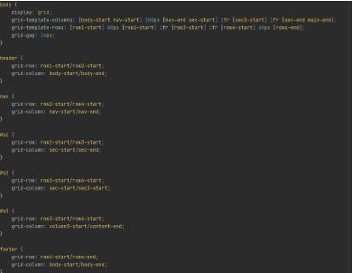


## JavaScript Objects, Hoisting and Destructuring

### JS Break Continue 
```
Math.floor(Math.random() * (max - min)) + min;
```

- The continue statement end the current
iteration of a loop, but allows the next
iteration to proceed (jumps to the start of the
loop)
- Example:
```
let isRegistered = true;

while(isRegistered){
        console.log("Inside of the while loop");
        let numberRand = Math.floor((Math.random() * 99) + 1); //get a random number between 100 and 1
        console.log("Random number: " + numberRand);
        /*//if random number divisible by three
        if (numberRand % 3 === 0){
            continue;
        }
        console.log("The number was not divisible by three.")
*/
        //if random number divisible by four
        if (numberRand % 4 === 0 ){
            break;
        }
        console.log("Number was not divisible by four. we are inside the while loop")

        isRegistered = false;
}
console.log("Number was not divisible by four. we are outside the while loop")
```

### REGEX

```
Example pattern
let phonePattern = /^\(416\)[0-9]{3}-[0-9]{4}$/;
let phonePatternLong = new RegExp("^\(416\)[0-9]{3}-[0-9]{4}$");
let phoneNumber = "(416)555-4444";
let phoneNumber2 = "(416)234-2937";
```
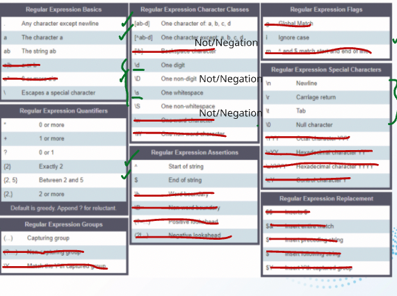

- **Regex Functions:**
```
//exec will return the matched(part of) the string as an array
let phonePattern = /^\(416\)[0-9]{3}-[0-9]{4}$/;
let phoneNumber = "(416)555-4444";
let phoneNumber2 = "(416)234-2937";
let returnResult = phonePattern.exec(phoneNumber2);
console.log(returnResult);

// Out
    Array [ "(416)234-2937" ]
        0: "(416)234-2937"
        groups: undefined​
        index: 0​
        input: "(416)234-2937"
        length: 1
        <prototype>: Array []
```

<hr>

```
//test will return boolean to indicate success match or no match
let phonePatternLong = new RegExp("^\(416\)[0-9]{3}-[0-9]{4}$");
let phoneNumber = "(416)555-4444";
let phoneNumber2 = "(416)234-2937";
let badPhoneNumber = "(416)234-29379";
let returnTest = phonePattern.test(badPhoneNumber);
console.log(returnTest);

// Out
    False
```

<hr>

```
//search function (that belongs to the string class) returns the
// index of the first match or -1 if there's no match
let phonePattern = /^\(416\)[0-9]{3}-[0-9]{4}$/;
let phoneNumber = "(416)555-4444";
let phoneNumber2 = "(416)234-2937";
let returnSearch = phoneNumber.search(phonePattern);
console.log(returnSearch);

// out
    0 //because of full match
```

### Objects
```
//longhand of instantiating a new object called puma
//from the class Object
const puma = new  Object();
puma.name = "angry";
puma.size = 20.77;
puma.limbs = {
    arms: 2,
    legs: 2,
    tail: 1

}
```

<hr>

```
//shorthand of instantiating a new object called tiger
//from the class Object
const tiger = {
    name: "fluffy",
    size: 34.55,
    limbs: {
        arm: 2,
        legs: 2
    }
};
``` 
<hr>

```
//destructuring 2 or more properties from an object at once
let {arms, legs, tail} = puma.limbs;
document.write(arms, legs, tail);

//destructuring 1 property at time
document.write(puma.limbs.arms);

//destructuring 1 property at times using dictionary syntax
document.write(puma.limbs["legs"]);
```

### Hoisting
- Only works with function and var keyword.

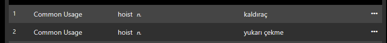

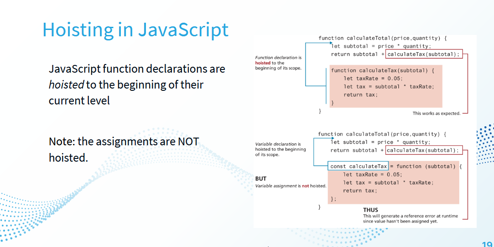

### Spread Operator
- The spread operator (…) is used to expand or
spread an iterable or an array.
```
const arrValue = ['my', 'name', 'is', 'jack']
console.log(arrValue) //['my', 'name', 'is', 'jack']
console.log(...arrValue) // my name is jack
------------------------
const arr1 = ['one', 'two'];
const arr2 = ['three', 'four'];
const arr3 = [...arr1, ...arr2];
console.log(arr3); // ['one', 'two', three', 'four']
```

### JSON

- JSON is a commonly used data-interchange format
- Has support for unicode

```
const weather_data = '{ "monday": "sunny", "tuesday": "humid" }'
console.log("This is the raw JSON string" + weather_data);
This is the raw JSON string{ "monday": "sunny", "tuesday": "humid"} 
```
- JSON strings use " ` "
- To convert json string to json object we use JSON.parse();

```
const weather_object = JSON.parse(weather_data);
console.log("This is the object version" + weather_object);
console.log(weather_object);
console.log(weather_object.monday)
// Out
This is the object version[object Object]
Object { monday: "sunny", tuesday: "humid" }
    monday: "sunny"
    tuesday: "humid"
    <prototype>: Object { … }
sunny
```

- To convert json object to json string we use JSON.stringify();
```
const weather_data_weekend = {
    wednesday: "cloudy",
    thursday: "light showers"
}
const weather_data_weekend_object = JSON.stringify(weather_data_weekend);
console.log("Weather weekend data turned onto a string so it can be passed over the web")
console.log(weather_data_weekend_object)
// Out
Weather weekend data turned onto a string so it can be passed over the web
{"wednesday":"cloudy","thursday":"light showers"}
```

### Functions

- Parameter when declaring, argument when calling

```
//When defining a function, add parameters into the round brackets
function calculate(num1, num2){
    let  quotient = num1 / num2;
    console.log(" quotient in function scope ", + quotient)
    console.log("This one actually created and deleted with function")
    return quotient;
}

// when calling a function, add arguments into the round brackets
let quotient = calculate(5, 7);
console.log(" quotient in main execution scope ", + quotient);
```

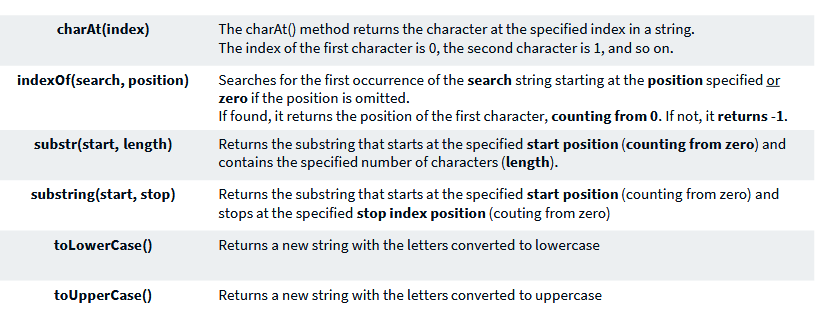

- **Anonymous functions:**
  - No name
  - But pseudo name can be added by saving the function into a variable
  - These will be useful later on for callback function:
    - A callback is a function definition passed as an argument to another function call
```
//definition
const calculate = function (num1, num2){
    return num1 / num2;
}
//call
console.log(calculate(1, 2));
-------------
let result = calculate(1, 2);
console.log(result)
```

- **Arrow functions:**
```
//classic arrow syntax
const calculate = (num1, num2) => {
    return num1 / num2;
};
```
- **Shorthands**
```
// Only 1 parameter no brackets
const greet = name => {
  console.log("Hello " + name);
};

// 2 or more parameters need brackets
const sum = (a, b) => {
  return a + b;
};

// If there is only one line for return, no need return keyword or {}
const sum = (a, b) => a + b;

// If return is an object () is needed
const getUser = () => ({ name: "Berhan", age: 25 });

//If no parameter () is needed
const sayHi = () => "Hi!";
```

- **Default Parameters**
```
// anonymous function definition with default paramters
const add = function (num1, num2=6){
    return num1 + num2;
}

//Call the anonymous function
console.log(add(5, 6)); //equals to 11
console.log(add(10)); //equals to 16


const subtract = function (num1=8, num2){
    return num1 - num2;
}
//You cannot put your default parameters at the start of the parameter list
console.log(subtract(10));//NaN


//Define an arrow function
const multiply = (num1=3, num2=4) => num1 * num2;

//Call the arrow function
console.log(multiply(3, 4));//3 and 4 passed
console.log(multiply(8, 7));// 3 and 4 overwritten
console.log(multiply()); // 3 * 4 default
```

- **Rest Parameters**
```
//all_args rest parameter will take AS MANY arguments as were passed in but places them all into an array
const divide = function (...all_args){
    return all_args[0] / all_args[1];
};

console.log(divide(1, 2));
```

- **Callback functions:**
- A function definition passed as an argument to another function call.
- The call back function itself is preferred to be of syntax: anonymous or arrow function - not regular function
```
const exponent = function(num1, power, intermediate_calc){
    //Add 3 to num1 then do the power
    let result = intermediate_calc(num1, 3);
    return result ** power;
}
```
