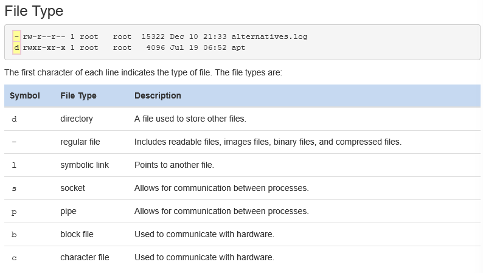
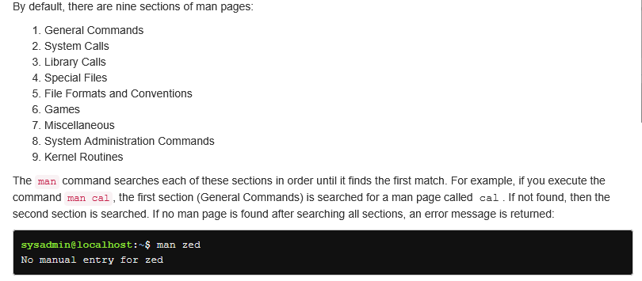
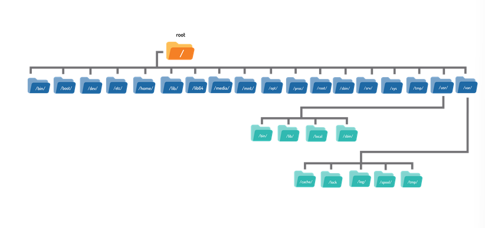
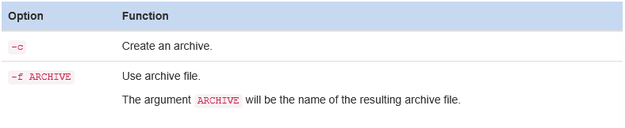
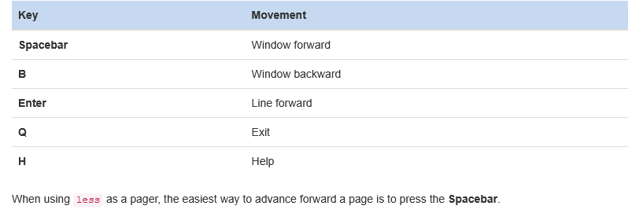
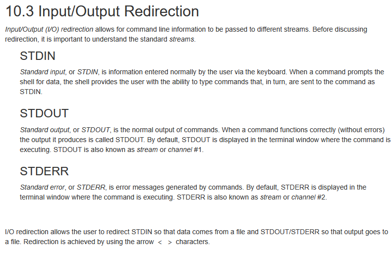
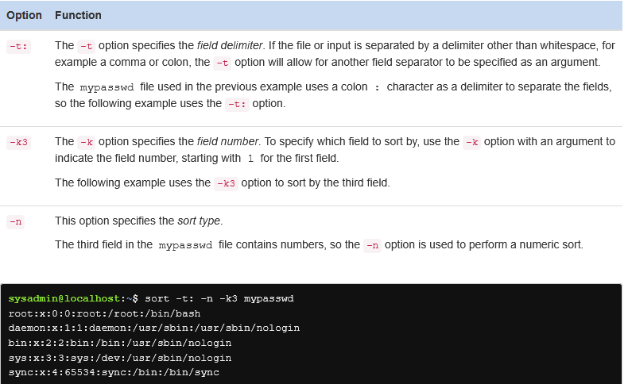
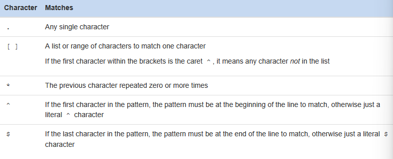
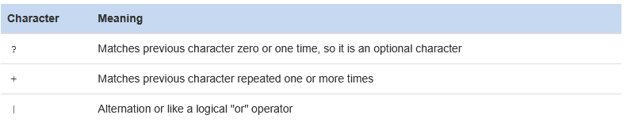

# Linux

- Linux is a kernel.
- Mostly we use a combination of GNU/Linux
  - GNU: GNU is the free software that provides open source equivalents of many common UNIX commands. 
- UNIX by AT&T Bell Labs, written in C.
  -  However, UNIX is now both a trademark and a specification, owned by an industry consortium called the Open Group. Only software that has been certified by the Open Group may call itself UNIX.
- Linus Torvalds, University of Helsinki.
- Linux isn't UNIX certified its called UNIX-like.
- Applications make requests to the kernel and in return receive resources, such as memory, CPU, and disk space.
- For Windows-centric file sharing, Samba is the clear winner. Samba allows a Linux machine to look and behave like a Windows machine so that it can share files and participate in a Windows domain
- The Netatalk project lets a Linux machine perform as an Apple Macintosh file server. The native file sharing protocol for UNIX/Linux is called the Network File System (NFS). NFS is usually part of the kernel which means that a remote file system can be mounted (made accessible) just like a regular disk, making file access transparent to other applications.
- Bourne Shell -----> Bash, C shell-->tcsh, Zshell zsh
- Vi, Vim, Emacs, Nano, Pico
- A package manager takes care of keeping track of which files belong to which package and even downloading updates from repositories, typically a remote server sharing out the appropriate updates for a distribution. In Linux, there are many different software package management systems, but the two most popular are those from Debian and Red Hat.
  - **Debian:**
  - .deb
  - dpkg commands, lowest command for file management, apt-get (a front-end program to the dpkg tool)
  - **Red Hat:**
  - RPM makes use of an .rpm file for each software package. This system is what distributions derived from Red Hat, including Centos and Fedora, use to manage software. Several other distributions that are not Red Hat derived, such as SUSE, OpenSUSE, and Arch, also use RPM.
  - The back-end tool most commonly used for RPM Package Management is the rpm command. While the rpm command can install, update, query and remove packages, the command line front-end tools such as yum and up2date automate the process of resolving dependency issues.
- End User License Agreement (EULA)-----> Windows
- Linux is owned by Linus Torvalds. He has placed the code under a license called GNU General Public License version 2 (GPLv2).
- One caveat to this is that if someone makes changes and distributes them, they must put the changes under the same license so that others can benefit. GPLv2 also says that no one is allowed to charge for distributing the source code other than the actual costs of doing so (such as copying it to removable media).

## Command Line Skills 

### Shell
- Command is passed into a shell.
- The shell is the command line interpreter that translates commands entered by a user into actions to be performed by the operating system. 

### Commands
- A command is a software program that, when executed on the CLI, performs an action on the computer.
```
command [options] [arguments]
ls -a ~/Documents
```

### Arguments
- An argument can be used to specify something for the command to act upon. If the ls command is given the name of a directory as an argument, it lists the contents of that directory. 

```
command [options] [arguments]
ls  ~/Documents

//two arguments
ls /etc/ppp /etc/ssh

```

### Options
- Options can be used with commands to expand or modify the way a command behaves
```
ls -l
drwxr-xr-x 1 sysadmin sysadmin 0 Jan 29  20:13 Desktop             
drwxr-xr-x 1 sysadmin sysadmin 0 Jan 29  20:13 Documents           
drwxr-xr-x 1 sysadmin sysadmin 0 Jan 29  20:13 Downloads           
drwxr-xr-x 1 sysadmin sysadmin 0 Jan 29  20:13 Music               
drwxr-xr-x 1 sysadmin sysadmin 0 Jan 29  20:13 Pictures            
drwxr-xr-x 1 sysadmin sysadmin 0 Jan 29  20:13 Public               
drwxr-xr-x 1 sysadmin sysadmin 0 Jan 29  20:13 Templates           
drwxr-xr-x 1 sysadmin sysadmin 0 Jan 29  20:13 Videos  
```


### Variables
- Local
```
variable=value
x=10
```

- Environmental
```
HISTSIZE
PATH
HOME
env --> used alone lists all environmental variables
env | grep variable1
export variable
```

- Internal commands are built into the shell itself. A good example is the cd
- External commands are binary executables stored in directories that are searched by the shell. PATH variable
  - which command searches

### Aliases
- An alias can be used to map longer commands to shorter key sequences.
  - For example, the command ls -l is commonly aliased to l or ll.
- Lost when the shell is closed
```
alias name=command
alias mycal="cal 2019"
```
### Functions
```
function_name () 
{
   commands
}
```

### Quotes
- Single quotes ' ': Treats everything literally. Variables are not expanded, and special characters are not interpreted.
- Double quotes " ": Allows variable expansion and interprets certain special characters like $, `.
- Backquotes (or backticks) are used for command substitution — the command inside is executed and its output replaces the command.
```
NAME=Berhan

echo 'Hello $NAME'     # Output: Hello $NAME
echo "Hello $NAME"     # Output: Hello Berhan

echo "Today is `date`"    # Output: Today is Sun Jun 15 17:45:00 EDT 2025
echo 'Today is `date`'    # Output: Today is `date`
```
### Man Pages
- Man pages are used to describe the features of commands.
- type / to search
- n --> next
- shift n -->previous



### Info
- The info command also provides documentation on operating system commands and features. The goal is slightly different from man pages: to provide a documentation resource that gives a logical organizational structure, making reading documentation easier.
```
info command
```

### Navigating the File System



- / root
- /home/user 

### Managing Files and Directories

- **Asterisk * Char:** represent zero or more of any character in a filename
- **Question Mark ? Character:** represents any single character.
  - Each question mark character matches exactly one character, no more and no less.
- **Bracket [ ] Characters:** characters are used to match a single character by representing a range of characters that are possible match characters. 
  - if [ab] used that means a or b
  - if[a-z] or [0-9] used that means a range according to ASCII table.
- **Exclamation Point ! Character:** ! character is used in conjunction with the square brackets to negate a range.

```
ls /etc/a* --> lists all file names, directory names and contents of directories
ls -d /etc/a* --> using this helps with confusing output, only lists file and directory names
```
- cp for copy
  - overwrites data
  - -i interactive
  - -n no clobber no overwrite
  - for directories use recursive
- mv for move
  - if you move no copy like cut
  - mv [source] [destination] --> mv example.txt Videos/newexample.txt you can change the name while moving

## Archiving and Compression
- Archiving: Combines multiple files into one, which eliminates the overhead in individual files and makes the files easier to transmit.
- Compression: Makes the files smaller by removing redundant information.

### Compression
- **Lossless:** No information is removed from the file. Compressing a file and decompressing it leaves something identical to the original.
- **Lossy:** Information might be removed from the file. It is compressed in such a way that uncompressing a file will result in a file that is slightly different from the original. 
  - Most image formats, such as GIF, PNG, and JPEG, implement some form of compression. JPEGs use lossy compression, while GIFs and PNGs are compressed but lossless.
```
gzip
gzip -l --> provide info on already zipped file
gzip -d
gunzip or gzip -d --> decompress
bzip
bunzip
xz
unxz
```

### Archiving
```
tar -c [-f ARCHIVE] [OPTIONS] [FILE...]
tar -czf alpha_files.tar.gz alpha* --> create, zip with gzip, filename
tar -cjf alpha_files.tar.gz alpha* --> create, zip with bzip, filename
```


## Working With Text
```
cat
more
less
/ --> for searching
n ---> next
```




### STDOUT
- Can be directed
- use >
- \>> preserves the contents
```
echo "Line 1" > example.txt
cat example.txt
//out
Line 1

echo "Another line" >> example.txt
cat example.txt
//out
New line 1
Another line
```

### STDERR
- Can be directed
- use 2>
```
ls /fake 2> error.txt
cat error.txt
//out
ls: cannot access /fake: No such file or directory
```

### Redirecting Multiple
- & means both
- both 1> and 2>
```
ls /fake /etc/ppp &> all.txt --> both stderr and std out directed
ls /fake /etc/ppp 1> out.txt 2>error.tx --> directed separately.
```

### STDINN
- example on tr command 
- tr --> translate

```
tr 'a-z' 'A-Z' < example.txt
/ETC/PPP:
IP-DOWN.D
IP-UP.D
```

### Sorting 


### Basic REGEX

