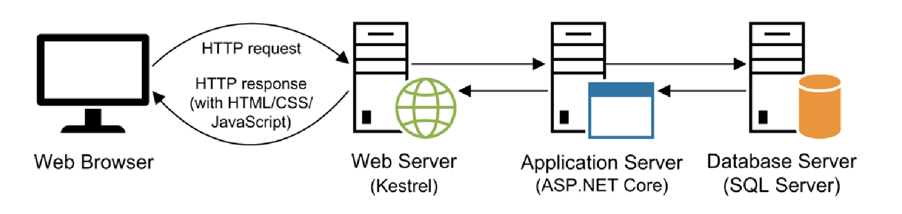

# Lecture 1

## The Components of a Web Application

- HTTP request and responses
- **Hypertext Transfer Protocol (HTTP):** is the protocol that web browsers and web servers use to communicate. It sets the specifications for HTTP requests and responses
- **Hypertext Transfer Protocol Secure (HTTPS):** same but secure
- **Transmission Control Protocol/Internet Protocol (TCP/IP):** is a suite of protocols that let two computers communicate over a network.



## Overview of ASP.NET
- Microsoft's web application framework designed for building dynamic web sites, web applications, and web services
- Cross-platform capabilities, performance improvements, and cloud optimization.

## .NET Core vs .NET Framework
- Framework is developed by microsoft to support software development on Windows.
- .NET Core cross-platform, open- source version of .NET. It has a modular design, which allows for the inclusion of only necessary packages, leading to improved performance and reduced footprint

## MVC - Model View Controller


- **Model** consists of the code that provides the data access and business logic, they are the classes.
- **View** consists of the code that generates the user interface and presents it to the user.
- **Controller** The controller consists of the code that receives requests from users, gets the appropriate data and stores it in the model, and passes the model to the appropriate view.
- **Middleware** in the context of .NET Core is software that's assembled into an application pipeline to handle requests and responses.
    - Authentication, static files, mvc middleware, error handling middleware

### Routing in MVC

- Routing means directing an HTTP reques to correct controller action
- **Conventional Routning:**
```
    app.UseEndpoints(endpoints =>
    {
        endpoints.MapControllerRoute(
            name: "default",
            pattern: "{controller=Home}/{action=Index}/{id?}");
    });
```

- **Attribute-based Routing:**
```
    [Route("products")]
    public class ProductsController : Controller
    {
        [Route("")] // products/
        public IActionResult Index()
        {
            return View();
        }

        [Route("details/{id}")]
        public IActionResult Details(int id)
        {
            return View();
        }
    }
```

### Dependency Injection

- Dependency Injection (DI) is a technique that allows a class to obtain the objects (dependencies) it needs from outside, without creating them internally.
  - **Constructor Injection** is the mosost common form where dependencies are provided through a class's constructor.

```
    public class HomeContorller : Controller {
        private readonly ILogger = _logger;

        public HomeController(ILogger<HomeController> loger{
            _logger = logger
        })

        public IActionReulst Index(){
            _logger.log("Home visited)
            return View();
        }
    }
```