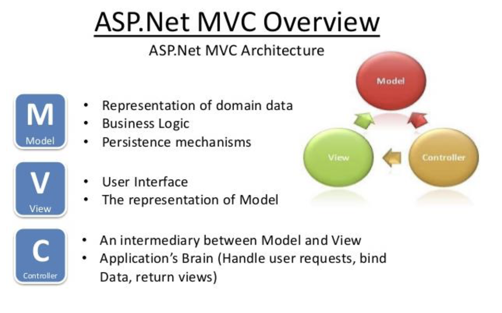
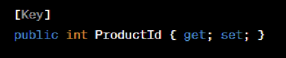
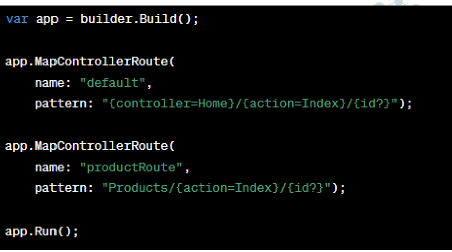

# Lecture 2

## Introduction to MVC Architecture



## Data Modelling

- Data Modeling is the process of defining the structure and relationships of the data an application will use. This means defining the types of data the application will use.
- Represent the shape of the data as well
as the business logic.
- Determines how the application interacts with the database.

```
public class Product
{
    // "Shape" of the data
    public int Id { get; set; }
    public string Name { get; set; }
    public decimal Price { get; set; }

    // "Business Logic"
    public decimal GetDiscountedPrice()
    {
        return Price * 0.9m; // %10 indirim
    }
}
```

- **Domain Modeling** is transferring real-world entities to the software world.

## Entity Framework Core

- **ORM Tool:** (Object Relational Mapper)
  - Entity Framework Core is an ORM that works with a database using .NET
objects.
- Creates a bridge between Model classes and database tables.
  - This allows querying and saving data in the database using strongly typed objects.
- Database Agnostic, EF Core can target different databases with minimal changes to the code
- Role of Models: In ASP.NET Core, models define the structure of data as well as the behavior that manipulates the data. They serve as the data transfer conduit between the database and the user interface
- EF Core translates operations on models to SQL queries and updates the database accordingly

## Annotations and Fluent API

- **Annotations** are attributes provided by EF Core that you can apply directly to model properties to define the schema of the database table.



- **Fluent API:**
  - EF Core allows for further configuration of the model in the OnModelCreating (in DbContext) method using a detailed, code-based configuration syntax

```
public class AppDbContext : DbContext
{
    public DbSet<Product> Products { get; set; }

    protected override void OnModelCreating(ModelBuilder modelBuilder)
    {
        // Fluent API ile Product table configuration
        modelBuilder.Entity<Product>(entity =>
        {
            entity.HasKey(p => p.Id); // Primary key
            entity.Property(p => p.Name)
                  .IsRequired()        // no NULL 
                  .HasMaxLength(100);  
            entity.Property(p => p.Price)
                  .HasColumnType("decimal(10,2)");
        });
    }
}
```

## CRUD Operations in EF Core

- **Create:** Add new records to the database.
- **Read:** Retrieve records from database
- **Update** 
- **Delete**


## Views in MVC

- In MVC, Views are responsible for displaying application data to the user.
- Are kept separate from the business logic and only focus on presenting the data provided by the Controllers.
- **Razor View Engine:**
  - **Razor Overview** lets you  server-based code (C#) into web pages. It bridges the gap between HTML and C#. 
  - Dynamic HTML content
- **Razor Syntax:**
  - Code blocks --> @{...}
  - Inline --> @...
  - HTML encoding, Razor automatically encodes content to prevent XSS attacks (cross-site scripting).
  - **Conditional Rendering:** Include if- else statements to conditionally display content
  
  


## Controllers in MVC

- Controllers take user input, work with models, and select views to render a response
- HTTP Request Handlers, each action correspond to different request.
- Inherit from the Controller base class, providing many methods for responding to HTTP requests.
- Actions within controllers are the endpoints to which HTTP requests are routed.


### Action Methods

- Action methods in controllers are responsible for responding to user
input, interacting with models, and selecting views.
- HTTP Request Mapping or NotMapped
- Attribute Routing, [HttpGet], [HttpPost], [HttpPut], and [HttpDelete]
- Also routes data or queries
- ActionResult determines what type of response will be sent to the user's browser

## MVC Routing Explained

- In MVC, routing is responsible for mapping incoming requests to specific controller action methods.




### Attribute Routing Explained

- Route("api/products") sets a common prefix for all actions in the controller
- Action-Specific Routes:
  - HttpGet("{id:int}"): Matches GET requests like api/products/5
  - HttpPost with [Route("create")]: Matches POST requests to api/products/create.


### Requests:

#### Request lifecycle


## MVC Filters

- A Filter is a piece of code in ASP.NET Core MVC that runs automatically before or after an Action runs.

```
[Authorize] // only accesible by log in
public IActionResult Dashboard()
{
    return View();
}
```

- **Custom filter example**

```
public class LogActionFilter : ActionFilterAttribute
{
    public override void OnActionExecuting(ActionExecutingContext context)
    {
        Console.WriteLine($"Action başladı: {context.ActionDescriptor.DisplayName}");
    }

    public override void OnActionExecuted(ActionExecutedContext context)
    {
        Console.WriteLine($"Action bitti: {context.ActionDescriptor.DisplayName}");
    }
}
```

- Types of filters:
  - Authorization Filters
  - Resoruce Filters
    - Run after authorization and can short-circuit the rest of the pipeline.
  - Action Filters
  - Exception Filters
  - Result Filters

## Dependency Injection - DI

- Is a design pattern where dependencies (services, objects, or classes) are injected into a class rather than being created within the class
- **Inversion of Control: (IoC)**
  - where the control over creating dependencies is shifted from the class to an external entity (the DI container in ASP.NET Core).
  - Services are registered in the DI container, usually in the Program.cs file.