# COMP2136 Midterm

##  SQA Foundations & the SDLC

- A set of activities that define and assess the adequacy of software processes to provide evidence that establishes confidence that the software processes are appropriate for and produce software products of suitable quality for their intended purposes.

### Impacts of Software Quality

- Business --> Downtime costs, SLA penaltien, brand risk
- User Impact --> Frustration, abandonment, accessibility features
- Team impact --> Firefighting, burnout, slow velocity
- Regulatory impact --> Compliance violations, privacy breaches
 

- Software includes these, that is why SQA does not touches only code.
  - Programs
  - Procedures
  - Rules
  - Documentatiion
  - Data

### Errors Defects and Failures

- **Error:** A human action that produces an incorrect result. (eg. a designer made an error)
  - Can occur in any software development phase
  - Almost always human mistakes
- **Defect (Bug):** A deficiency in a work product where it does not satisfy specified requirements or user expectations
  - Errors become defects if go unnoticed
  - If not fixed, becomes failure
  - Approximately 50% of defects can occur during the requirements phase.
- **Failure:** The termination of a product's ability to perform a required function or its inability to perform within specified limits (e.g., the system crashed during production). **RUNTIME**

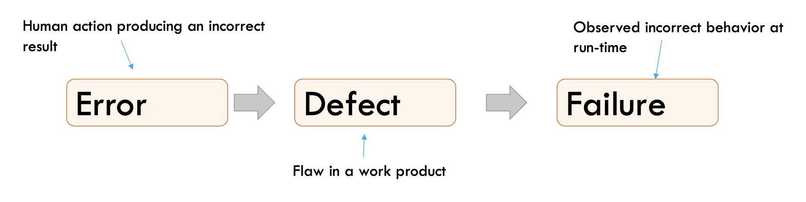

### Two Perspective on SQA
#### Crosby's perspective: Conformance to requirements
- If requirements are made its okay

#### Juran's perspective: Fitness for use
- One must satisfy the client’s needs, wants, and expectations that are not necessarily described in the requirements documentation.
 

 

### SQ Attributes:

#### Translating Attributes to Tests

- Given/When/Then
- Given the user is on the login page
    - And has a valid account
    - When the user enters the correct username and password
    - Then the system should grant access
    - And redirect the user to the dashboard page

### Cost of Quality 

- **Cost of Quality (CoQ):** An economic point of view to classify costs associated with quality assurance.

#### Categories of Costs

- Implementation costs
- Preventation costs
  -  (e.g., efforts to define quality, set quality criteria, training for processes, measurement activities)
- Detection costs
  - (e.g., conducting reviews and tests).
- Failure costs

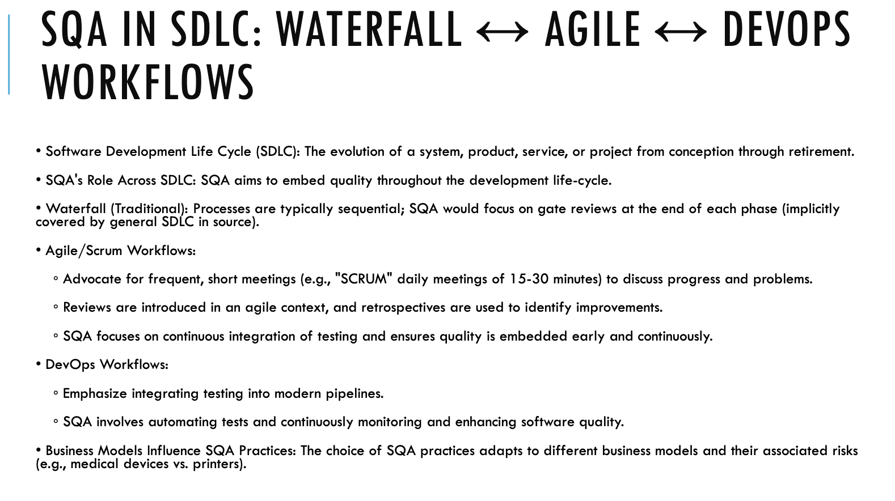

## Culture, Ethics & the V model

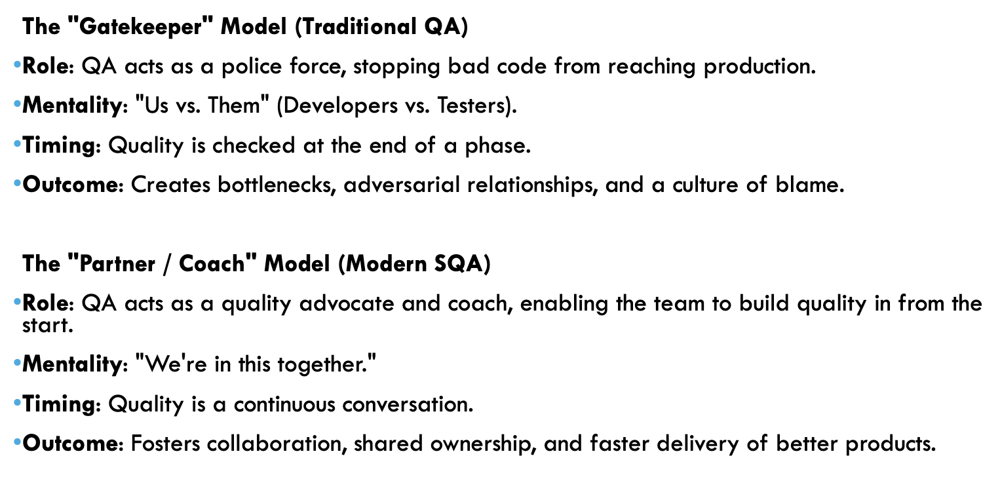

### RACI Chart:

- Responsible, the doer
  - This is the person (or people) who actively performs the work to complete the task. 
- Accountable, the owner
  - This is the one individual who is ultimately answerable for the correct and thorough completion of the task.
- Consulted, The "Expert" or "In the Loop"
  - These are the people who provide input, feedback, or expertise.
- Informed, The "Kept in the Loop"
  - These are the people who need to be kept up-to-date on progress or when a task is completed

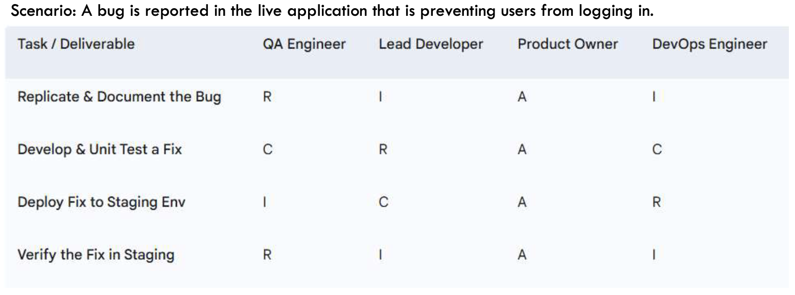

### Ethics

#### Data Privacy and Handling

- Mishandling this data can lead to security breaches, identity theft, and massive legal liability for the company.
- Advocate for anonymization of test data
- Adhere regulations
- Maintain confidentality
- **check ethical area examples on slides further**

### Workflows and V-Model

- **Waterfall**
  - Every phase is distinct, one ends other starts
  - The QA team is responsible for finding and reporting defects before the product is released.
  - Relies heavily on formal requirement and design documents
- **Agile**
  - QA is not a separate team but part of a cross-functional team alongside developers and a Product Owner.
  - Continuous testing
- **DevOps**
  - Combines software development (Dev) and IT operations (Ops) to shorten the development lifecycle.
  - The primary focus shifts from manual testing to building and maintaining a robust automated testing pipeline (CI/CD - Continuous Integration/Continuous Deployment).
  - QA should provide tools and frameworks beforehand and needs instant feedback about them.
- **V-Model**
  -  An evolution of the Waterfall model that demonstrates the relationship between each development phase and its corresponding testing phase.
  -  Verification, left side
  -  Validation, right side
  
  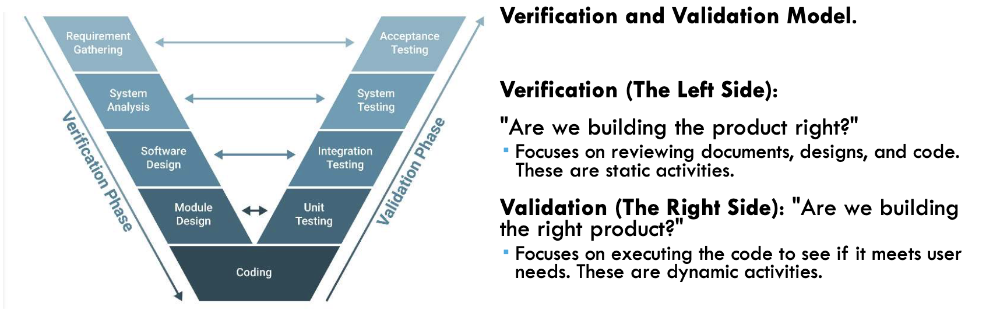

## Testing Fundamentals & Strategy

- **Level 1: Unit Testing** (the bricks)
  - Smallest, most isolated part, often a single function, method, or a class
  - Often developers does it
  - Precision, pinpoints exact location of a bug
- **Level 2: Integration Testing** (putting bricks together)
  - Testing the interaction and data flow between two or more integrated units or modules. The focus is on the interfaces.
  - Developers and QA analyists
  - Individual units might work perfectly in isolation but fail when combined.
- **Level 3: System Testing** (whole building)
  - Testing if system meets the reqs
  - The QA Team or dedicated testers.
- **Level 4: Acceptance Testing** (is the building livable)
  - The final level of testing, where the software is validated against the business needs and requirements. It answers the question: "Does this software deliver the value the client asked for?
  - User, client or Product owner does this test
- These tests are sequential and complementary 

#### Test Driven Development

- Write tests first.
- Red-Green-Refactor Cycle
  - **Red** --> Write a small, failing unit test. It fails because unit does not exist yet.
  - **Green** --> Write absolute minimum to pass that test
  - **Refactor** code.

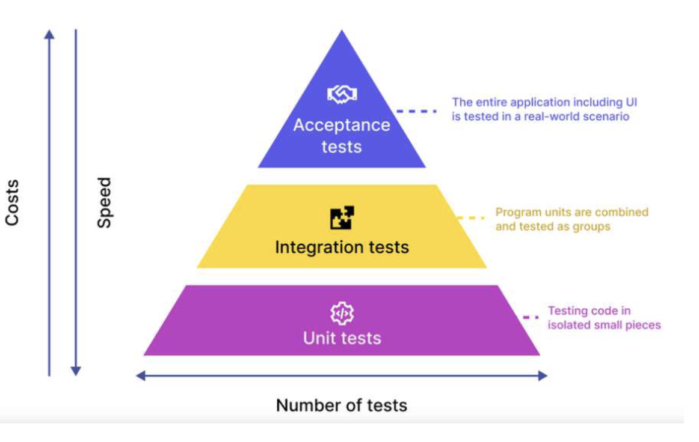

- **Static Testing:** (Verification)
  - Without executing the code
  - Find defects in requirements, design documents, and source code itself.
  - Like proofreading
- **Dynamic Testing:** (Validation)
  - Executing the code
  - Finds failures that only occur in run-time

### Testing Techniques

- **Black-box:** 
  - End-user perspective
  - No knowledge of code
  - Testing the system's functionality by examining its inputs and outputs. "Given input X, does the system produce the expected output Y?"
- **White-box:**
  - Developer perspective
  - Full knowledge of code
  - Testing the internal logic, paths, branches, and conditions within the code. The goal is often code coverage
  
  

- **Grey-box:**
  - Technical teste perspective
  - Partial knowledge of code
  - Designing more intelligent tests based on this limited knowledge.

### Risk Assesment Matrix

- Likehood
- Impact
- Purpose
- Risk = likehood x impact

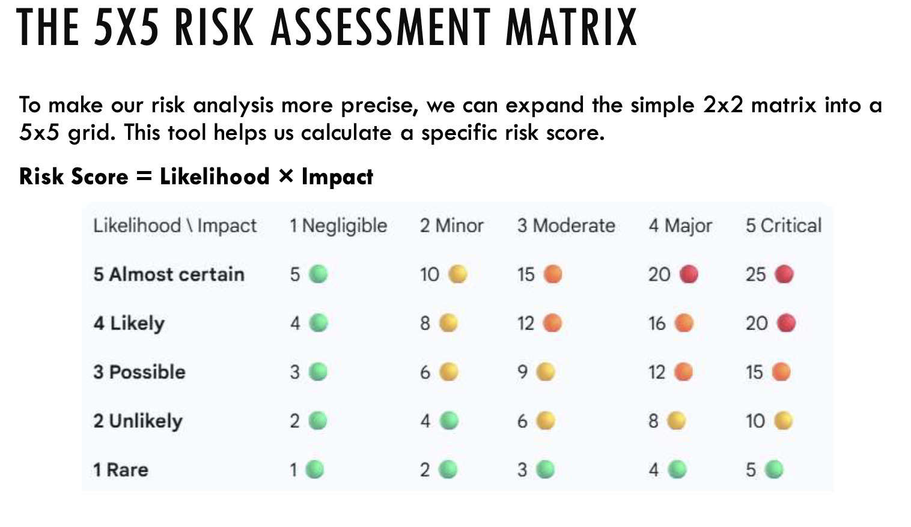

### Priority Driven Test Strategy

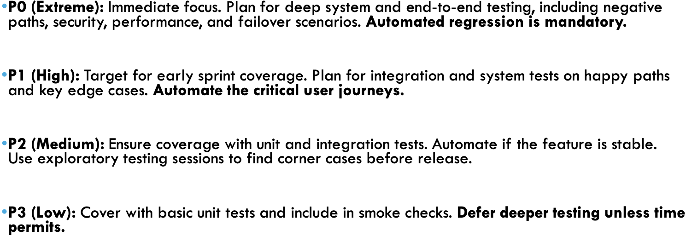

## Requirements to Test Plans

- **Acceptence Criteria** are the conditions that a software product must meet to be accepted by a user, a customer, or other stakeholders.

### Gherkin:

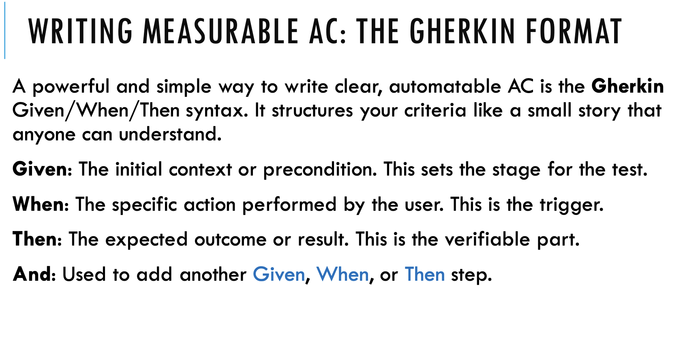

### Happy and negative path examples:

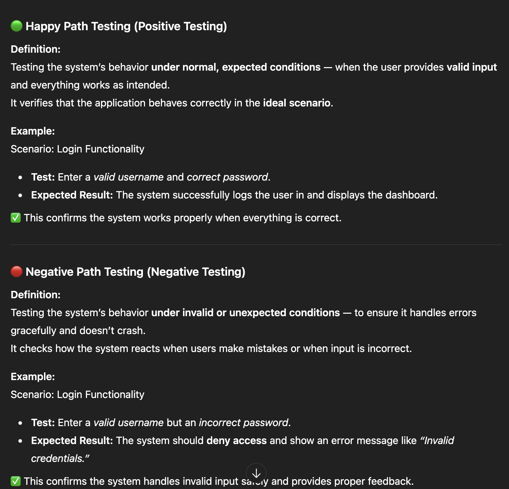

### Requirements Tracebility Matrix (RTM)

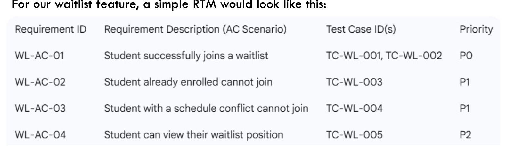

### Master Test Plan

- **Identifier**
  - A unique versioned ID (e.g.,CRS_Waitlist_MTP_v1.0)
- **Intro and Scope**
  - Describe the feature itself and test objectives.
  - In-scope and out-of-scope
- **Features to be tested** 
  - A list of the specific features or user stories being tested
- **Test Approach / Strategy**
  - Indicate levels of testing
    - integration testing, system testing, unit testing etc.
  - Indicate type of testing
  - Priorization
- **Pass/Fail Criteria**
- **Test Deliverables**
  - What artifacts will the QA team produce?
    - This Master Test Plan, Test Cases, Requirements Traceability Matrix, Bug Reports, Final Test Summary Report.
- **Schedule and Resoources**
- **Environmental Needs**
    - What hardware, software, and tools are required?
- **Risks and Contingencies**
  -  What could go wrong, and what's our backup plan?
  -  Contingency example: "Automate P0 regression tests to run overnight. Defer P2 manual testing if necessary.

## Designing Effective Test Cases

### Black-Box Techniques

- **Equivalence Partitioning (EP):**
  - Black-box

    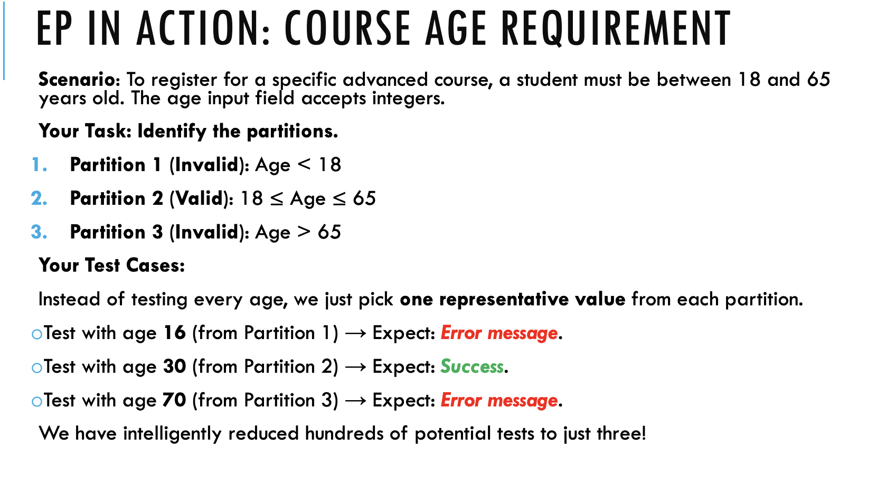

- **Boundary Value Analysis (BVA):***
  - A technique that complements EP. Experience shows that defects are most likely to occur at the boundaries or "edges" of an equivalence partition, not in the middle. BVA focuses testing specifically on these boundaries.
  
    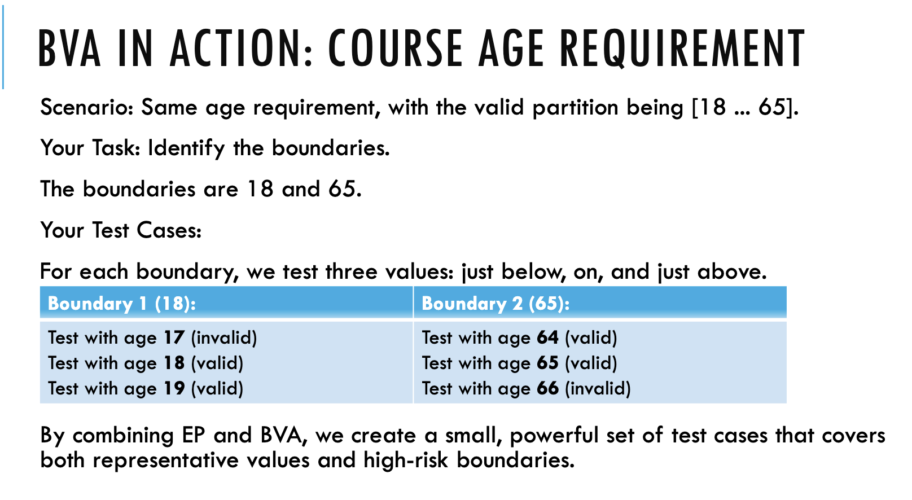

### Decision Tables

- Maps various combinations of conditions (inputs) to the actions (outputs) that must occur.

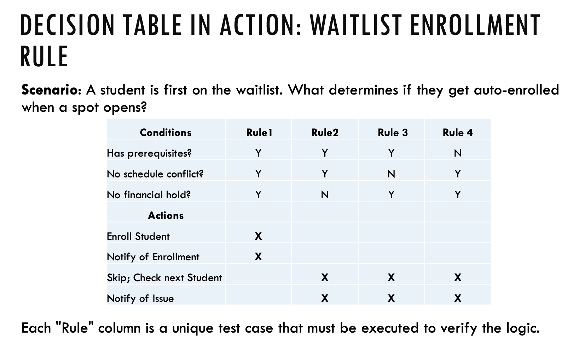

### State-transition 

- Eg. An elevator. Its behavior (opening doors, moving up/down) depends entirely on its current state (e.g., idle at a floor, moving between floors) and the events that trigger it (e.g., a button is pressed, a floor is reached)
- OR, user login phases

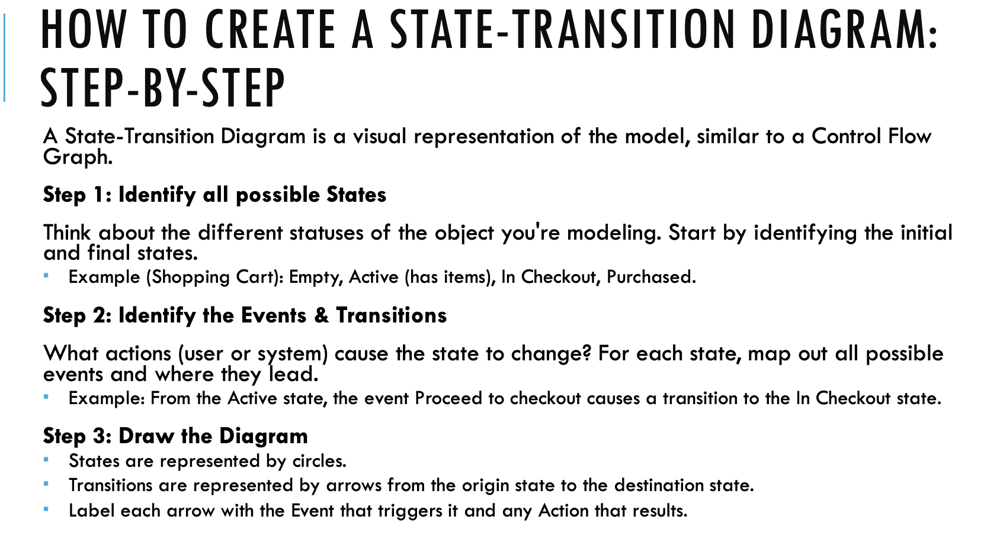

### White-box Techniques

- **Statement Coverage**
  - The simplest and weakest type of coverage. It measures whether each executable line of code has been run at least once by your tests.
- **Branch Coverage**
  - A stronger metric that measures whether every possible branch (outcome) of each decision point has been executed. For an if statement, this means both the true and false paths have been tested
- **Condition Coverage**
  - This technique focuses on compound logical expressions (e.g., if (A && B)). It measures whether every individual sub-condition has been evaluated as both true and false at least once across all your tests.

### Control Flow Graphs (CFG)

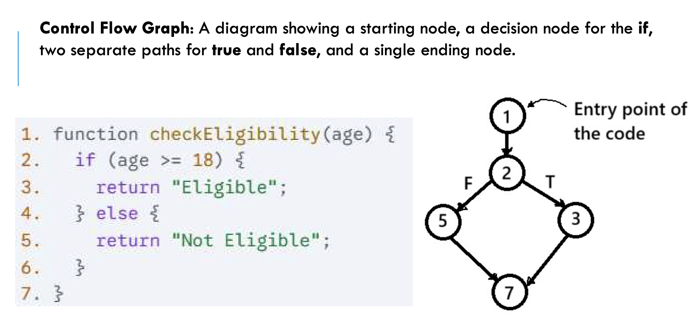

### Cyclomatic Complexity

- It tells us the exact number of linearly
independent paths through our code.
- Minimum number of test cases required to
guarantee 100% branch coverage

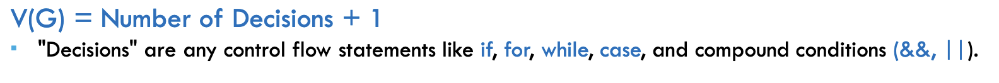

## Manual Testing & the Defect Lifecycle

- Manual testing is essential for:
  - Usability testing
  - Exploratory Testing
  - Accessibility testing
  - New, unstable features

### Static Testing
- **Desk Check:**
  - An informal review where an author examines their own work for defects, or has a single peer do the same
- **Walkthrough:**
  - A semi-formal meeting where the author of a work product (like a Test Plan or a requirements document) presents it to a small group of peers.

### Dynamic Testing
- **Scripted testing:**
  - The tester follows a predefined test case with step-by-step instructions and compares the actual result to the expected result.
  - **Smoke testing:**
    - To verify that the most critical, basic functionalities of a new build are working.
    - Narrow and shallow (e.g., Can the app start? Can I log in? Does the main page load?).
  - **Reggression testing:** 
    - verify that recent code changes have not broken any existing, previously working functionality

- **Unscripted Testing:**
  - **Exploratory Testing:**
    - a style of testing that emphasizes the tester's freedom and creativity. It's a process of simultaneous learning, test design, and test execution
    - Finds unexpected, hidden, complex bugs

### Defect Lifecycle

- **Severity:** The technical impact of the defect on the system's functionality.
    - Has levels of Critical, major, minor, trivial
    - Does the system become inoperable or is it just a minor visual glitch?
- **Priority:** The business impact of the defect and the urgency with which it needs to be fixed
  - P0-3 --> 0 is the highest

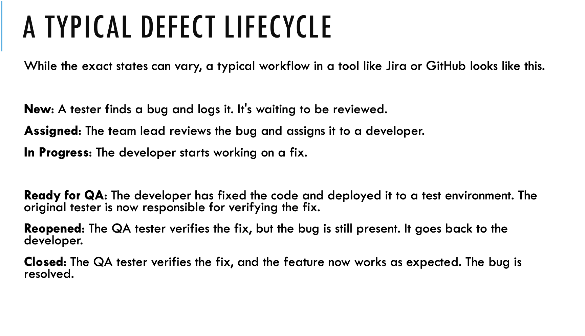

### Bug Report

- Should be easy to reproduce the bug

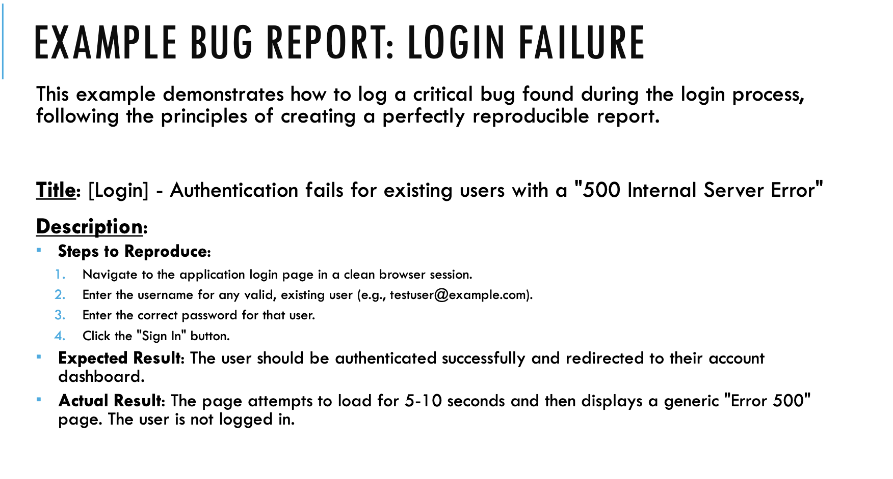
     