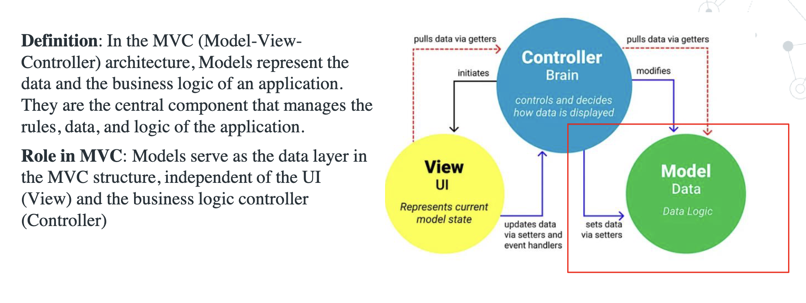
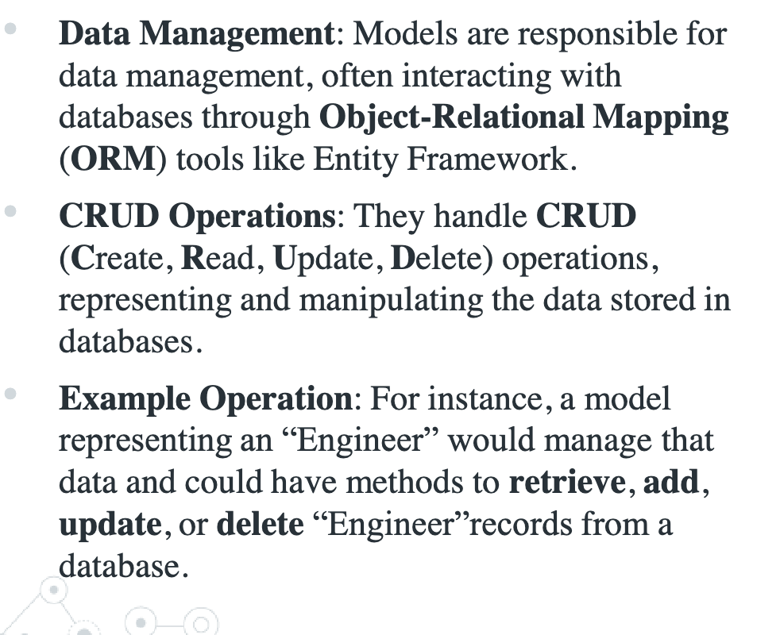
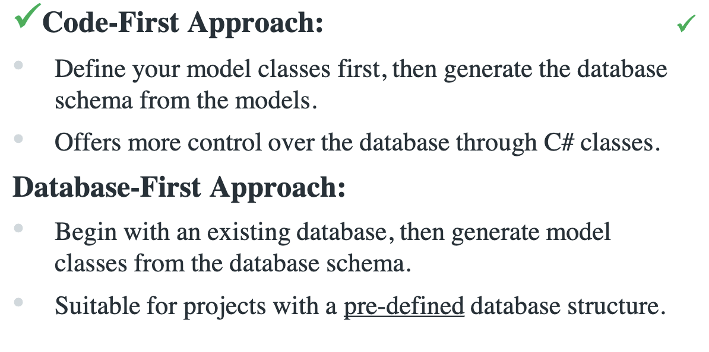
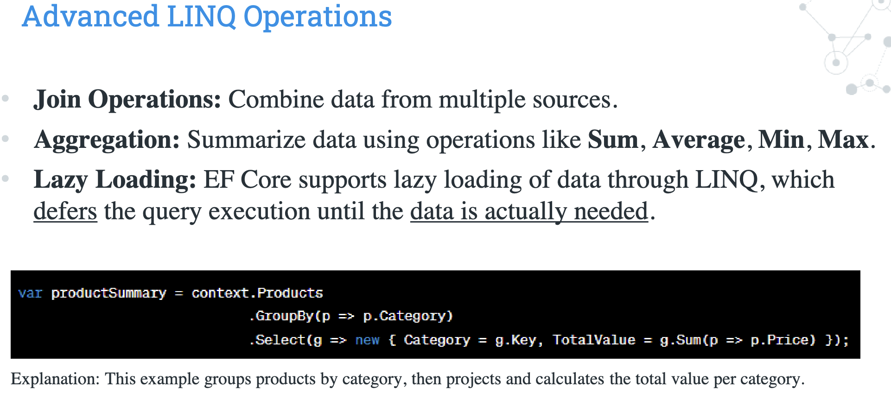
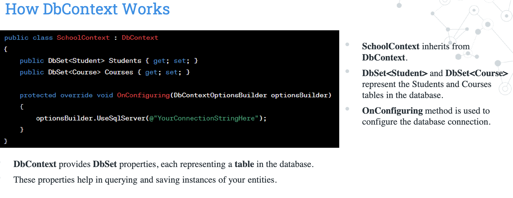
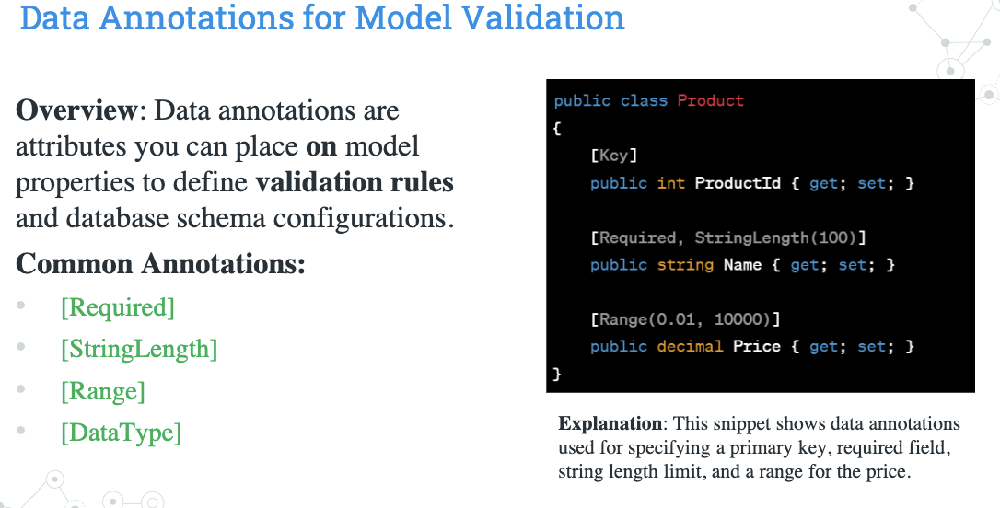
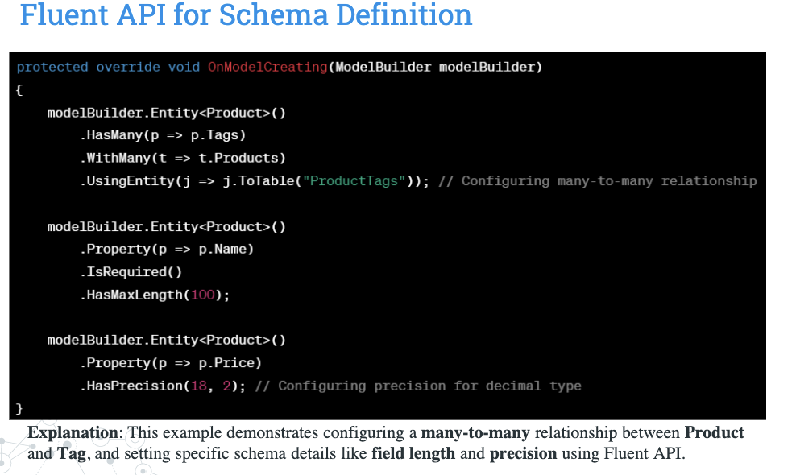
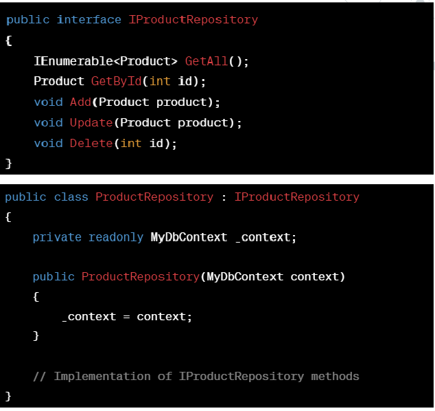
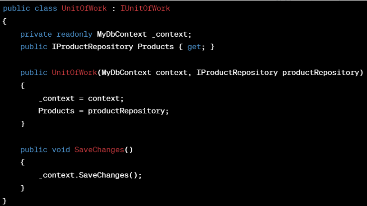
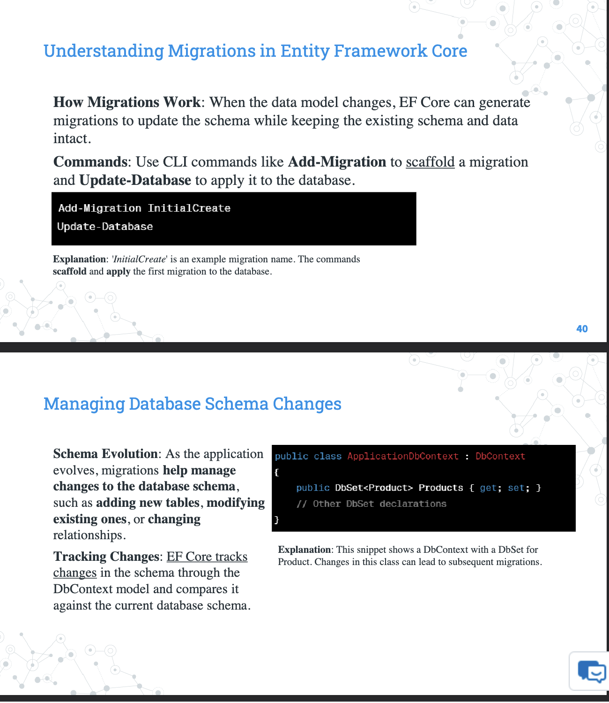

# Lecture 3

## Concepts in Data Models




## Entitiy Framework Core

- **Function:** EF Core is an Object-Relational Mapper (ORM) that enables .NET developers to work with a database using .NET objects, eliminating the need for most of the data-access code that developers usually need to write.

### EF Core Key Features

- **LINQ Queries**
  - Querying databases using LINQ (Language Integrated Query), with the queries being translated into SQL by EF Core
- **Change Tracking**
- **Migrations**
  - Provides a way to incrementally update the database schema to keep it in sync with the application's data model while preserving existing data in the database.
  - Good for team use
- **Conventions and Configurations**
  - **Convention:** Built in features EF Core applies, like pluralizing table names, primary key recognition
  - **Configuration:** Overriding default conventions using Fluent API or Data Annotations with a pre-defined database structure
<hr>
<br>




## Introduction to LINQ - Language Integrated Query

- Integrates query capabilities directly into C# syntax.

```
var highValueProducts = products.Where(p => p.Price > 1000)
                                .OrderBy(p => p.Name)
                                .Select(p => new { p.Name, p.Price })
```

### LINQ with Entity Framework Core
```
using (var context = new MyDbContext()){
    var expensiveProduct = context.Products
                                    .Where(p => p.Price > 1000)
                                    .ToList();
}
```
<hr>
<br>




## DbContext in Entity Framework Core

- The DbContext class in Entity Framework Core is a key component that represents a session with the database, allowing for querying and saving data




## Data Modeling Techniques

- Data modeling involves creating models that represent more data structures and relationships, mirroring real-world scenarios

### Relationships in Data Modelling

- **One-to-One:** A single instance of a model is associated with one instance of another model.

```
modelBuilder.Entity<User>()
    .HasOne(u => userProfile)
    .WithOne(up => up.User)
    .HasForeignKey<UserProfile>(up => up.UserId)
```

- **One-to-Many:** One instance of a model is associated with multiple instances of another model.

```
modelBuilder.Entity<Category>()
    .HasMany(c => c.Products)
    .WithOne(p => p.Category)
    .HasForeignKey(p => p.CategoryId)
```

- **Many-to-Many:** Multiple instances of a model are associated with multiple instances of another model.
  
```
modelBuilder.Entity<Student>()
    .HasMany(s => s.Courses)
    .WithMany(c => c.Studets)
    .UsingEntity(j => j.ToTable("StudentCourses"))
```

### Data Annotations for Model Validation


<hr>
<br>




## Data Access Patterns

### Repository Pattern:

- Define a repository interface for each entity. Implement these interfaces in concrete repository classes.
- Abstracts database access, providing a more object-oriented view of the persistence layer.



### Unit of Work Pattern

- Create a Unit of Work class that wraps the DbContext and repository instances.
- When all work is completed, the SaveChanges() method on the UnitOfWork is called. This single call reflects all insertion, deletion, and update operations performed in that workflow into the database as a single, secure transaction.



## Handling Data Migrations

