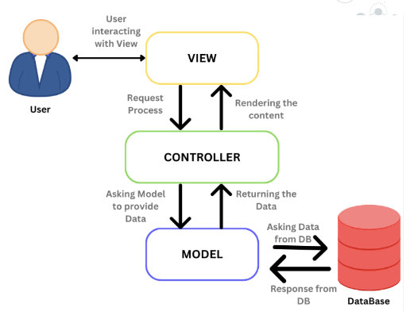
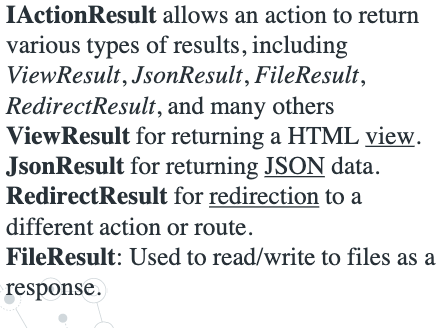
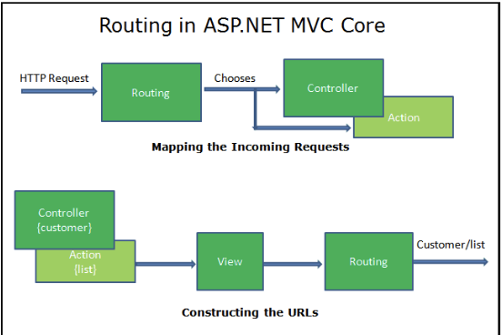
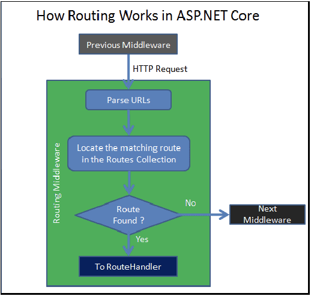
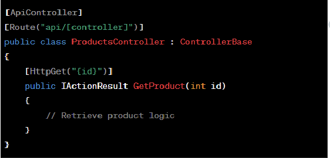
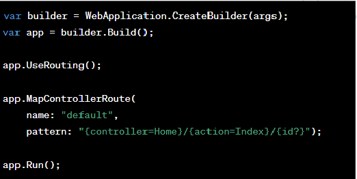
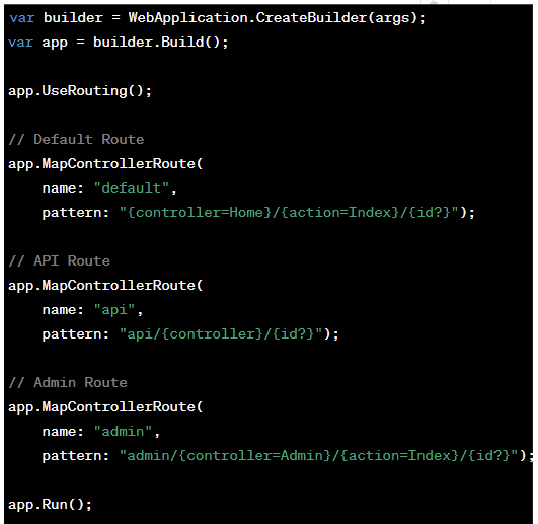

# Lecture 4

## Controllers in MVC

- Act as intermediates between the model and the view..
- Handle user requests
- Controllers determine how to respond to user input and which View should be rendered, if at all
- Action methods in controllers correspond to a spesific request.
- **Routing**, Controllers work with routing engine of ASP.NET Core.



### Action Results

- Action methods can return various types of responses, known as action results

- **Common action results:**

    

- **Attribute Routing:**
  - Action methods can be decorated with attributes like [HttpGet], [HttpPost], [HttpPut], [HttpDelete] to specify which HTTP verb they handle

### Basics of Routing in ASP.NET Core



- **How Routing Works:**
  - Request arrives to Middleware
  - Middleware parses the URL
  - Searches for the Matching Route in the RouteCollection
  - If the Route is found, then it passes the control to RouteHandler
  - If not found, it gives up and invokes the next Middleware.
 

  - You can map URLs to controllers
    - Eg --> [HttpGet("/home/index/{id?}")]
    - **Attribute Routing**
       
  - Or you can define routes in Program.cs
  

  - Example with multiple routes:
  

  - **Default Route:**
    - {controller=Home}/{action=Index}/{id?}
    - This is a general-purpose route
    - If no controller action is specified, defaults to HomeController and Index action, id is optional
  - **API Route:**
    - api/{controller}/{id?}
    - Dedicated to api calls.
    - responds only URLs that start with /api/
  - **Admin Route:**
    -  admin/{controller=Admin}/{action=Index}/{id?}
    -  Specific route for an admin section. Defaults to AdminController and its Index action if not specified.

### Advanced Routing Techniques

- **Route Constraints**
```
app.MapControllerRoute(
    name: "products",
    pattern: "products/{id:int}",
    defaults: new {controller = "Products", action = "Details"}
)
```
  - This route will only match if the id segment is an integer. For example, /products/5 will match, but /products/abc will not. 
- **Custom Routes**
```
// instead of conventional pattern below

app.MapControllerRoute(
    name: "products",
    pattern: "products/{id:int}",
    defaults: new {controller = "Products", action = "Details"}
)

// custom patterns as below can be used

app.MapControllerRoute(
    name: "products",
    pattern: "products/{productName}-{id}",
    defaults: new {controller = "Products", action = "Details"}
)

// it will respond URLs like
// /products/widget-5
```

- **Route Grouping**
```
var builder = WebApplication.CreateBuilder(args);
var app = builder.Build();

//The MapGet method is used to define an endpoint
app.MapGroup("/api/v1")
   .MapGet("/products", () => "V1 - Get Products");

app.MapGroup("/api/v2")
   .MapGet("/products", () => "V2 - Get Products");

app.Run();
```
```
// example with endpoints

var v1 = app.MapGroup("/api/v1");
v1.MapGet("/products", () => "V1 - Products");
v1.MapGet("/orders", () => "V1 - Orders");
```

## Passing Data to Views

- ViewBag, ViewData, and TempData

- **ViewBag**
  - is a dynamic object that allows you to pass data from the controller to the view.
  - It uses dynamic properties, meaning properties are defined at runtime.
  - Ideal for small amounts of data.

- **ViewData**
  - Is a dictionary of objects that are accessed using string keys. It's based on ViewDataDictionary class.
  - Good for data accessed by keys
- **TempData**
  - Is used to pass data from one request to another, especially in scenarios like redirects. It's a temporary storage.
  -  Ideal for passing data after redirects, as it persists data for the duration of an HTTP request.

```
VievBag.Message = "Welcome";
ViewData["Message"] = "Welcome";

TempData["Message"] = "Welcome";
```