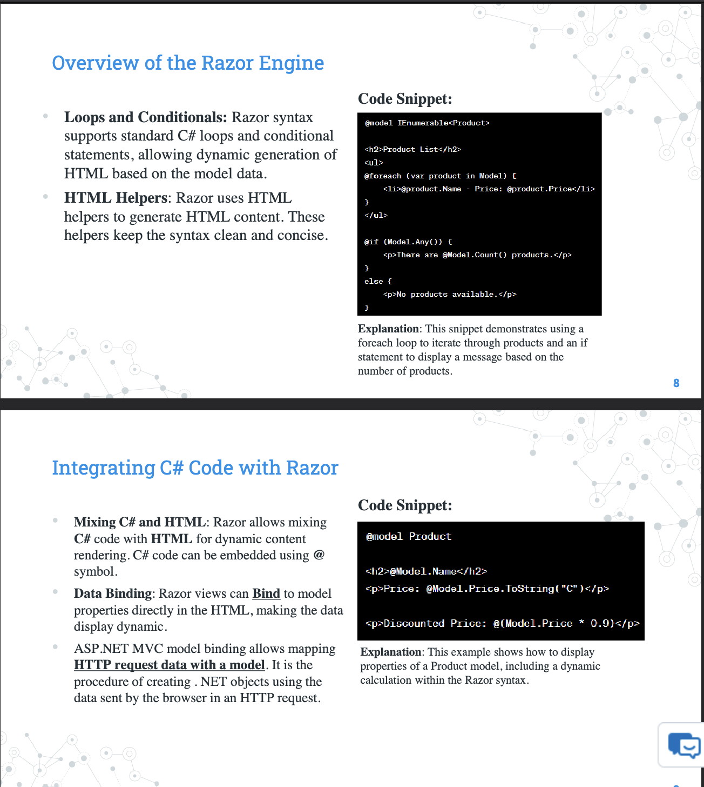
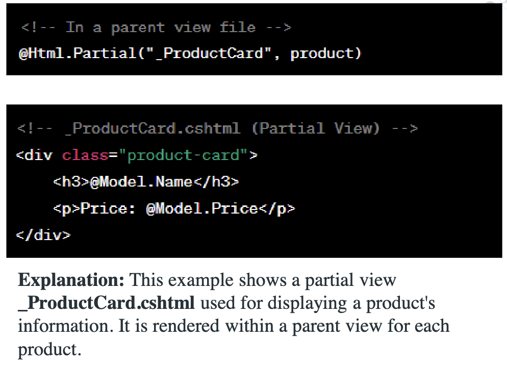
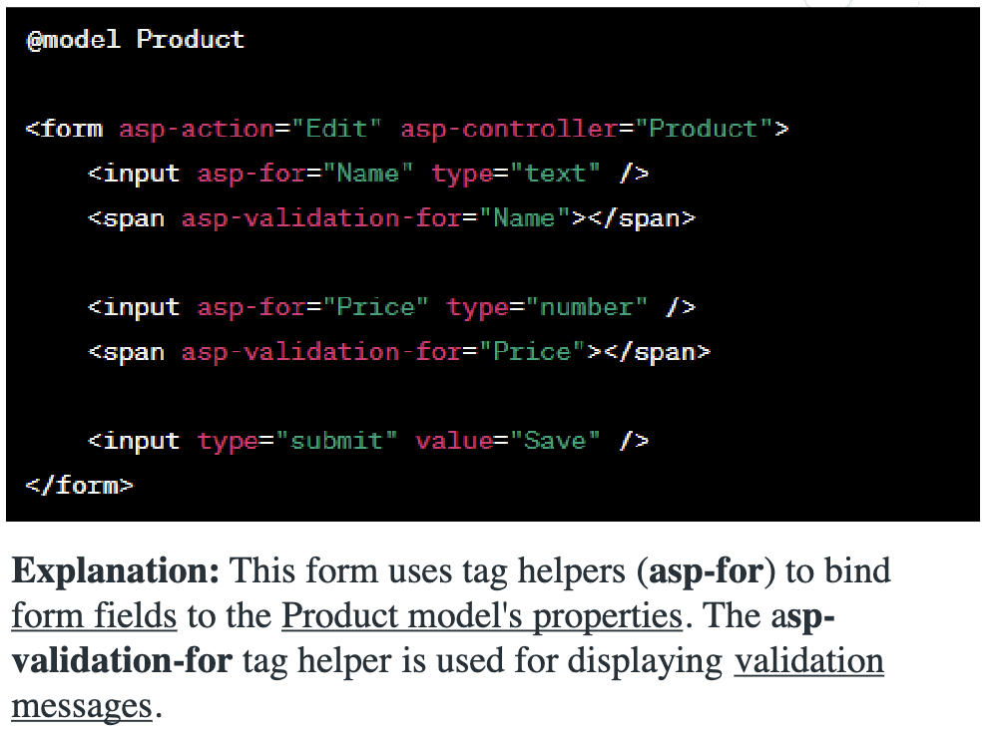

# Lecture 5

## In-Depth Look at Razor View Engine



### Partial Views

- mini-views which are rendered within other views. 
- They are stored in the Views folder, often within a Shared directory.
- Can be rendered using the Html.Partial or Html.RenderPartial methods in a parent view.
- Data can be passed with ViewBag or ViewData



### View Components

- Same with partial views but also contain logic (c# code)
- They are intended for creating reusable components that encapsulate both rendering and data-fetching logic.
- Inherits from ViewComponent.
- It typically contains a InvokeAsync method which returns a IViewComponentResult.
- View components can be invoked from Views by using Component.InvokeAsync method.

```
public class LatestProductsViewComponent : ViewComponent
{
    public async Task<IViewComponentResult> InvokeAsync()
    {
        var products = await _context.Products
            .OrderByDescending(p => p.Id)
            .Take(3)
            .ToListAsync();

        return View(products);
    }
}
```

## Layouts, Sections and RenderBody

- **Layout**
  - Razor files used to define a common site template. This can include headers, footers, navigation menus, etc., ensuring a consistent look and feel across multiple pages.
- **RenderBody Method**
  - A placeholder where the content of a view is rendered within the layout


## Data Binding in Views

- Data binding in Razor views refers to the process of connecting the data from models to the corresponding HTML elements.
- **One-Way**, Model to View
- **Two-Way**, Model to View, View to Model with forms usually, submits data back to the server

