# COMP 2147 - System Analysis Design and Testing

## Chapter 1: System Developments Environment

- Application Software --> Software designed to support organizational function or process.
- Systems Analyst --> Organizational role most responsible for analysis and design of information systems.

### A Modern Approach to Systems Analysis and Design

- Present Day --> focus on developing systems for the Internet and for firm’s intranets and extranets

- **Three tier design** -->
  - Database on one server
  - Application on second server
  - Client logic located on user machines

- Move to wireless system components (Access from everywhere like cloud things getting more and more common

- Continuing trend toward assembling systems from programs and
components purchased off the shelf --> It was used to be different most compamies used to prefer writing their own software for everything.)

### Developing Information Systems and theSystems Development Life Cycle

- Systems Development Methodology --> 
  
    A standard process followed in an organization to conduct all the steps necessary to analyze, design, implement, and maintain information systems

- System Developments Life Cycle (SDLC) -->
    
    **The traditional methodology** used to develop, maintain,
    and replace information systems

    - It is a circular process. End of one successful phase lead to another.
    - Can be iterative.
    - In any phase, organization can return to previous one if needed.

    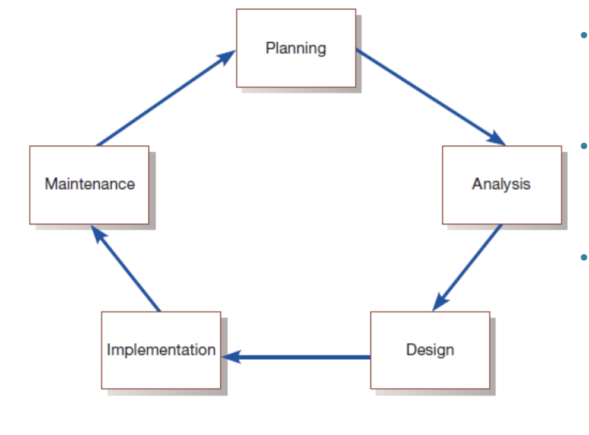

- Evolutionary Model --> 

    A spiral process in which one is
    constantly cycling through phases
    at different levels

    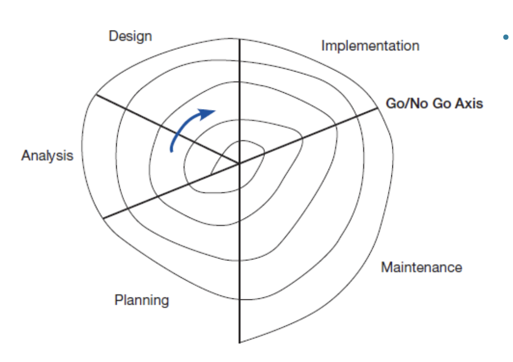

### Phases of SDLC

- Planing
  - Need for a new system is identified.
  - Needs are identified, analyzed, prioritized, and arranged.
  - Determine the scope of the proposed system.
  - Baseline project plan is developed.

- Analysis 
  - The goal of the analysis phase is to understand what users need and translate it into technically definable requirements.
  - System requirements are studied from user input and structured.
    - Eg. 
    
    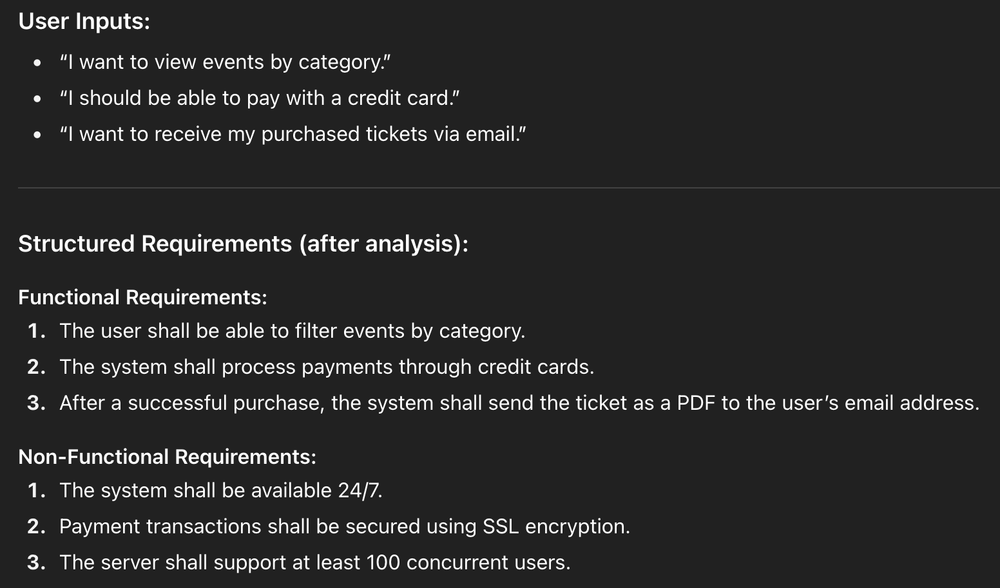
  
  - Requires careful study of current systems, manual and computerized, that might be replaced or be enhanced
  - Output is description of the alternate solution recommend by
    the analysis team

- Design
  - In this phase, Analyst converts to solution into logical and physical spesifications.
  - Local Design --> This process is independent from any hardware or software platform.
  - Physical Design --> The logical specifications of the system from logical design are
transformed into technology-specific details from which all
programing/system construction can be accomplished

    - Most of the times tech stack is already determined by client or the organization.

- Implementation
  - Occurs when the information system is coded, tested, installed,
and supported in the organization

- Maintenance 
  - The phase in which an information system is systematically
    repaired and improved.
  - Organization’s needs may change over time requiring changes
    to the system based on user’s needs

## Agile and Waterfall

## Waterfall Model

### Definition  
The **Waterfall model** is a traditional software development methodology where the process flows **sequentially** through distinct phases. Each phase must be **completed before** moving to the next one.

### Key Characteristics  
- Follows a strict sequence: **Analysis → Design → Development → Testing → Deployment → Maintenance**  
- Difficult to go back once a phase is finished  
- All requirements are clearly defined at the beginning  
- Works best for **large, well-defined, and stable projects**

### Example  
A bank develops a secure transaction system.  
Because requirements are fixed and approvals are needed at every stage, the **Waterfall model** ensures stability and documentation.

---

## Agile Model

### Definition  
**Agile** is a flexible and iterative approach to software development.  
The project is divided into **small parts (iterations or sprints)**, and each sprint delivers a **working product increment**. Continuous feedback is used to improve the system.

### Key Characteristics  
- Development occurs in short cycles called **sprints** (2–4 weeks)  
- Each sprint produces a working feature  
- **User feedback** is gathered and applied frequently  
- Requirements can **change or evolve** during the project  
- Encourages **team communication and collaboration**

### Example  
A team develops an online ticketing website.  
They first build the “view events” feature, show it to users, get feedback like “add a category filter,” and implement that in the next sprint.  
This reflects the **Agile** approach.

---

- **Waterfall** → “Plan everything first, then execute.”  
- ⚡ **Agile** → “Build, test, get feedback, and improve continuously.”
  - Three key principles:
    - Focus on adaptive rather than predictive (Waterfall is predictive)
    - Focus on people rather than roles
    - Focus on self-adaptive
  - Agile is recommended for:
    - Unpredictable or dynamic requirements
    - Responsive and motivated developers
    - With customers who understand the process and willing to get involved in it.

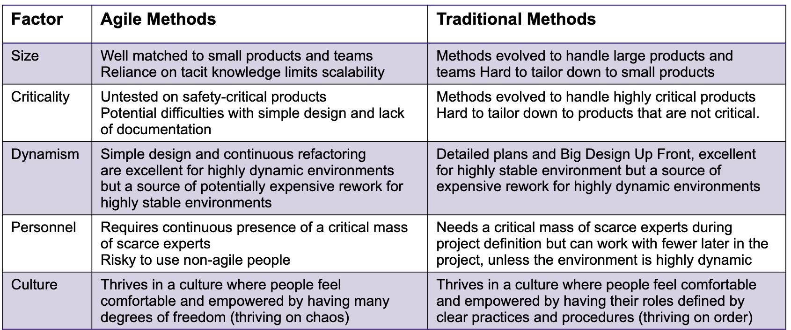

## eXtreme Programming

- Shorter, incremental development cycles
- Focus on automated tests
- Emphasis on two-person programming teams and customers to monitor the development.
- Planning, analysis, design and construction on one phase
- Coding and testing is second phase.

## Scrum

- Originated in 90s and most popular methodology.
- Scrum Framework includes:
  - Scrum teams 
    - Product owner
    - Development team
    - Scrum master
- Designed for speed and multiple functional product
releases

- Primary unit is called a sprint.
- Steps and details -->
  - A sprint runs two weeks to a month
  - Starts with an 8-hour meeting,  needs to be delivered at the  end of the sprint, how will this accomplushed.
  - Daily Standup: A 15-minute meeting held to evaluate progress
    made within the past 24 hours and what needs to be done
  - At the end of the sprint there are 2 meetings:
    - The Sprint Review: (4 hours) focusing on the product, what has been accomplished, and what needs to be done
    - The Sprint Retrospective: (3 hours) focusing on team performance and how it can improve

- Three primary artifacts -->
  - Product Backlog: Listing of potential requirements
  - Sprint Backlog: Listing of only items to be addressed in a particular sprint
  - Increment: Represents the sum of all the Product Backlog items
    completed during a sprint.

## Chapter 2: Origins of Software

- In the past software development for organizations was
done mostly in-house and from scratch. Today we have many sources.

### Outsourcing

- Turning over responsibilities for some or all of an organization’s information systems applications and operations to an outside firm.
- Reasons:
  - Freeing up internail resources
  - Increasing revenue potential
  - Reducing time to market
  - Increase efficency
  - Outsourcing noncore activities

### Sources of Application Software

- IT service firms
  - Firms that help companies develop customer information systems for internal use.

- Packaged Software Producers
  - Range from general, broad-based packages, such as productivity tools, to very narrow, niche packages, such as managing a day care center
  - Microsoft Office for example, At best meet 70% of an organization’s needs.

- Enterprise Solution Software
  - Instead of using multiple separate systems for each business function, ERP integrates them so a single transaction is recorded seamlessly in one system.
  - SAP AG is the most popular one.

- Cloud Computing
  - It is the provision of computing resources, including applications, over the Internet.
  - Customers do not have to invest in the computing infrastructure needed to run and maintain the resources

- Open Source Software
- In-house Development

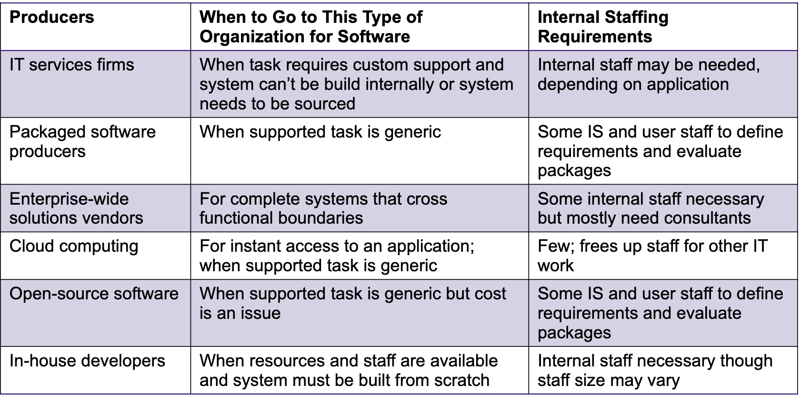

## Chapter 3: Managing the Information Systems Project

- Project manager –-> systems analyst with a diverse set of
skills – management, leadership, technical, conflict
management, and customer relationship – who is
responsible for initiating, planning, executing, and closing
down a project

- Project –-> planned undertaking of related activities to
reach an objective that has a beginning and an end

- Deliverable –-> end product of an SDLC phase

- System Service Request -->standard form for requesting or proposing systems development work within an organization

    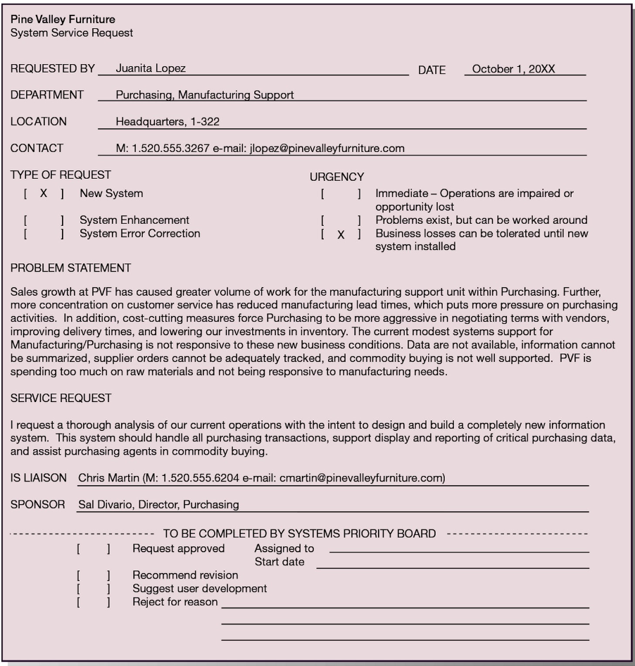

- Feasiblity Study --> study that determines whether a requested system makes economic and operational sense for an organization

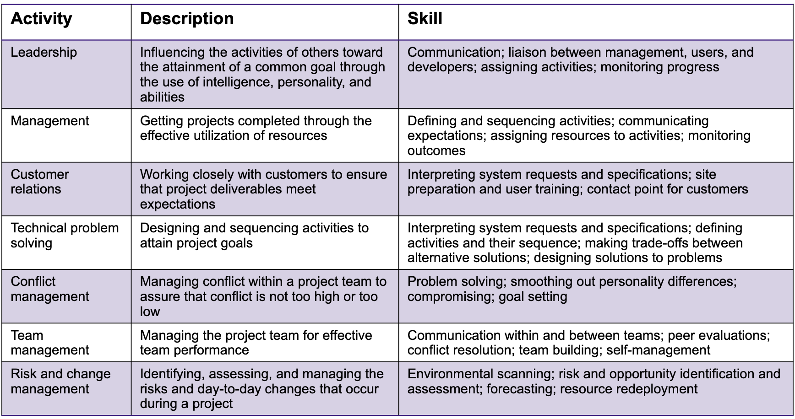

### Project Management

- controlled process of initiating, planning, executing, and closing down a project
    - Initiating Project
    - Planning the project
    - Executing the project
    - Closing down the project

### 1- Project Initiation

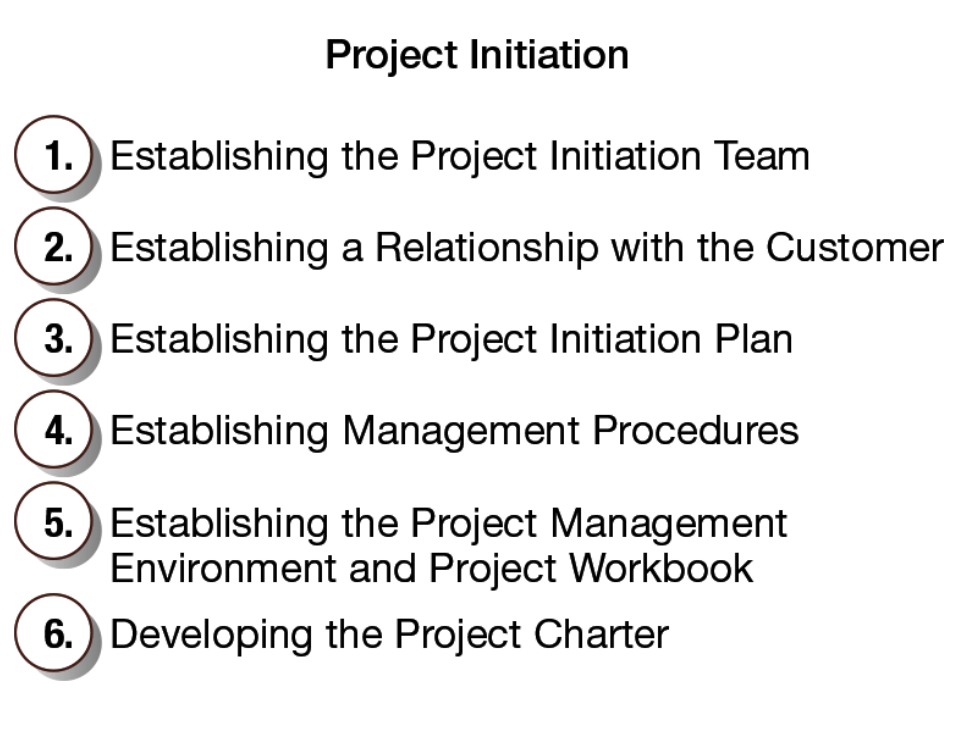

- Project Workbook --> An online repository that includes all project related documents. Very often a different standalone repo.

- Project Charter --> Describes what the project will deliver to the customer. Outlines at a high level all work required to complete the project.
  - Project title and date of authorization
  - Project manager name and contact
  - Customer name and contact
  - Standart completion date
  - Key stakeholders, project role, and responsibilities
  - Objectives and description
  - Key assumptions or approach
  - Signatures section

    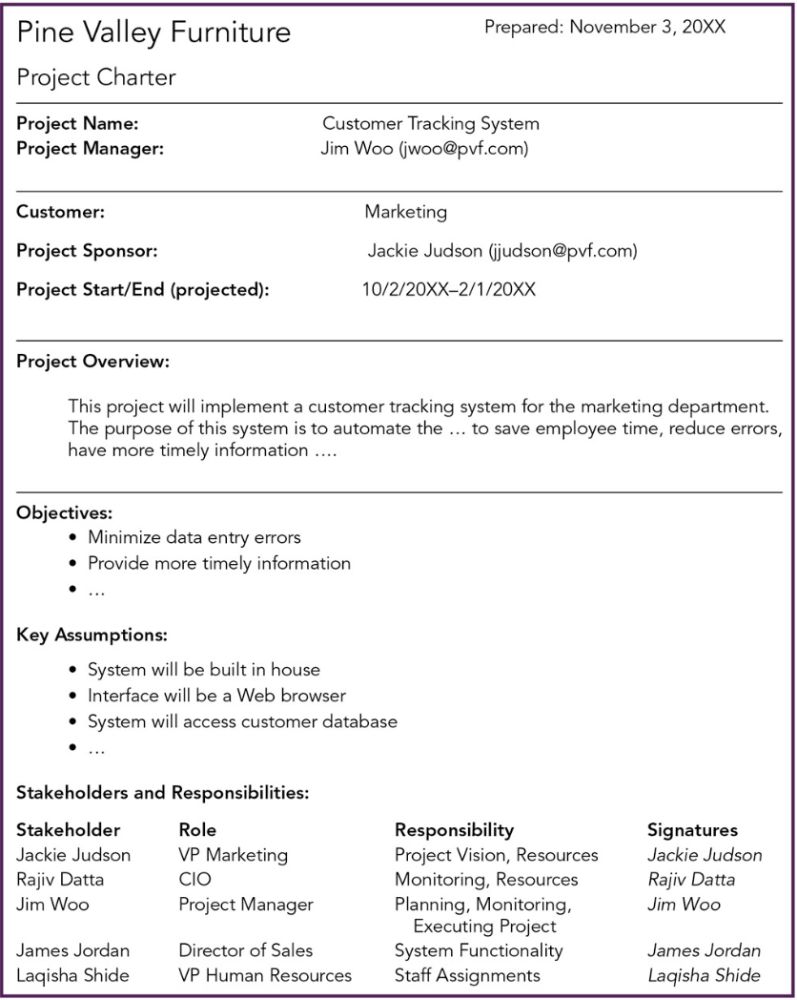

### 2- Planning the Project

- Focuses on defining clear, discrete activities and the work needed to complete each activity within a single project

- Work breakdown structure –-> process of dividing the project into manageable tasks and logically ordering them to ensure a smooth evolution between tasks

- Gantt chart –-> graphical representation of a project that shows each task as a horizontal bar whose length is proportional to its time for completion
  
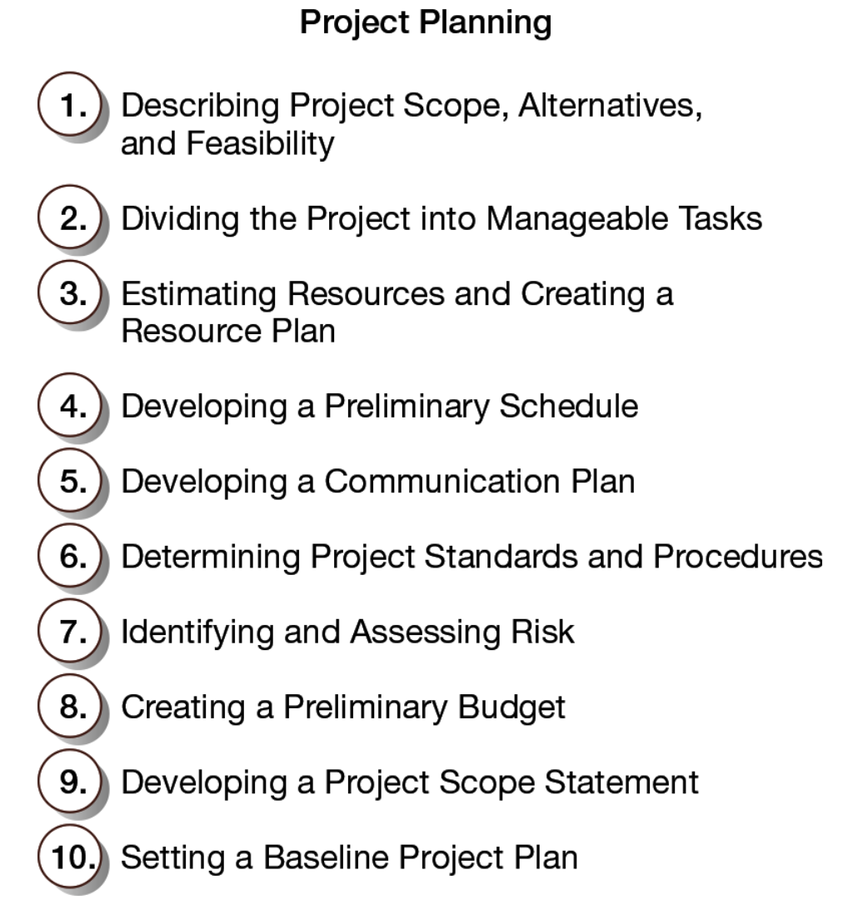

- Constructive Cost Model (COCOMO) –-> automated software estimation model that uses historical project data and current as well 

- Communication plan example:

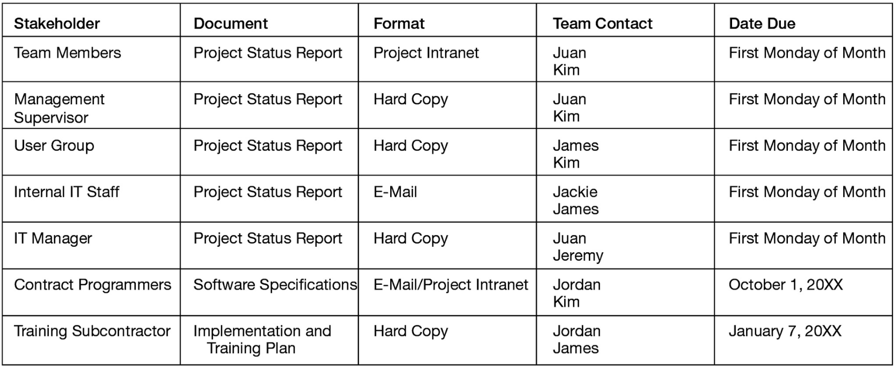

### 3- Project Execution

- hird phase of the project management process, in which the plans created in the prior phases (project initiation and planning) are put into action

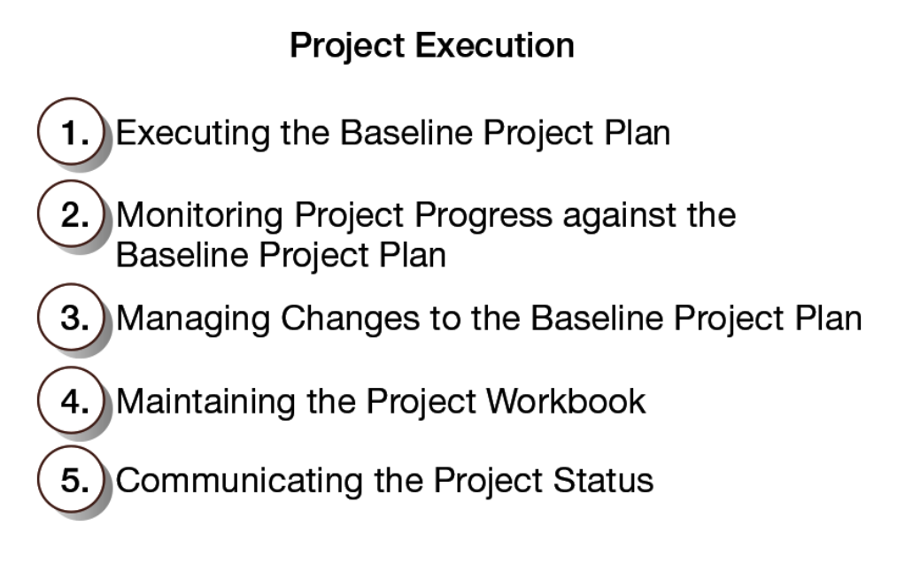

### 4- Closing Down

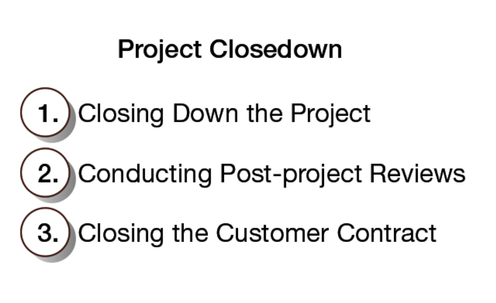

### Gnatt Chart vs Network Diagram

- Gnatt Chart -->
  - Task durations
  - Time overlap
  - Slack time in duration
- Network Diagram -->
  - Task dependencies
  - Do not show time overlap but show parallelism
  - Show slack time in boxes

    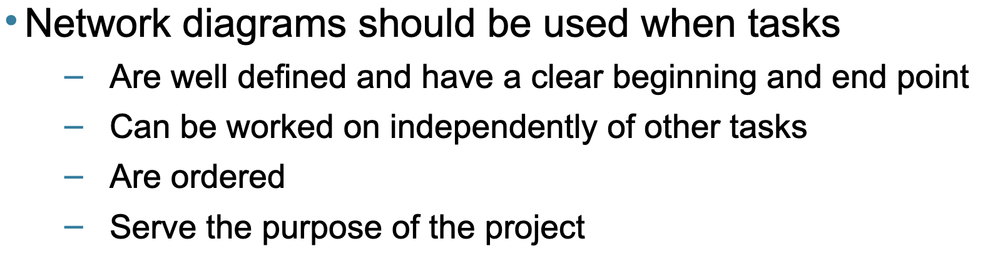

    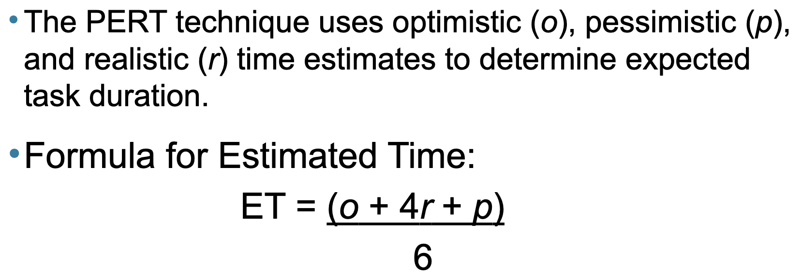

## Chapter 4: Identifying and Selecting Systems Development Projects

- Identifying and selecting systems development projects is part of the first phase (Planning) of the SDLC
- Most firms follow a formal path to select
- Requests come from:
    - By managers needing to replace aging existing systems
    – By managers wanting to make a system more efficient
    – By managers needing a new system to help the organization
    meet corporate objectives

- Project Identification and Selection Activities
  - 1) Identifying potential development projects
    - By key member of top management
    - By steering committee (top-down source)
    - By user departments (bottom-up source)
    - By development group or senior IS manager

  - 2) Classifying and ranking IS development projects
    - Value chain analysis – used in analyzing an organization’s activities to determine where value is added to products and/or services and the costs incurred for doing so; it usually also includes a comparison with the activities, added value, and costs of other organizations for the purpose of making improvements in the organization’s operations and performance

  - 3) Selecting IS development projects

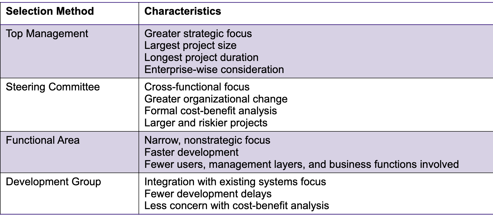

- Incremental commitment is a strategy in systems analysis and design in which the project is reviewed after each phase and continuation of the project is rejustified

- Top-down & bottom-up

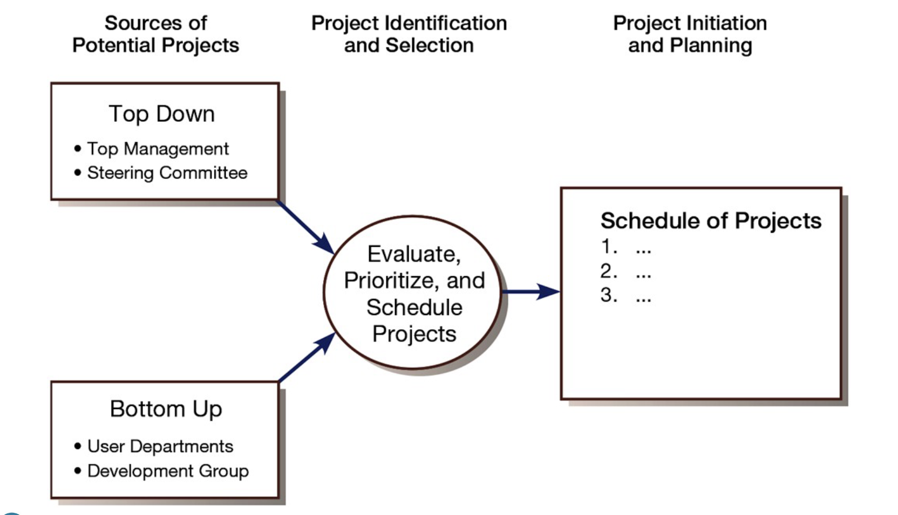

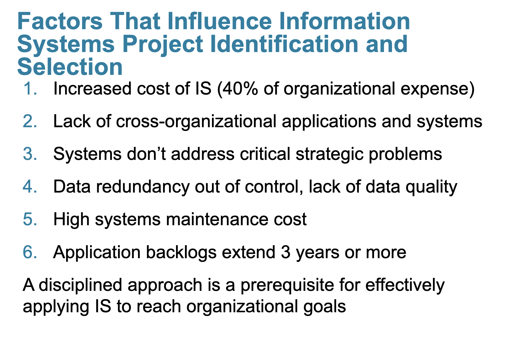

### Corporate Strategic Planning

- Corporate strategic planning is an ongoing process that defines the mission, objectives, and strategies of an organization
- Mission statement –-> statement that makes it clear what business a company is in
- Objective statement –-> series ofstatements that express an organization’s qualitative and quantitative goals for reaching a desired future position
- Vizyonumuz vs misyonumuz

- Competitive Strategy --> The method by which organization attempts to achieve its mission and objectives
  - Low-cost produceer
  - Product differentation -->To stand out on a specific feature demanded by the market
  - Product focus or niche

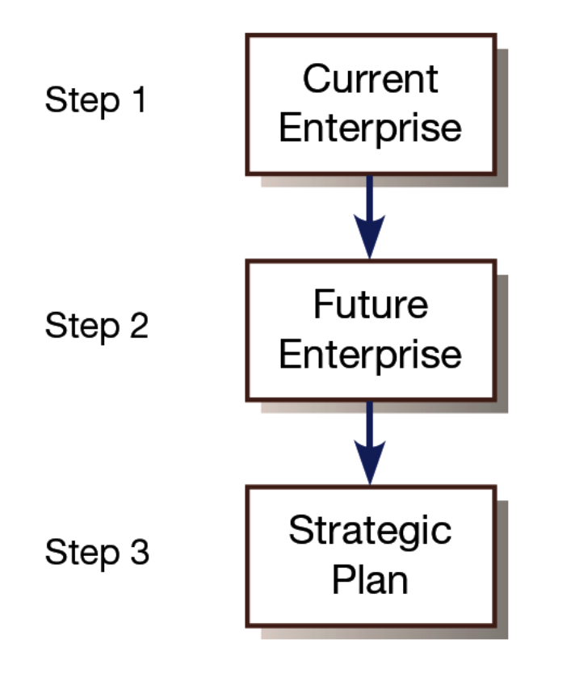

### Information Systems Planning

- means of assessing the information needs of an organization and defining new systems, databases, and technologies that will best satisfy those needs

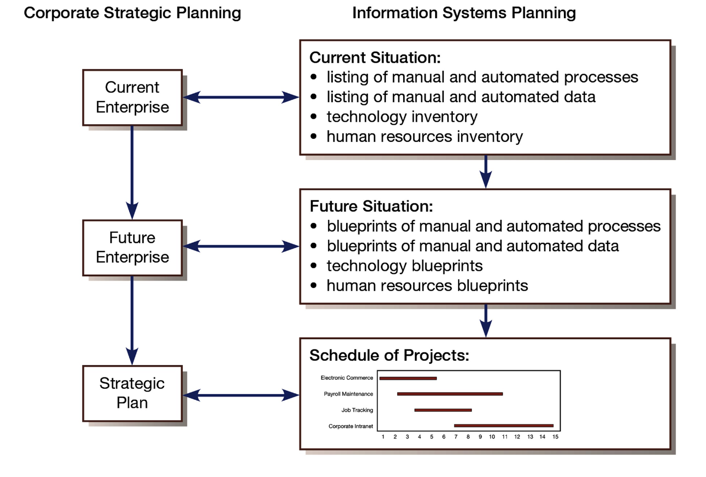

- Top-down -->
  - generic methodology that attempts to gain a broad understanding of the information systems needs of the entire organization

- Bottom-up -->
  - generic information systems planning methodology that identifies and defines IS development projects based upon solving operational business problems or taking advantage of some business opportunities

- Affinity clustering -->
  - While creating a matrix, write down relevant things close to each other.

### EC Business Models

A broad range of business models in electronic commerce include:

- **Business-to-Business (B2B)**: Transactions between businesses (e.g., a manufacturer selling to a wholesaler).  
- **Business-to-Consumer (B2C)**: Businesses selling directly to consumers (e.g., Amazon, online retail).  
- **Consumer-to-Consumer (C2C)**: Consumers selling to other consumers (e.g., eBay, Craigslist).  
- **Consumer-to-Business (C2B)**: Consumers providing value to businesses (e.g., freelance platforms, user-generated content).  
- **Business-to-Government (B2G)**: Businesses providing products or services to government entities.  
- **Government-to-Business (G2B)**: Government providing services or information to businesses (e.g., permits, tax filing).  
- **Government-to-Citizen (G2C)**: Government providing services to citizens (e.g., e-government portals, online tax payment).  
- **Thing-to-Thing (T2T)**: Devices communicating and transacting with each other autonomously (e.g., IoT devices, smart sensors).  

## Chapter 5: Initiating and Planning Systems Development Projects

- How much effort should be expended on the project initiation
and planning process?
- Who is responsible
- Why is project initiation and planning such a challenging
activity
- Project initiation focuses on activities designed to assist in organizing a team to conduct project planning
  - Assign good guys to good places
- Project planning is the process of defining clear, discrete activities and the work needed to complete each activity within a single project
  - Be clear
- The objective of the project planning process is the development of a Baseline Project Plan (BPP) and the Project Scope Statement (PSS)

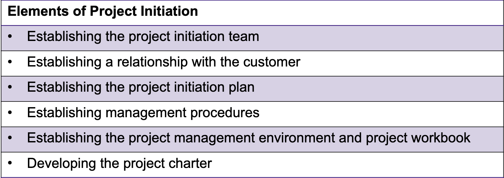 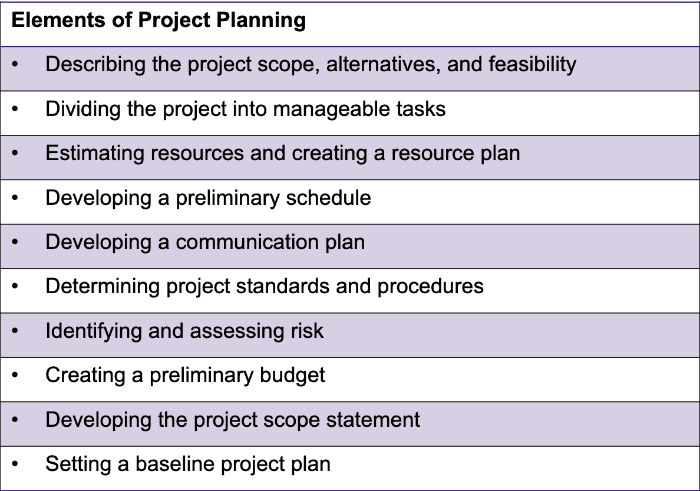

- Business case --> Justification for an information system, economic benefits, costs, organizational feasibility

- Baseline Project Plan (BPP) --> Major outcome of initiation, contains scope, benefits, costs, risks, and resource requirements

- Project Scope Statement (PSS) --> Document that describes what the project will deliver and outlines generally at a high level all work required to complete the project.

### Assesing Project Feasibilty

- Economic
- Technical
- Operational
- Scheduling
- Legal and contractual
- Political

#### Assesing Economic Feasibility 

- Economic Feasibility: Identifying benefits and costs of the project.
- Tangible benefit: benefit from the creation of an information system that can be measured in dollars and with certainty
- Most tangible benefits:
  - Cost reduction and avoidence
  - Error reduction
  - Increased flexibility
  - Increased speed of activity
  - Improvement of management planning and control
  - Opening new markets and increasing sales opportunities

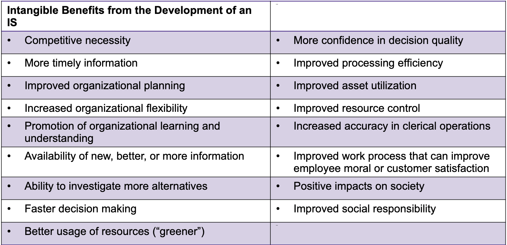

#### Determining Project Costs

- Total cost of ownership (TCO): cost of owning and operating a system, literally now and the future.
- One time costs, examples include systems development, new hardware and software purchases, user training, site preparation, and data or system conversion
- Recurring costs, examples include Application software maintenance, Incremental data storage expenses, incremental communications, new software and hardware relases, supplies and other expenses.

#### Time Value of Money (TVM)

- Money available today is worth more than the same amount
tomorrow.
- Discount rate: rate of return used to compute the present value of future cash flows.
- Present value: current value of a future cash flow
- Net Present value: uses the discount rate to determine present value of cash outlays and receipts

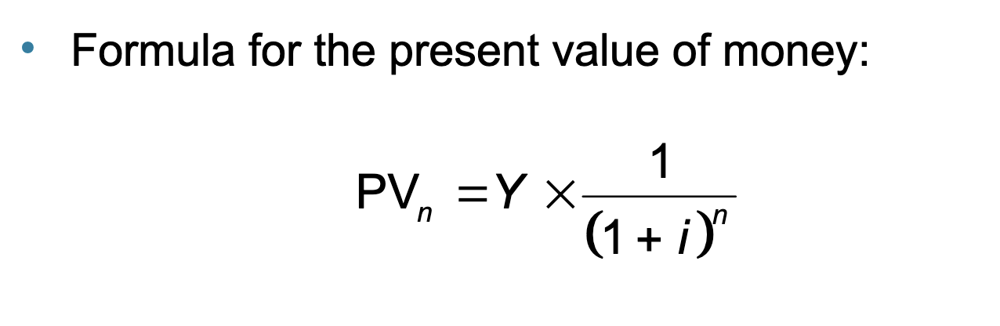

- Break-even analysis: at what point benefits (if ever) equal costs.

#### Assesing Technical Feasibility

- To learn if development organization is capable of constructing proposed system.

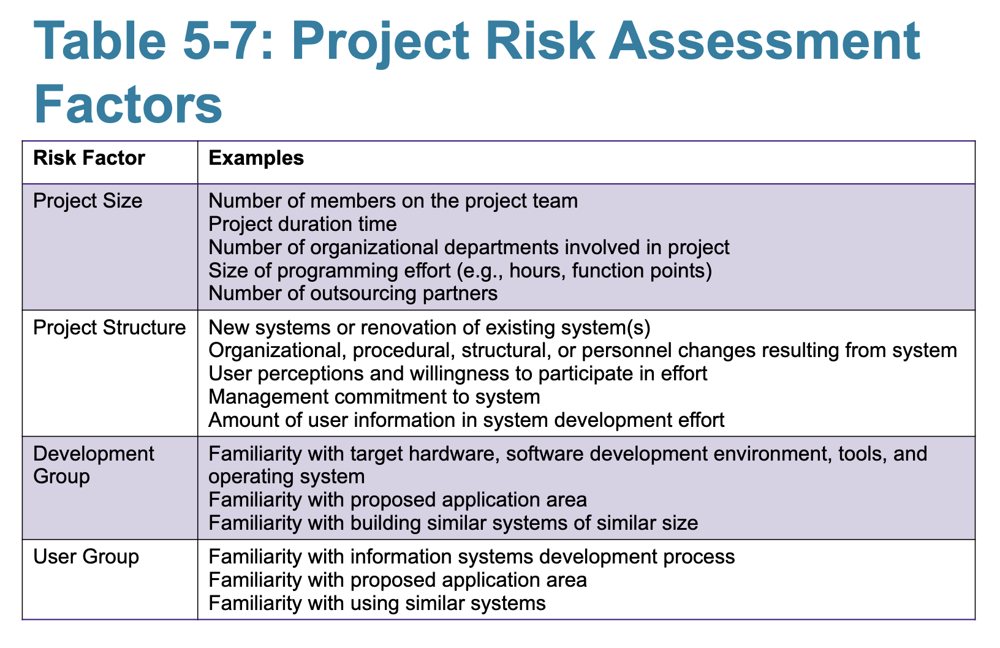

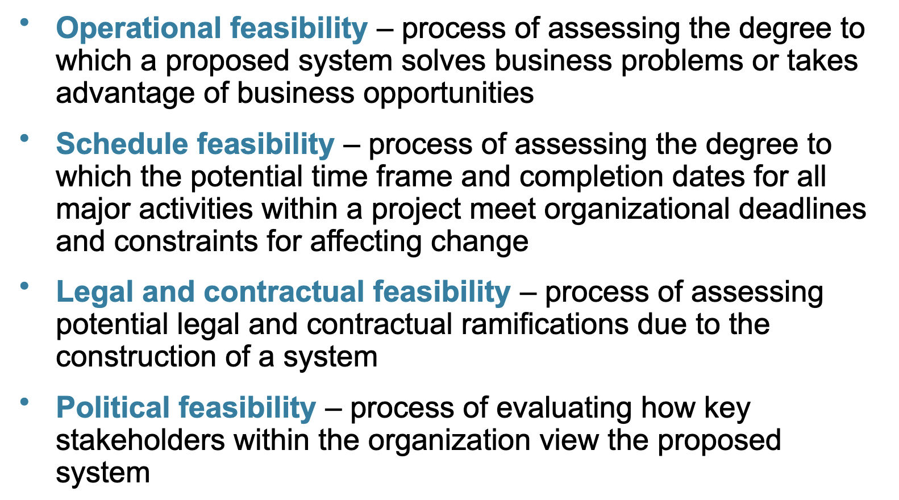

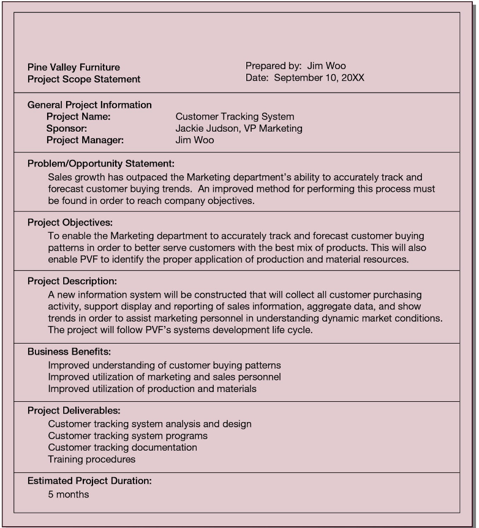

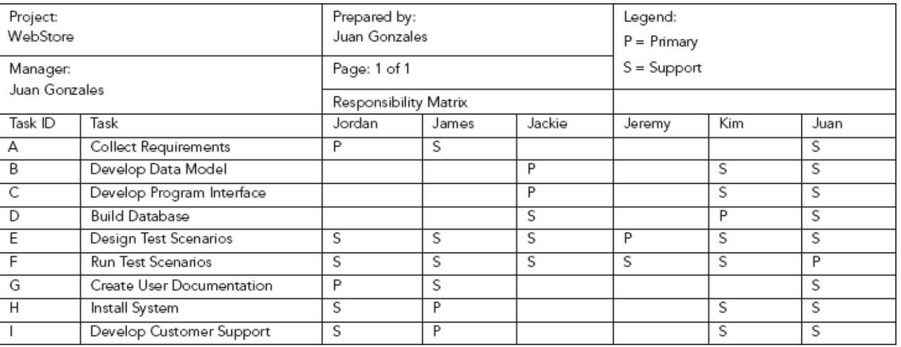

## Chapter 6: Determining System Requirements
